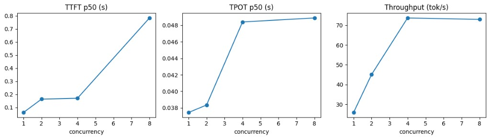

# Concurrency sweep lab notes — Qwen stream on single-model serving

Companion to [`01_concurrency_sweep.ipynb`](./01_concurrency_sweep.ipynb) and the CSV written by that notebook (`results/concurrency_sweep.csv`).

This note explains *what the experiment actually ran*, how that maps to *batches* inside the single-model server, and how to read the three plots.

## 1. Setup — what was under test

| Piece | Value |
| ----- | ----- |
| Server | `single_model_llm_serving` FastAPI on `http://127.0.0.1:8000` |
| Endpoint | `POST /generate_stream` (SSE tokens) |
| Model | Qwen2.5-0.5B-Instruct (local checkpoint) |
| Client | `observability/runner.py` → `concurrency_sweep` |
| Prompt | `Explain KV cache in one short paragraph.` (plus a `[i]` suffix per concurrent copy) |
| Concurrency levels | 1, 2, 4, 8 |
| Stream length | Engine caps completion at about 20 tokens (`LLMEngine.max_tokens`) |
| Warmup | One stream request before the sweep |

The client does *not* change server knobs. It only fires more overlapping HTTP streams and timestamps every SSE token.

### Metrics in the CSV / table

| Column | Meaning |
| ------ | ------- |
| `concurrency` | How many `/generate_stream` calls were in flight together |
| `n_ok` / `n_err` | Successful vs failed streams |
| `ttft_p50_s` / `ttft_p95_s` | Time to first token (median / 95th) — send → first SSE token |
| `tpot_p50_s` | Time per output token after the first (median of per-request mean ITL) |
| `e2e_p50_s` | End-to-end: send → last token |
| `throughput_tok_s` | Total completion tokens across the wave ÷ wall-clock for that wave |
| `throughput_req_s` | Completed requests ÷ wall-clock |
| `wall_s` | First send → last token among that concurrency wave |
| `gpu_util_*` / `mem_used_*` | Samples from `nvidia-smi` during the wave |

## 2. What “batch” means in this server

The plots are easier once you separate *client concurrency* from *server batch size*.

### Workload manager

In `workload_manager.py`:

```text
batch_size = 4
```

For streaming, the manager keeps at most four *active* streaming sequences. Extra arrivals wait in `incoming_streaming_queue` until a slot frees.

So for each decode step the kitchen can cook up to four tickets at once. That is the batch the server is willing to form — not the same number as how many HTTP clients you opened.

### Related knobs (same lab)

| Knob | Where | Role |
| ---- | ----- | ---- |
| `batch_size = 4` | `WorkloadManager` | Max concurrent active sequences (stream + non-stream paths) |
| `max_num_seqs = 4` | vLLM init in `main.py` | Caps concurrent seqs on the *embedded* `/generate_vllm` path (this sweep did not hit that endpoint) |
| `max_tokens ≈ 20` | `LLMEngine` | Stops each stream after ~20 completion tokens |

This sweep measured the *custom HF streaming* path (`/generate_stream`), not `/generate_vllm`.

### Mental picture per concurrency level

```text
Client concurrency 1
  → 1 active, 0 waiting
  → batch size used ≈ 1

Client concurrency 2
  → 2 active, 0 waiting
  → batch size used ≈ 2

Client concurrency 4
  → 4 active, 0 waiting
  → batch full (matches batch_size=4)

Client concurrency 8
  → ~4 active, ~4 waiting
  → same cook capacity as 4; the extras queue
```

That queue is why *TTFT* blows up at 8 while *throughput* stops climbing.

## 3. Measured results (this run)

Rounded from the notebook output:

| Concurrency | TTFT p50 | TPOT p50 | Throughput | E2E p50 | GPU util mean | GPU mem |
| ----------: | -------: | -------: | ---------: | ------: | ------------: | ------: |
| 1 | 61 ms | 37 ms | ~26 tok/s | 0.81 s | ~19% | ~13.5 GB |
| 2 | 163 ms | 38 ms | ~45 tok/s | 0.93 s | ~21% | ~13.5 GB |
| 4 | 170 ms | 48 ms | ~74 tok/s | 1.14 s | ~21% | ~14.1 GB |
| 8 | 784 ms | 49 ms | ~73 tok/s | 1.76 s | ~19% | ~14.8 GB |

At concurrency 8, TTFT p95 was ~1.32 s — the tail is worse than the median because some requests waited longer in queue.

Smoke before the sweep: one stream OK (~141 ms TTFT, 21 tokens). Server was alive and warm.

## 4. How to read the three plots

<figure>



<figcaption><span class="figure-label">Figure 1.</span> Concurrency sweep — TTFT, TPOT, and throughput versus concurrent streams</figcaption>
</figure>

### Left — TTFT p50 (s)

*Time to first token* is mostly “when does my request get its first decode slot?” plus a little prefill work.

- 1 → 4: first token stays relatively quick (tens to ~170 ms).
- 4 → 8: sharp jump (~0.17 s → ~0.78 s).

Interpretation: past `batch_size=4`, new streams wait. Waiting shows up almost entirely in TTFT, not in how fast tokens drip after generation starts.

### Middle — TPOT p50 (s)

*Time per output token* is the gap between consecutive tokens after the first (decode cost while sharing the worker).

- Roughly flat: ~37 ms at low concurrency → ~49 ms at 4–8.

Interpretation: once a request is *active*, sharing the batch slows each token a little. It does *not* explain the big latency cliff at concurrency 8 — that cliff is queueing before the first token.

### Right — throughput (tok/s)

System-wide tokens finished per second for the whole concurrent wave.

- Climbs 1 → 2 → 4 (~26 → 45 → 74).
- Flat (slightly down) at 8 (~73).

Interpretation: packing more work into the batch improves GPU usefulness up to four streams. Adding four more clients does not create a fifth cook — wall clock stretches, tok/s stalls.

## 5. Prediction versus measurement

The notebook prediction was:

> Throughput rises 1→4 because batching helps; beyond that TTFT climbs; TPOT rises only modestly.

That is exactly what happened:

| Expectation | Observed |
| ----------- | -------- |
| Throughput up to concurrency 4 | Yes — peak ~74 tok/s at 4 |
| Throughput flat past batch capacity | Yes — ~73 tok/s at 8 |
| TTFT jumps when queued | Yes — ~4.6× from 4 → 8 |
| TPOT only modest rise | Yes — ~37 → 49 ms |

So the bottleneck at 8 is *admission / queue depth*, not a sudden collapse of decode speed.

## 6. Why GPU util stayed ~20%

`nvidia-smi` hovered around 19–24% even at peak throughput. That does *not* contradict the batching story.

Reasons that fit this lab:

- The model is small (0.5B); V100 is not fully busy on short prompts.
- Streams stop at ~20 tokens — waves are short.
- The HF streaming worker path is not a production continuous-batch engine; there is idle time between steps and around Python/IPC.

Low GPU util here means “headroom on the card,” not “batching failed.” Batching still showed up clearly in *throughput* and *TTFT*.

GPU memory did rise with concurrency (~13.5 → ~14.8 GB), consistent with more resident sequences.

## 7. Practical takeaway

For *this* server configuration, concurrency **4** is the knee for *throughput*: max tok/s without oversubscribe. It is **not** the lowest-TTFT point (that is concurrency 1).

- Goal = interactive single-user latency → stay near 1–2
- Goal = max useful capacity without queue tax → 4 (`batch_size`)
- Concurrency 8 → same tok/s as 4, much worse TTFT/E2E

### One-variable follow-ups

Change *one* thing and re-run:

1. Raise `WorkloadManager.batch_size` (e.g. 4 → 8) — expect TTFT at client concurrency 8 to improve if queue was the limit.
2. **Prompt-length sweep** at concurrency 1 — [`03_prompt_length_sweep.ipynb`](./03_prompt_length_sweep.ipynb) (prefill → TTFT).
3. Output-length sweep — needs controllable `max_tokens` (stream is capped ~20 today).

Method stays the same: predict → measure → explain → change one knob → measure again.
