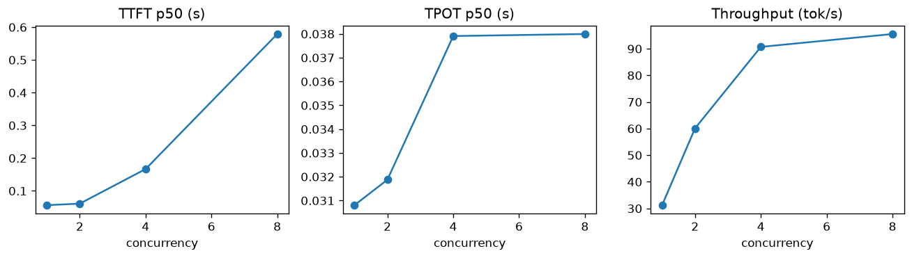
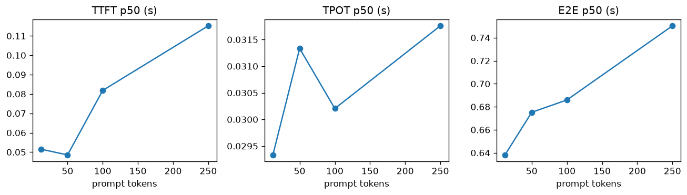
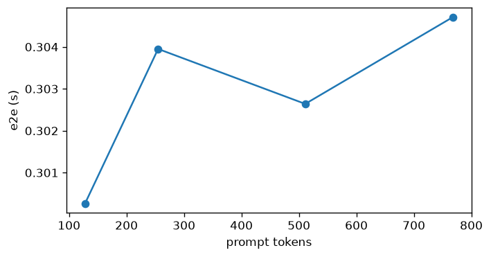

# 1.1 — Single-model performance

Notebook: [`1.1_single_model_performance.ipynb`](./1.1_single_model_performance.ipynb)

Single-model *metrics* only. Batching policy labs → [`2.1_batching.md`](./2.1_batching.md).

## Setup

| Item | Value |
|------|--------|
| Server | `single_model_llm_serving` · `:8000` |
| Stream | `POST /generate_stream` |
| vLLM | `POST /generate_vllm` (Part C only) |
| Model | Qwen2.5-7B (`QWEN_MODEL` in `local_paths.json`) |
| Decode cap | ~20 tokens (stream) |
| HF tokenize | ~512 |
| vLLM context | `max_model_len = 1024` |

CSVs: `../results/` · plots: `./images/1.1_part_*.png`

| Part | Question |
|------|----------|
| **A** Concurrency | Load → TTFT / tok/s |
| **B** Prompt length | Prefill → TTFT |
| **C** Long prompts (vLLM) | e2e vs length past HF 512 |

---

## Part A — Concurrency

**Results** (`concurrency_sweep.csv`):

| Conc | TTFT p50 | TPOT p50 | E2E p50 | tok/s | req/s | GPU util |
|-----:|---------:|---------:|--------:|------:|------:|---------:|
| 1 | 0.056 s | 0.031 s | 0.67 s | 31 | 1.5 | 19% |
| 2 | 0.061 s | 0.032 s | 0.70 s | 60 | 2.9 | 25% |
| 4 | 0.167 s | 0.038 s | 0.92 s | 91 | 4.3 | 25% |
| 8 | **0.58 s** | 0.038 s | 1.34 s | 96 | 4.5 | 25% |

- tok/s rises to ~4, then flattens (~91 → 96).
- At 8, TTFT jumps (0.17 → 0.58 s) — wait past `batch_size=4`.
- TPOT stays flat (~0.03 s).

**Takeaway:** Knee ≈ concurrency **4**.

---

## Part B — Prompt length (stream, conc=1)

**Results** (`prompt_length_sweep.csv`):

| Prompt tok | TTFT p50 | TPOT p50 | E2E p50 | tok/s | GPU util |
|-----------:|---------:|---------:|--------:|------:|---------:|
| 12 | 0.052 s | 0.029 s | 0.64 s | 33 | 22% |
| 50 | 0.049 s | 0.031 s | 0.68 s | 31 | 28% |
| 100 | 0.082 s | 0.030 s | 0.69 s | 31 | 31% |
| 250 | 0.115 s | 0.032 s | 0.75 s | 28 | 37% |

- TPOT flat. TTFT rises gently with prefill (0.05 → 0.12 s by 250 tok).
- Oversubscribe (A) often moves latency more than prompt length (B) on this setup.

---

## Part C — Long prompts (vLLM e2e)

**Results** (`vllm_prompt_length_e2e.csv`):

| Prompt tok | e2e | ok |
|-----------:|----:|:--:|
| 128 | 0.30 s | yes |
| 256 | 0.30 s | yes |
| 512 | 0.30 s | yes |
| 768 | 0.30 s | yes |

- 128–768 essentially flat on this model (~0.30 s).
- Stayed under `max_model_len=1024` so no context-edge artifact.

---

## Summary

| Finding | Part |
|---------|------|
| Throughput knee ~conc 4 | A |
| Oversubscribe → TTFT tax | A |
| Prefill mild ≤250 tok | B |
| Long prompt e2e flat to 768 (vLLM) | C |

## Bridge → topic 2

Part A already shows *seats and queues* in the metrics. Topic **2.1** studies batching policy with those pains:

- empty seats vs oversubscribe  
- how arrivals fill the batch  
- uneven prompt lengths in one wave  
- HF stream path vs vLLM batch path  

→ [`2.1_batching.md`](./2.1_batching.md) · [`../PLAN.md`](../PLAN.md)
