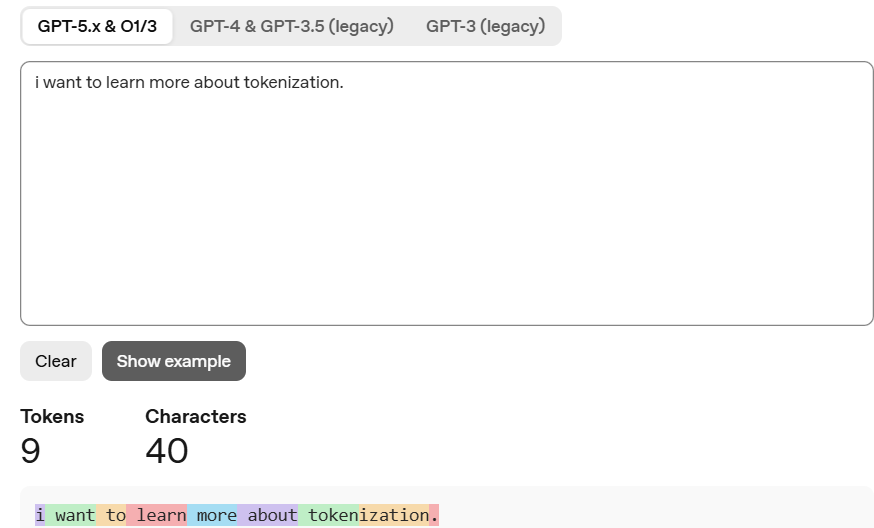
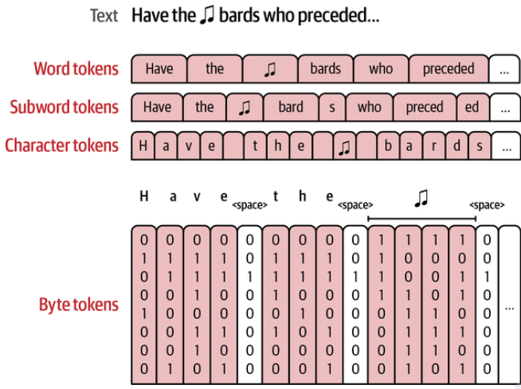
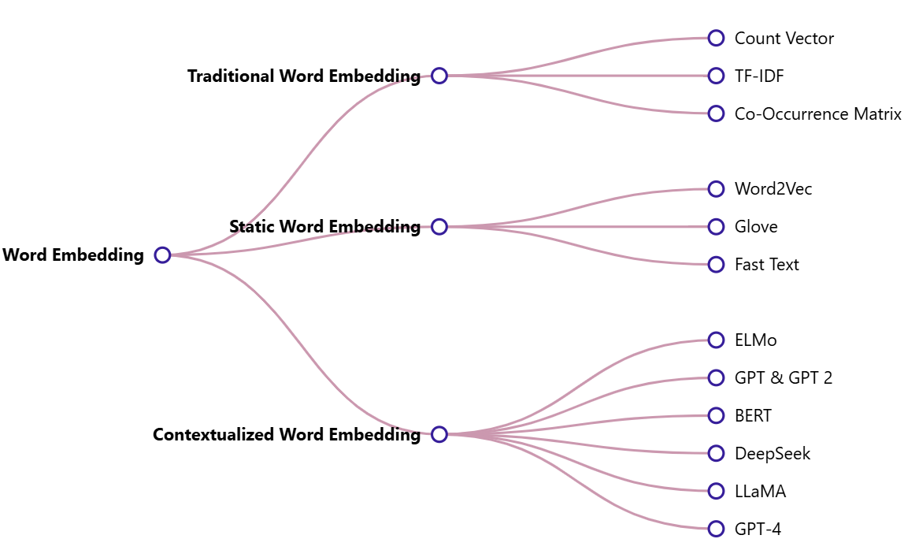

**Tokens**

Tokens are the means the model sees its inputs and outputs. A text sent to model is broken down into tokens
https://platform.openai.com/tokenizer

1 token ~ 4 characters ~ 3/4 word. 100 tokens ~ 75 words

Some tokens are
1. complete words (want, learn)
2. Part of words (token, ization)
3. Punctuation are their own token

**Tokenizer**

1. Word Tokens : Earliest of methods. One challenge is unable to deal with new words. All similar words have different tokens (problem, problematic, etc). Results in massive vocab size.
    
    * Ex : i want to learn ML
    * Word Token : "i", "want", "to", "learn", "ML"

2. Subword Tokens : Can represent new words - break down into characters that tend to be part of vocabulary already. Subword splitting lets model represent unseen words from known subwords

    * Ex : i want to learn ML nicely
    * Subword Token : "i", "want", "to", "learn", "ML", "nic", "ely"

    2.1 Frequent words stay as is.

    2.2 Rare words break down into recognizable roots.
    
    2.3 Prevent unknown words.

3. Character Tokens : Every words are split into letters. Tiny vocab (only similar alphabets) but lose context
    * Ex : i want to learn ML
    * Character Token : "i", "w", "a", "n", "t", etc

    

4. Byte Pair Encoding (BPE) :
Like subword tokenization. Data compression algorithm that iteratively merges most frequent parits of consecutive characters in given corpus.

    Steps:

        4.1   Sample Corpus : "ab", "bc", "bcd" and "cde"

        4.2   Initialization - split into individual characters 
            {"a", "b", "c", "d", "e"}

        4.3   Frequency Counting
            {"a": 1, "b": 3, "c": 3, "d": 2, "e": 1}

        4.4   Find most frequent pair
            "bc" 3 times

        4.5   Merge new subword
            {"a", "b", "c", "d", "e", "bc"}
            {"a": 1, "b": 1, "c": 1, "d": 2, "e": 1, "bc": 2}
            b & c freq reduces.

        4.5   Repeat steps until vocab size is reached

        4.6   Final subword units 
            {"a", "b", "c", "d", "e", "bc", "cd", "de","ab","bcd","cde"}

        4.7   Now original corpus get tokens like below
            "ab" -> "a" + "b"
            "bc" -> "bc"
            "bcd" -> "bc" + "d"
            "cde" -> "c" + "de"

    Encoding New Text - When a new text is provided, the tokenizer breaks it down into pieces by applying the learned merge rules sequentially. It matches the longest possible tokens existing in its vocabulary first. Any entirely unmapped sequence is ultimately broken down into its fundamental byte representations

**Token Embeddings**

Embeddings add meaning to the words or add contextual information. Initial algorithms were Word2Vec. Embeddings were generated by classification task. Train a NN to predict words commonly appear together. NN will take two words and predict 1 if appear together or 0 if not

Ex: i want to learn machine learning and human ethics.

Training Samples

| Word 1 | Word 2 | Target |
| ------ | ------ | ------ |
| i | want | 1 |
| want | to | 1 |
| to | learn | 1 |
| learn | machine | 1 |
| i | to | 1 |
| want | learn | 1 |
| to | machine | 1 |
| i | machine | 0 |
| want | machine | 0 |
| i | learn | 0 |

Good to add random negative examples. Now we take these pairs and give random token weights to each words and send it to NN and predict. Over training it will start updating embeddings.

Overview of different embedding techniques

