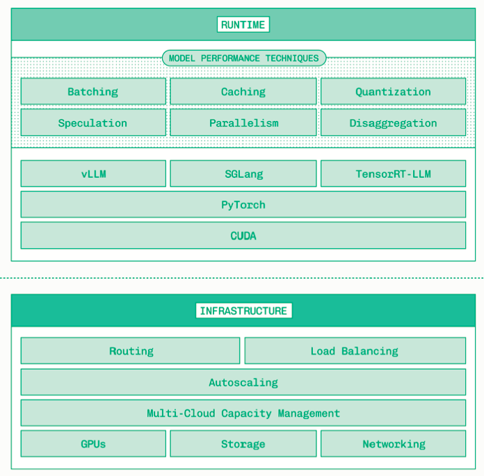

Inference

Training - Learning model weights from data
Inference - Serving AI model in production

Inference of generative models are not straight forward. Inference requires

• Runtime: Ensures LLM model runs efficiently. Optimization Tech - Caching, Batching, Quantizations, etc
• Infrastructure: No matter how efficient, it need scaling. GPU, Storage, Networking, Scaling etc. Infra - all available resources into one single unified pool of compute
• Tooling: Providing engineers working on inference with the right level of abstraction to balance control with productivity

In short, Inference Engineering is about making models faster, less expensive and more reliable without sacrificing quality.