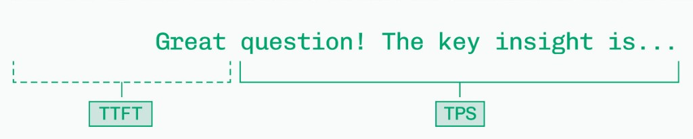

Training learns model weights from data. *Inference* is serving that model in production — turning prompts into tokens under latency, cost, and reliability constraints.

Inference for generative models is not a single forward pass. It needs three layers working together:

- *Runtime* — keep the model efficient: caching, batching, quantization, and related tricks
- *Infrastructure* — scale regardless of how efficient one GPU is: storage, networking, and a unified pool of compute
- *Tooling* — give engineers enough abstraction to move fast without losing control

<figure>

<figcaption>Figure 1. Runtime, infrastructure, and tooling</figcaption>
</figure>

In short, inference engineering is about making models faster, cheaper, and more reliable without sacrificing quality.

## 1. Latency metrics — TTFT, ITL, and TPS

When a user sends a prompt, the answer does not appear all at once. Two clocks matter: how long until the first token, and how fast the rest streams.

<figure>

<figcaption>Figure 2. TTFT is the wait before the first token; TPS is how fast the remaining tokens stream</figcaption>
</figure>

| Metric | Full name | What it measures |
|--------|-----------|------------------|
| TTFT | Time to first token | Delay from request arrival until the first output token |
| ITL | Inter-token latency | Time between consecutive tokens after the first |
| TPS | Tokens per second | Generation rate after the first token (roughly $1 / \text{ITL}$ when ITL is steady) |

- *TTFT* is dominated by *prefill*: processing the full prompt and building the KV cache before decode starts. Long prompts and heavy queues push TTFT up.
- *ITL* is the *decode* step time — one new token per forward (plus any scheduling delay). Users feel this as typing speed.
- *TPS* is the reciprocal view of ITL over a window: more tokens per second means lower average inter-token wait.

A good interactive experience usually needs both: low TTFT (the answer starts soon) and stable TPS / ITL (the answer keeps flowing). Optimizing only one often hurts the other under load.

### Percentile latency — what p50 means

Raw averages hide tails. Serving systems report *percentiles* of latency (for TTFT, ITL, or end-to-end).

*p50* (the median): half of requests are faster, half are slower. In plain language: **1 in every 2 requests is slower than this number.**

| Percentile | Meaning |
|------------|---------|
| p50 | 1 in 2 is slower |
| p90 | 1 in 10 is slower |
| p99 | 1 in 100 is slower |

p50 is a useful “typical user” number. For SLOs, also watch p90 / p99 — that is where queueing, long prompts, and interference show up.

## 2. Arithmetic intensity — attention as an example

GPUs have two speed limits: how fast they do math (*FLOPS*) and how fast they move data from HBM (*bandwidth*). Which one bites depends on *arithmetic intensity*:

$$
\text{Arithmetic intensity} = \frac{\text{FLOPs performed}}{\text{bytes moved}} \quad [\text{FLOPs/byte}]
$$

- High intensity → lots of math per byte loaded → often *compute-bound*
- Low intensity → little reuse of loaded bytes → often *memory-bandwidth-bound*

### Llama 3 8B decode attention vs H100 ridge

Worked example: Llama 3 8B (GQA), FP16 (2 bytes per element), sequence length $n{=}100$, one layer, attention-over-cache only (no $W_Q / W_K / W_V$ or MLP weight traffic).

Matmul FLOPs use the usual $2mkn$ count (multiply + add). Softmax is $O(n)$ and negligible next to the matmuls, so we omit it.

*H100 SXM ridge* (machine balance) — dense BF16 Tensor peak, not the sparse datasheet number:

$$
\frac{989\ \text{TFLOPS}}{3.35\ \text{TB/s}} \approx 295\ \text{FLOPs/byte}
$$

Workloads below this line are memory-bandwidth-bound on that GPU; above it are compute-bound. See [GPU Architecture](./gpu-architecture).

| Spec | Value |
|------|------:|
| Query heads $n_q$ | 32 |
| KV heads $n_{kv}$ | 8 |
| Head dim $d$ | 128 |
| Hidden size | 4096 |

GQA: 32 queries attend; only 8 key/value heads are cached (each KV head shared by 4 queries).

| Tensor / op | Read (bytes) | Compute (FLOPs) | Write (bytes) |
|-------------|-------------:|----------------:|--------------:|
| $Q$ $(n_q \times d)$ | $32 \times 128 \times 2 = 8{,}192$ | — | — |
| $K$ $(n \times n_{kv} \times d)$ | $100 \times 8 \times 128 \times 2 = 204{,}800$ | — | — |
| $V$ $(n \times n_{kv} \times d)$ | $100 \times 8 \times 128 \times 2 = 204{,}800$ | — | — |
| $QK^\top$ (32 heads) | — | $32 \times 2 \times 128 \times 100 = 819{,}200$ | — |
| $\mathrm{scores}\,V$ (32 heads) | — | $32 \times 2 \times 100 \times 128 = 819{,}200$ | — |
| output $(1 \times 4096)$ | — | — | $4096 \times 2 = 8{,}192$ |
| Total | 417,792 | 1,638,400 | 8,192 |

$$
\begin{align*}
\text{Memory} &= 417{,}792 + 8{,}192 = 425{,}984\ \text{bytes} \\
\text{AI} &= \frac{1{,}638{,}400}{425{,}984} \approx 3.8\ \text{FLOPs/byte}
\end{align*}
$$

Large-$n$ asymptote (KV dominates): $\approx 4\,n_q\,d / (2\,n_{kv}\,d \cdot 2) = n_q / n_{kv} = 4$ FLOPs/byte.

| Workload | AI (FLOPs/byte) | vs H100 ridge (~295) | Regime on H100 |
|----------|----------------:|----------------------|----------------|
| Llama 3 8B GQA ($n{=}100$) | ~3.8 | ≪ ridge | Memory-bound |
| Llama 3 8B GQA (large $n$) | ~4 | ≪ ridge | Memory-bound |
| H100 SXM dense BF16 | ~295 | — | Ridge |

Decode attention alone sits far below the H100 line. A full decode step is even hungrier for bandwidth: every layer also rereads all attention and MLP weights — which is why HBM GB/s, quantization, and batching move TPS more than raw TFLOPS.

Contrast with *prefill*, where many tokens reuse the same loaded weights → intensity rises toward (or past) the ridge → more compute-bound. That is why TTFT and TPS respond to different hardware knobs.

For the hardware ridge line and prefill vs decode in more detail, see [GPU Architecture for LLM Inference](./gpu-architecture).
