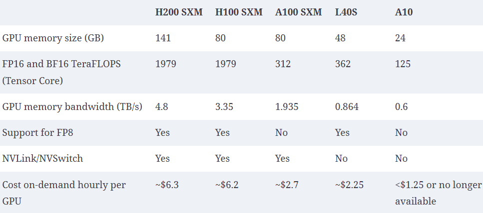

LLM inference lives or dies on the GPU. Before you tune batching, KV cache, or a serving engine, you need a clear mental model of what the hardware is actually doing.

This note covers three numbers on every GPU datasheet, arithmetic intensity (compute- vs memory-bound), how GPUs talk to each other inside and across nodes, and how to choose when two cards pull in opposite directions — like H100 SXM vs H100 NVL.

---

## 1. Understanding GPUs

A CPU is optimized for a few complex tasks at once. A GPU is optimized for **many simple math operations in parallel** — exactly the pattern of matrix multiplies that transformers are built from.

For inference, think of the GPU as three coupled resources:

| Spec | What it is | What it limits for LLMs |
|------|------------|-------------------------|
| **Compute (TFLOPS)** | How fast the cores can do math | Prefill speed, dense matmul throughput |
| **Memory (GB)** | How much HBM you can hold | Model weights + KV cache + activations |
| **Bandwidth (TB/s)** | How fast data moves between HBM and cores | Decode tokens/sec, how fast weights are fed |

If any one of these is short for your workload, the other two cannot fully help. That imbalance is why two "H100" cards can feel very different in practice.

---

## 2. Teraflops — how fast can it calculate?

**FLOPS** = floating-point operations per second.  
**TFLOPS** = $10^{12}$ FLOPS (teraflops).

Datasheets list different TFLOPS for different precisions (FP32, BF16, FP8, …). For modern LLMs you usually care about **Tensor Core** numbers at **BF16 / FP16 / FP8**, not the plain FP32 figure.

Rough intuition:

- Higher TFLOPS → more matrix multiplies per second  
- Prefill (processing the prompt) is often **compute-heavy** — more FLOPS helps  
- Decode (emitting one token at a time) is often **not** FLOPS-limited on large models — the cores sit waiting for memory

So "faster GPU" on paper does not always mean "faster tokens/sec" for chat serving. It depends which phase dominates your traffic.

---

## 3. Memory — can the model fit?

GPU **HBM capacity** (e.g. 24 GB, 48 GB, 80 GB) is the first hard wall.

At load time you need room for:

1. **Weights** — the model parameters
2. **KV cache** — past keys and values for every active sequence
3. **Misc** — activations, CUDA context, allocator fragmentation, engine buffers

Section 4 works the numbers: model size, KV cache from tensor shapes, and how many parallel requests fit on 24 GB vs 48 GB.

That is why a model that "fits" at idle can still OOM under load. Memory decides **whether** you can serve; bandwidth and FLOPS decide **how fast**.

---

## 4. Sizing — model, KV cache, and misc

Budget GPU memory as:

$$
\text{GPU memory} \approx \text{model weights} + \text{KV cache} + \text{misc}
$$

### 4.1 Model size

Rough estimate:

$$
\text{Weight memory (bytes)} \approx \text{parameters} \times \text{bytes per parameter}
$$

| Format | Bits | Size in bytes |
|--------|------|---------------|
| FP32 (single precision) | 32 | 4 |
| FP16 (half) / BF16 | 16 | 2 |
| INT8 / FP8 | 8 | 1 |
| INT4 (common weight quant) | 4 | 0.5 |

Examples (weights only):

| Parameters | FP16 / BF16 | FP8 / INT8 | INT4 |
|------------|-------------|------------|------|
| 7B–8B | ~14–16 GB | ~7–8 GB | ~3.5–4 GB |
| 70B | ~140 GB | ~70 GB | ~35 GB |

### 4.2 KV cache size — from the transformer shapes

Keys and values are what get cached. Use a consistent shape from the full transformer dimension diagram:

Hyperparameters in that figure:

| Symbol | Value | Meaning |
|--------|-------|---------|
| batch $B$ | 128 | parallel sequences |
| sequence $S$ | 100 | tokens in context |
| $d_{\text{model}}$ | 512 | model width |
| heads $H$ | 8 | attention heads |
| $d_k$ | 64 | per-head size ($d_{\text{model}} / H$) |

Projected **K** and **V** each have shape $(B,\ H,\ S,\ d_k) = (128,\ 8,\ 100,\ 64)$.

For **one** attention layer, store K and V:

$$
\text{KV elements per layer} = 2 \times B \times H \times S \times d_k
$$

$$
\begin{align*}
&= 2 \times 128 \times 8 \times 100 \times 64 \\
&= 13{,}107{,}200 \text{ elements}
\end{align*}
$$

At FP16 (2 bytes):

$$
13{,}107{,}200 \times 2 \approx 26.2\ \text{MB per layer}
$$

Check: $H \times d_k = d_{\text{model}}$, so the same number is $2 \times B \times S \times d_{\text{model}} \times \text{bytes}$.

For a stack of $L$ layers (decoder self-attention — the usual LLM case):

$$
\text{KV cache} = 2 \times L \times B \times H \times S \times d_k \times \text{bytes}
$$

Classic small transformer with $L = 6$, FP16, same $B,S$:

$$
6 \times 26.2\ \text{MB} \approx 157\ \text{MB}
$$

Tiny vs the weights — because $d_{\text{model}}=512$ and $S=100$. Real models are wider, deeper, and use much longer contexts.

**Per-token form** (handy for serving math):

$$
\text{bytes per token (all layers)} = 2 \times L \times H \times d_k \times \text{bytes}
$$

Diagram model, $L=6$, FP16: $2 \times 6 \times 8 \times 64 \times 2 = 12{,}288$ bytes ≈ **12 KB per token**.
At $S=100$: $12\ \text{KB} \times 100 = 1.2\ \text{MB per sequence}$; $\times B=128$ ≈ 157 MB — same as above.

### 4.3 Rough estimate for a modern 7B–8B model

Take a Llama-3-class **8B** decoder-only model (GQA):

| Spec | Typical value |
|------|----------------|
| Parameters | ~8B |
| Layers $L$ | 32 |
| KV heads $H_{\text{kv}}$ | 8 (not 32 — grouped-query attention) |
| Head dim $d_k$ | 128 |
| Weight dtype | BF16 / FP16 → ~**16 GB** weights |

Per token (K+V, all layers, FP16):

$$
2 \times 32 \times 8 \times 128 \times 2 = 131{,}072\ \text{bytes} \approx \mathbf{128\ \text{KB/token}}
$$

| Context length $S$ | KV for **1** request | KV for **batch $B$** |
|--------------------|----------------------|----------------------|
| 1k | ~128 MB | $B \times 128$ MB |
| 2k | ~256 MB | $B \times 256$ MB |
| 4k | ~512 MB | $B \times 512$ MB |
| 8k | ~1 GB | $B \times 1$ GB |

GQA (8 KV heads) already cuts KV vs full MHA (32 heads) by ~4×. Multi-query / more aggressive GQA shrinks it further.

### 4.4 Misc (everything else)

Reserve headroom beyond weights + KV:

| Item | Typical ballpark |
|------|------------------|
| CUDA context + cuBLAS / engine | ~0.5–2 GB |
| Activations / workspace (prefill) | grows with $B$ and $S$; often 1–4+ GB |
| Fragmentation / allocator slack | ~10% of free memory is a safe cushion |
| Torch / vLLM overhead | depends on engine; keep a fixed reserve |

Rule of thumb for planning:

$$
\text{Usable for KV} \approx \text{GPU GB} - \text{weights} - \text{misc reserve}
$$

Use **~2–4 GB** misc on a 24 GB card and **~3–5 GB** on a 48 GB card unless you have measured otherwise.

### 4.5 Scaling on 24 GB vs 48 GB — how many parallel requests?

Example: **8B BF16** (~16 GB weights), FP16 KV (~128 KB/token), misc reserved as below.

**24 GB GPU** (e.g. A10-class / consumer 24 GB):

| | Estimate |
|---|----------|
| Weights | 16 GB |
| Misc reserve | 3 GB |
| **Left for KV** | **~5 GB** |

$$
\text{Max total cached tokens} \approx \frac{5\ \text{GB}}{128\ \text{KB/token}} \approx 40{,}000\ \text{tokens}
$$

| Avg context per request | Max concurrent batch $B$ (approx.) |
|-------------------------|-------------------------------------|
| 1k tokens | ~40 |
| 2k | ~20 |
| 4k | ~10 |
| 8k | ~5 |

**48 GB GPU** (e.g. L40S):

| | Estimate |
|---|----------|
| Weights | 16 GB |
| Misc reserve | 4 GB |
| **Left for KV** | **~28 GB** |

$$
\text{Max total cached tokens} \approx \frac{28\ \text{GB}}{128\ \text{KB/token}} \approx 224{,}000\ \text{tokens}
$$

| Avg context per request | Max concurrent batch $B$ (approx.) |
|-------------------------|-------------------------------------|
| 1k tokens | ~220 |
| 2k | ~110 |
| 4k | ~55 |
| 8k | ~28 |

Same model, same dtype: **~5–6× more concurrent sequences** on 48 GB than on 24 GB, because almost all of the extra 24 GB becomes KV headroom.

What changes the batch you can actually run:

- **Longer context** → fewer parallel requests (linear in $S$)
- **FP8/INT8 weights** → more room for KV (e.g. ~8 GB weights → much higher $B$ on 24 GB)
- **Larger model** (70B) → may not fit in 24/48 GB without quant + multi-GPU
- **Prefill activations** → peak memory can exceed the steady decode KV budget; engines often limit max batch/context for that reason

So the 24 vs 48 GB question is rarely "does 8B fit?" (both can). It is "**how much concurrent context** can I keep warm?" — and that is almost entirely a KV-cache sizing problem once weights are loaded.

---

## 5. CPU memory vs GPU memory

At a high level, CPU memory and GPU memory are built for different jobs:

| | CPU memory | GPU memory |
|---|------------|------------|
| Technology | DRAM (typically DDR) | **HBM** — a stacked, wide form of DRAM |
| Optimized for | Capacity and general-purpose access | Massive parallel data movement |
| Role in inference | Host OS, request queues, staging | **Where model weights (and KV) should live** |

**GPU memory is where the model weights should be cached.** The Tensor Cores only see data that is already in (or streaming from) HBM. If weights sit in CPU memory instead, every use requires a transfer over PCIe into the GPU. That extra hop adds latency that is usually unacceptable for interactive serving.

Bandwidth across the memory hierarchy makes the gap obvious:

| Hard disk (SSD) bandwidth | CPU memory bandwidth | GPU memory bandwidth |
|---------------------------|----------------------|----------------------|
| 0.5 to 14 GB/s | 50 to 200 GB/s | 300 GB/s to 3 TB/s |

Roughly: SSD ≪ CPU DRAM ≪ GPU HBM. Loading from disk into CPU RAM is already slow relative to serving; streaming weights from CPU to GPU on the critical path is slower still relative to what HBM can feed the cores.

Practical rule:

1. **Load once** — move weights from disk → CPU → GPU at startup (or when swapping models).  
2. **Serve from HBM** — keep weights (and active KV) on the GPU for the lifetime of the process.  
3. Treat CPU RAM as staging and orchestration, not as the hot weight store for latency-sensitive inference.

Offloading weights to CPU (or disk) can stretch what fits on a small GPU, but you pay in tokens/sec. For production chat latency, plan so the working set fits in GPU memory.

---

## 6. Bandwidth — how fast can data move?

**Memory bandwidth** is how quickly bytes travel from HBM to the compute units (and back). Units are GB/s or TB/s.

During decode, generating one token often requires reading a large fraction of the weights (and touching KV). If the cores finish their math before the next tile of weights arrives, they stall. That is a **memory-bandwidth-bound** regime — common for LLM decode.

Intuition:

$$
\text{Rough decode ceiling} \propto \frac{\text{memory bandwidth}}{\text{bytes read per token}}
$$

More bandwidth → more tokens/sec when you are bandwidth-bound.  
More FLOPS alone barely moves the needle in that regime.

Prefill can flip the story: long prompts do a lot of arithmetic per byte loaded, so you may become **compute-bound** instead.

---

## 7. Arithmetic intensity — compute bound vs memory bound

FLOPS and bandwidth alone do not say which one limits you. **Arithmetic intensity** ties them together:

$$
\text{Arithmetic intensity} = \frac{\text{compute performed}}{\text{bytes moved from memory}} \quad [\text{FLOPs/byte}]
$$

A related hardware ratio (sometimes called the ridge point / machine balance) is:

$$
\frac{\text{peak compute (TFLOPS)}}{\text{peak memory bandwidth}} \quad \text{also in FLOPs/byte}
$$

Compare the two:

| If workload intensity is… | Relative to GPU peak FLOPs/byte | The task is… | What helps |
|---------------------------|----------------------------------|--------------|------------|
| **High** | Above the ridge | **Compute-bound** | More TFLOPS |
| **Low** | Below the ridge | **Memory-bandwidth-bound** | More GB/s (HBM bandwidth) |

- **Compute-bound** — Tensor Cores stay busy; speeding up memory barely helps.
- **Memory-bandwidth-bound** — cores finish early and wait for HBM; more FLOPS barely helps.

### Matrix size moves the boundary

The same GPU can be compute-bound on one matmul and memory-bound on another. Arithmetic intensity of $A_{m \times k} \times B_{k \times n}$ scales with how much **reuse** you get from each loaded byte.

- **Large / square-ish matrices** (big $m,n,k$) → many FLOPs per byte loaded → intensity rises → tends toward **compute-bound**.
- **Skinny / small matrices** (tiny batch, $m{=}1$, or short inner dimension) → little reuse → intensity falls → tends toward **memory-bound**.

So "is this GPU compute- or bandwidth-limited?" is not a property of the card alone — it depends on the **shapes** you run.

### Prefill vs decode

LLM inference splits into two phases with very different intensities:

| Phase | What happens | Intensity | Usually… |
|-------|--------------|-----------|----------|
| **Prefill** | Process the whole prompt in one (or few) forward passes | High — many tokens reuse the same weights | **Compute-bound** (or closer to it) |
| **Decode** | Emit one new token; often reread most weights + touch KV | Low — little reuse per step | **Memory-bandwidth-bound** |

That is why:

- Faster **TFLOPS** (and larger effective matmuls via batching many prefills) speeds **time-to-first-token**.
- Faster **HBM bandwidth** (and tricks that cut bytes moved — quantisation, GQA, PagedAttention) speeds **tokens/sec after the first token**.
- Continuous batching / larger decode batches raise intensity a bit by sharing weight traffic across sequences — still often bandwidth-bound, but less painfully so.

Roofline in one sentence: raise arithmetic intensity (bigger mats, more batching) until you hit the compute roof; if you cannot, buy bandwidth (or move fewer bytes).

---

## 8. Inter-GPU connection — how GPUs talk to each other

HBM bandwidth moves data **inside** one GPU. Once a model is sharded across devices (tensor parallel, pipeline parallel, expert parallel), another link matters: **how fast GPUs exchange activations and gradients with each other**.

### Node

A **node** is one server: shared CPU, RAM, PCIe topology, and usually a fixed set of GPUs (often 2, 4, or 8). Communication **within a node** can use PCIe, an NVLink bridge, or a full NVLink/NVSwitch fabric. Communication **across nodes** goes over the cluster network (typically InfiniBand or Ethernet) and is much slower.

### PCIe

**PCIe** is the general-purpose host interconnect. Every GPU hangs off it for CPU traffic, and GPU-to-GPU can fall back to PCIe when there is no NVLink path. On H100-class systems that is about **128 GB/s** — usable, but a steep drop from NVLink when you do heavy all-reduce / all-gather during tensor parallel.

### NVLink Bridge

An **NVLink Bridge** is a physical bridge that pairs PCIe GPUs (e.g. two H100 NVL cards) so they get a direct NVLink path without a full SXM board + NVSwitch. Typical bandwidth: **~600 GB/s**. Good for a two-GPU “fat” memory pool (e.g. ~188 GB on bridged H100 NVL), less flexible than an all-to-all NVSwitch fabric.

### NVLink / NVSwitch

**NVLink** is NVIDIA’s high-bandwidth GPU-to-GPU link. On SXM systems, GPUs connect through **NVSwitch**, which gives every GPU in the node a high-bandwidth path to every other GPU — not just a pairwise bridge. H100 SXM NVLink is about **900 GB/s** per GPU. That is what you want for dense multi-GPU tensor parallel inside one node.

### Bandwidth ladder (typical H100-era numbers)

| Setup | Bandwidth |
|-------|-----------|
| GPU-to-GPU within node with NVLink/NVSwitch | 900 GB/s |
| GPU-to-GPU within node with NVLink Bridge | 600 GB/s |
| GPU-to-GPU within node with PCIe | 128 GB/s |
| GPU-to-GPU across node | 50 GB/s |

Order of magnitude matters more than the exact datasheet row:

- **Within-node NVLink/NVSwitch** — cheapest place to put tensor parallel  
- **NVLink Bridge** — strong pairwise link; great for 2-GPU setups  
- **PCIe** — fine for light traffic; painful as the main TP fabric  
- **Across node (~50 GB/s)** — pipeline / data parallel friendly; avoid chatty collective patterns here if you can keep shards inside one node

For inference: keep tightly coupled shards (tensor parallel) on the fastest link you have. Push only coarser splits (pipeline stages, whole replicas) across nodes.

---

## 9. Choosing among the three — H100 SXM vs H100 NVL

NVIDIA's own H100 lineup makes the trade-off concrete:

| Spec | H100 SXM | H100 NVL |
|------|----------|----------|
| BF16 Tensor Core* | ~1,979 TFLOPS | ~1,671 TFLOPS |
| FP8 Tensor Core* | ~3,958 TFLOPS | ~3,341 TFLOPS |
| GPU memory | 80 GB HBM3 | 94 GB HBM3 |
| Memory bandwidth | ~3.35 TB/s | ~3.9 TB/s |
| Form factor / TDP | SXM, up to ~700 W | PCIe, ~350–400 W |
| NVLink | ~900 GB/s | ~600 GB/s (bridge) |

\*With sparsity, as listed on NVIDIA datasheets. Dense numbers are lower; the **relative** gap still favors SXM on compute.

**SXM calculates faster** — higher FLOPS and stronger multi-GPU NVLink.  
**NVL holds more and feeds faster** — ~17% more memory and ~17% more HBM bandwidth, at lower power, in a PCIe form factor. Two NVL cards can also be bridged for ~188 GB — useful for models like Llama-class 70B.

### How do you choose?

Ask which resource is the bottleneck for *your* workload:

| Situation | Lean toward |
|-----------|-------------|
| Prefill-heavy / high arithmetic intensity / training-like bursts | **SXM** (FLOPS + NVLink) |
| Model barely fits, or you need more KV headroom on one GPU | **NVL** (capacity) |
| Decode-heavy chat serving, bandwidth-bound | **NVL** (bandwidth) often wins or ties despite fewer FLOPS |
| Dense multi-GPU nodes, max interconnect | **SXM** |
| Power / cooling / PCIe servers | **NVL** |

Rule of thumb for inference:

1. **Fit first** — memory (weights + KV under target concurrency). If it does not fit, FLOPS do not matter.  
2. **Then feed the cores** — bandwidth for decode throughput.  
3. **Then burn FLOPS** — compute for prefill and for workloads that keep Tensor Cores saturated.

SXM is not "strictly better." NVL is not "strictly better for inference." Match the scarce resource.

---

## 10. Analogy — kitchen, pantry, and conveyor

Imagine a restaurant kitchen:

| GPU spec | Kitchen role |
|----------|--------------|
| **TFLOPS** | How fast the chefs can cook |
| **Memory** | How large the pantry is |
| **Bandwidth** | How fast the conveyor brings ingredients from pantry to stove |

- Huge pantry, slow conveyor → chefs stand idle (bandwidth bound).  
- Tiny pantry, fast chefs → you cannot store tonight's menu (memory bound).  
- Giant conveyor and pantry, few chefs → food piles up uncooked (compute bound).

**Finding a balance:** size the kitchen for the meal you actually serve.

- Serving many short chat replies (decode-heavy) → prioritize pantry + conveyor (memory + bandwidth).  
- Digesting long documents in one shot (prefill-heavy) → prioritize chefs (FLOPS).  
- Hosting a model that barely fits → enlarge the pantry first; then re-check conveyor and chefs.

A practical way to "find the balance" on real hardware:

1. Load the model and measure **peak memory** at your target batch / context.  
2. Profile whether decode kernels are **waiting on memory** or **busy on Tensor Cores**.  
3. Only then pick (or pay for) more FLOPS vs more HBM / bandwidth.

That is the same three-way trade-off as H100 SXM vs NVL — written as a kitchen instead of a datasheet.

---

## 11. GPU comparison snapshot

Putting the earlier ideas side by side across common inference cards:

| Spec | H200 SXM | H100 SXM | A100 SXM | L40S | A10 |
|------|----------|----------|----------|------|-----|
| GPU memory (GB) | 141 | 80 | 80 | 48 | 24 |
| FP16 / BF16 Tensor Core (TFLOPS) | 1979 | 1979 | 312 | 362 | 125 |
| Memory bandwidth (TB/s) | 4.8 | 3.35 | 1.935 | 0.864 | 0.6 |
| FP8 support | Yes | Yes | No | Yes | No |
| NVLink / NVSwitch | Yes | Yes | Yes | No | No |
| On-demand cost / GPU-hour | ~$6.3 | ~$6.2 | ~$2.7 | ~$2.25 | <$1.25 or N/A |

### What this table is telling you

- **Compute leap at Hopper.** A100 sits at ~312 TFLOPS; H100/H200 jump to ~1979. Prefill-heavy work gets a large step-change on H-class cards.
- **H200 vs H100 is mostly memory, not FLOPS.** Same TFLOPS (~1979), but H200 brings 141 GB and 4.8 TB/s vs 80 GB and 3.35 TB/s — almost the same hourly price. Prefer H200 when you are capacity- or bandwidth-bound (large models, long context, decode-heavy serving).
- **NVLink draws a hard line.** H200 / H100 / A100 can use the fast within-node fabric from §8. L40S and A10 fall back to PCIe for GPU-to-GPU — fine for single-GPU or lightly coupled setups, painful for dense tensor parallel.
- **FP8 is a modern inference lever.** H-series and L40S can run FP8; A100 and A10 cannot. That helps fit more model (or more KV) on the same card.
- **Cost vs capability.** A100 is the mid-price NVLink option. L40S is cheaper with FP8 but no NVLink. A10 is the low-cost single-GPU tier. Pay H200/H100 rates when you need Hopper compute *and* (for H200) memory/bandwidth headroom.

---

## Takeaways

- **TFLOPS** = compute rate; matters most when the GPU is compute-bound (often prefill).  
- **Memory** = weights + KV + misc; size KV from $2 L H_{kv} d_k$ bytes per token.  
- **24 vs 48 GB** — for an 8B BF16 model, extra VRAM mostly buys concurrent context, not “fit.”  
- **CPU DRAM vs GPU HBM** — weights must live in HBM for low-latency serving; SSD ≪ CPU ≪ GPU in bandwidth.  
- **Bandwidth** = feed rate; often caps decode tokens/sec.  
- **Arithmetic intensity** (FLOPs/byte) decides compute-bound vs memory-bound; matrix shape and prefill vs decode move that line.  
- **Interconnect** = how GPUs share work: NVSwitch (~900 GB/s) > NVLink Bridge (~600) > PCIe (~128) ≫ cross-node (~50).  
- **H100 SXM** wins on FLOPS and NVLink; **H100 NVL** wins on memory, bandwidth, and power/form factor.  
- **H200** is the H100 compute profile with more HBM and bandwidth — often the better inference pick when memory-bound.  
- Choose by bottleneck: fit → feed → compute — and keep tensor-parallel traffic on the fastest link you can.

Next in this series: how serving engines use that GPU memory for KV cache and keep the device busy under many concurrent requests.
