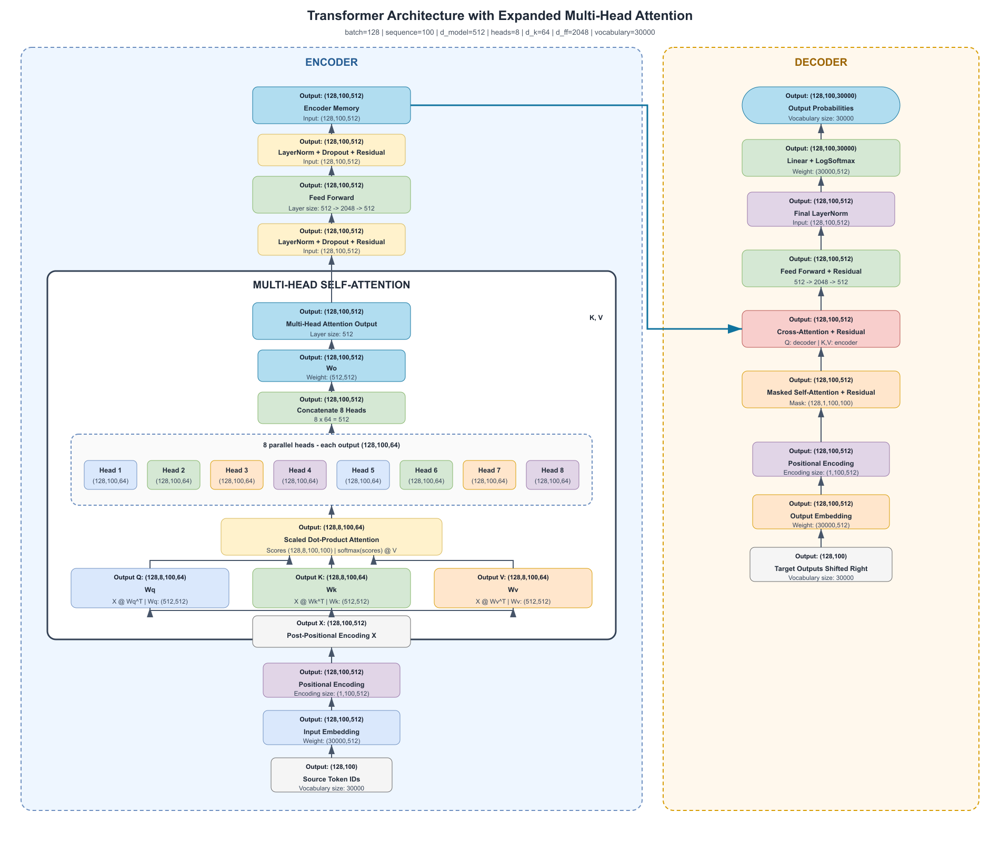

LLM inference lives or dies on the GPU. Before you tune batching, KV cache, or a serving engine, you need a clear mental model of what the hardware is doing — and which number on the datasheet actually matters for *your* traffic.

This note is that story: where the model must live, how to size memory, what limits speed (and why prefill and decode disagree), how GPUs talk to each other, and how to pick a card when specs pull in opposite directions.

## 1. The mental model — three resources, one kitchen

A CPU is built for a few complex tasks at once. A GPU is built for many simple math operations in parallel — the pattern of matrix multiplies that transformers are made of.

For inference, treat every GPU as three coupled resources. A kitchen analogy keeps them straight:

| Spec | What it is | Kitchen role | What it limits for LLMs |
|------|------------|--------------|-------------------------|
| Compute (TFLOPS) | How fast the cores do math | Chefs | Prefill, dense matmuls |
| Memory (GB) | How much HBM you hold | Pantry size | Weights + KV + workspace |
| Bandwidth (TB/s) | How fast HBM feeds the cores | Conveyor to the stove | Decode tokens/sec |

- Huge pantry, slow conveyor → chefs idle (*bandwidth-bound*).
- Tiny pantry, fast chefs → tonight’s menu does not fit (*capacity-bound*).
- Giant pantry and conveyor, few chefs → food piles up uncooked (*compute-bound*).

If any one is short for your workload, the other two cannot fully help. That imbalance is why two “H100” cards can feel very different in practice.

## 2. Where the model must live — CPU DRAM vs GPU HBM

At a high level, CPU memory and GPU memory are different technologies:

| | CPU memory | GPU memory |
|---|------------|------------|
| Technology | DRAM (typically DDR) | HBM — stacked DRAM built for parallel access |
| Optimized for | Capacity, general-purpose access | Massive data movement to many cores |
| Role in inference | OS, queues, staging | Hot store for weights and KV |

The Tensor Cores only see data that is already in (or streaming from) HBM. If weights sit in CPU memory, every use pays a PCIe transfer — usually unacceptable for interactive serving.

Bandwidth across the hierarchy makes the gap obvious:

| SSD | CPU memory | GPU HBM |
|-----|------------|---------|
| 0.5–14 GB/s | 50–200 GB/s | 300 GB/s – 3 TB/s |

SSD ≪ CPU DRAM ≪ GPU HBM.

Practical rule: load once (disk → CPU → GPU at startup), then serve from HBM. Treat CPU RAM as staging, not the hot weight store. Offloading to CPU can stretch a small GPU, but you pay in tokens/sec.

## 3. Sizing the pantry — weights, KV cache, misc

GPU HBM capacity (24 GB, 48 GB, 80 GB, …) is the first hard wall. Budget it as:

$$
\text{GPU memory} \approx \text{model weights} + \text{KV cache} + \text{misc}
$$

A model that “fits” at idle can still OOM under load. Memory decides *whether* you can serve; bandwidth and FLOPS decide *how fast*.

### Weights

$$
\text{Weight memory (bytes)} \approx \text{parameters} \times \text{bytes per parameter}
$$

| Format | Bits | Bytes |
|--------|------|-------|
| FP32 | 32 | 4 |
| FP16 / BF16 | 16 | 2 |
| INT8 / FP8 | 8 | 1 |
| INT4 | 4 | 0.5 |

| Parameters | FP16 / BF16 | FP8 / INT8 | INT4 |
|------------|-------------|------------|------|
| 7B–8B | ~14–16 GB | ~7–8 GB | ~3.5–4 GB |
| 70B | ~140 GB | ~70 GB | ~35 GB |

### KV cache — from transformer shapes

Keys and values are what get cached. Use a consistent shape from the dimension diagram:

<figure>

<figcaption>Figure 1. Transformer dimensions used for KV sizing (batch 128, sequence 100, d_model 512, heads 8, d_k 64)</figcaption>
</figure>

| Symbol | Value in the figure | Meaning |
|--------|---------------------|---------|
| batch $B$ | 128 | parallel sequences |
| sequence $S$ | 100 | tokens in context |
| $d_{\text{model}}$ | 512 | model width |
| heads $H$ | 8 | attention heads |
| $d_k$ | 64 | per-head size ($d_{\text{model}} / H$) |

Projected K and V each have shape $(B,\ H,\ S,\ d_k) = (128,\ 8,\ 100,\ 64)$.

For one attention layer, store K and V:

$$
\text{KV elements per layer} = 2 \times B \times H \times S \times d_k
$$

$$
\begin{align*}
&= 2 \times 128 \times 8 \times 100 \times 64 \\
&= 13{,}107{,}200 \text{ elements}
\end{align*}
$$

At FP16 (2 bytes):

$$
13{,}107{,}200 \times 2 \approx 26.2\ \text{MB per layer}
$$

Check: $H \times d_k = d_{\text{model}}$, so the same number is $2 \times B \times S \times d_{\text{model}} \times \text{bytes}$.

For a stack of $L$ layers (decoder self-attention — the usual LLM case):

$$
\text{KV cache} = 2 \times L \times B \times H \times S \times d_k \times \text{bytes}
$$

Classic small transformer with $L = 6$, FP16, same $B,S$:

$$
6 \times 26.2\ \text{MB} \approx 157\ \text{MB}
$$

Tiny versus the weights — because $d_{\text{model}}=512$ and $S=100$. Real models are wider, deeper, and use much longer contexts.

Per-token form (handy for serving math):

$$
\text{bytes per token (all layers)} = 2 \times L \times H \times d_k \times \text{bytes}
$$

Diagram model, $L=6$, FP16: $2 \times 6 \times 8 \times 64 \times 2 = 12{,}288$ bytes ≈ 12 KB per token.  
At $S=100$: $12\ \text{KB} \times 100 = 1.2\ \text{MB per sequence}$; $\times B=128$ ≈ 157 MB — same as above.

### Rough estimate for a modern Llama-class 8B

Take a Llama-3-class 8B decoder-only model (GQA):

| Spec | Typical value |
|------|----------------|
| Parameters | ~8B |
| Layers $L$ | 32 |
| KV heads $H_{\text{kv}}$ | 8 (not 32 — grouped-query attention) |
| Head dim $d_k$ | 128 |
| Weight dtype | BF16 / FP16 → ~16 GB weights |

Per token (K+V, all layers, FP16):

$$
2 \times 32 \times 8 \times 128 \times 2 = 131{,}072\ \text{bytes} \approx 128\ \text{KB/token}
$$

| Context length $S$ | KV for 1 request | KV for batch $B$ |
|--------------------|------------------|------------------|
| 1k | ~128 MB | $B \times 128$ MB |
| 2k | ~256 MB | $B \times 256$ MB |
| 4k | ~512 MB | $B \times 512$ MB |
| 8k | ~1 GB | $B \times 1$ GB |

GQA (8 KV heads) already cuts KV versus full MHA (32 heads) by about 4×. Multi-query or more aggressive GQA shrinks it further.

### Misc

Reserve headroom beyond weights + KV:

| Item | Typical ballpark |
|------|------------------|
| CUDA context + cuBLAS / engine | ~0.5–2 GB |
| Activations / workspace (prefill) | grows with $B$ and $S$; often 1–4+ GB |
| Fragmentation / allocator slack | ~10% of free memory is a safe cushion |
| Torch / vLLM overhead | depends on engine; keep a fixed reserve |

Rule of thumb for planning:

$$
\text{Usable for KV} \approx \text{GPU GB} - \text{weights} - \text{misc reserve}
$$

Use about 2–4 GB misc on a 24 GB card and 3–5 GB on a 48 GB card unless you have measured otherwise.

### How many concurrent requests? — 24 GB vs 48 GB

Example: Llama-class 8B BF16 (~16 GB weights), FP16 KV (~128 KB/token), misc reserved as below.

*24 GB GPU* (for example A10-class / consumer 24 GB):

| | Estimate |
|---|----------|
| Weights | 16 GB |
| Misc reserve | 3 GB |
| Left for KV | ~5 GB |

$$
\text{Max total cached tokens} \approx \frac{5\ \text{GB}}{128\ \text{KB/token}} \approx 40{,}000\ \text{tokens}
$$

| Avg context per request | Max concurrent batch $B$ (approx.) |
|-------------------------|-------------------------------------|
| 1k tokens | ~40 |
| 2k | ~20 |
| 4k | ~10 |
| 8k | ~5 |

*48 GB GPU* (for example L40S):

| | Estimate |
|---|----------|
| Weights | 16 GB |
| Misc reserve | 4 GB |
| Left for KV | ~28 GB |

$$
\text{Max total cached tokens} \approx \frac{28\ \text{GB}}{128\ \text{KB/token}} \approx 224{,}000\ \text{tokens}
$$

| Avg context per request | Max concurrent batch $B$ (approx.) |
|-------------------------|-------------------------------------|
| 1k tokens | ~220 |
| 2k | ~110 |
| 4k | ~55 |
| 8k | ~28 |

Same model, same dtype: roughly 5–6× more concurrent sequences on 48 GB than on 24 GB, because almost all of the extra 24 GB becomes KV headroom.

What changes the batch you can actually run:

- Longer context → fewer parallel requests (linear in $S$)
- FP8/INT8 weights → more room for KV (for example ~8 GB weights → much higher $B$ on 24 GB)
- Larger model (70B) → may not fit in 24/48 GB without quantisation and multi-GPU
- Prefill activations → peak memory can exceed the steady decode KV budget; engines often limit max batch/context for that reason

So the 24 vs 48 GB question is rarely “does 8B fit?” (both can). It is *how much concurrent context* you can keep warm — and that is almost entirely a KV-cache sizing problem once weights are loaded.

## 4. What limits speed — FLOPS, bandwidth, and arithmetic intensity

Once the model fits, speed is a fight between how fast you calculate and how fast you feed the cores.

### TFLOPS and HBM bandwidth

*FLOPS* means floating-point operations per second; *TFLOPS* means $10^{12}$ FLOPS. Prefer Tensor Core rates at BF16 / FP16 / FP8 over plain FP32.

*Memory bandwidth* is how fast bytes move from HBM to the cores (GB/s or TB/s).

When decode rereads weights every step, a rough ceiling is:

$$
\text{Decode tokens/sec} \propto \frac{\text{memory bandwidth}}{\text{bytes read per token}}
$$

More FLOPS alone barely helps if the cores are waiting on HBM.

### Arithmetic intensity decides which one wins

$$
\text{Arithmetic intensity} = \frac{\text{FLOPs performed}}{\text{bytes moved}} \quad [\text{FLOPs/byte}]
$$

The GPU’s ridge (machine balance) is the same units:

$$
\frac{\text{peak TFLOPS}}{\text{peak memory bandwidth}} \quad [\text{FLOPs/byte}]
$$

| Workload intensity vs ridge | Regime | What helps |
|-----------------------------|--------|------------|
| High (above ridge) | Compute-bound | More TFLOPS |
| Low (below ridge) | Memory-bandwidth-bound | More HBM GB/s |

Matrix shape moves the line. Large / square-ish matmuls reuse each loaded byte many times → intensity rises → compute-bound. Skinny shapes (batch $m{=}1$, short $k$) → little reuse → memory-bound. So “is this GPU compute- or bandwidth-limited?” depends on the shapes you run, not only the datasheet.

### Prefill vs decode

| Phase | What happens | Intensity | Usually |
|-------|--------------|-----------|---------|
| Prefill | Whole prompt in one (or few) forwards; weights reused across many tokens | High | Compute-bound (or closer) |
| Decode | One new token; often reread most weights + touch KV | Low | Memory-bandwidth-bound |

So:

- More TFLOPS (and batching prefills into fatter matmuls) → better time-to-first-token.
- More bandwidth (and fewer bytes moved: quantisation, GQA, PagedAttention) → better tokens/sec after the first.
- Continuous batching raises decode intensity a bit by sharing weight traffic — still often bandwidth-bound, but less so.

Roofline in one line: raise intensity (bigger mats, more batching) until you hit the compute roof; if you cannot, buy bandwidth or move fewer bytes.

## 5. When one GPU is not enough — interconnect

HBM bandwidth moves data *inside* one GPU. Once you shard a model (tensor / pipeline / expert parallel), another link matters: GPU-to-GPU.

A *node* is one server (shared CPU, RAM, PCIe, usually 2–8 GPUs). Within a node you may have PCIe, an NVLink bridge, or full NVLink/NVSwitch. Across nodes you ride InfiniBand/Ethernet — much slower.

| Setup | Typical bandwidth |
|-------|-------------------|
| Within node — NVLink / NVSwitch | 900 GB/s |
| Within node — NVLink Bridge | 600 GB/s |
| Within node — PCIe | 128 GB/s |
| Across nodes | ~50 GB/s |

- *NVSwitch* — all-to-all high bandwidth inside SXM nodes; best home for chatty tensor parallel.
- *NVLink Bridge* — strong pairwise link (for example two H100 NVL ≈ 188 GB); great for 2-GPU setups, less flexible than NVSwitch.
- *PCIe* — host path and fallback; painful as the main TP fabric.
- *Cross-node* — prefer coarse splits (pipeline stages, whole replicas), not fine-grained collectives every layer.

Keep tightly coupled shards on the fastest link you have.

## 6. Choosing a GPU — from trade-offs to a comparison table

### H100 SXM vs H100 NVL

Same generation, opposite strengths:

| Spec | H100 SXM | H100 NVL |
|------|----------|----------|
| BF16 Tensor Core* | ~1,979 TFLOPS | ~1,671 TFLOPS |
| FP8 Tensor Core* | ~3,958 TFLOPS | ~3,341 TFLOPS |
| GPU memory | 80 GB | 94 GB |
| Memory bandwidth | ~3.35 TB/s | ~3.9 TB/s |
| Form / TDP | SXM, up to ~700 W | PCIe, ~350–400 W |
| NVLink | ~900 GB/s | ~600 GB/s (bridge) |

\*With sparsity on NVIDIA datasheets; the relative gap still favors SXM on compute.

SXM calculates faster and interconnects better. NVL holds more, feeds faster, and runs cooler in PCIe boxes. Match the scarce resource:

| Situation | Lean toward |
|-----------|-------------|
| Prefill-heavy / high intensity / dense multi-GPU TP | SXM |
| Need capacity or decode bandwidth on one GPU / power-limited PCIe | NVL |

Inference rule of thumb: fit → feed → compute. If it does not fit, FLOPS do not matter.

### Broader snapshot

| Spec | H200 SXM | H100 SXM | A100 SXM | L40S | A10 |
|------|----------|----------|----------|------|-----|
| GPU memory (GB) | 141 | 80 | 80 | 48 | 24 |
| FP16 / BF16 Tensor Core (TFLOPS) | 1979 | 1979 | 312 | 362 | 125 |
| Memory bandwidth (TB/s) | 4.8 | 3.35 | 1.935 | 0.864 | 0.6 |
| FP8 | Yes | Yes | No | Yes | No |
| NVLink / NVSwitch | Yes | Yes | Yes | No | No |
| On-demand $/GPU-hour | ~$6.3 | ~$6.2 | ~$2.7 | ~$2.25 | <$1.25 or N/A |

Reading the table with the story above:

- Hopper’s compute leap (A100 ~312 → H100/H200 ~1979 TFLOPS) helps prefill-heavy work.
- H200 ≈ H100 FLOPS, but more HBM and bandwidth at nearly the same price — often the better memory-bound inference pick.
- NVLink separates H200/H100/A100 from L40S/A10 (PCIe-only multi-GPU).
- FP8 on H-series and L40S is a fit/efficiency lever A100/A10 lack.
- Cost tiers: A10 → L40S → A100 → H100/H200; pay up when you need Hopper compute and (for H200) capacity/bandwidth.

On real hardware: measure peak memory at target batch/context, then check whether kernels wait on memory or saturate Tensor Cores — then buy the scarce resource.

## Takeaways

1. Fit first — weights + KV + misc in HBM; serve from GPU memory, not CPU.
2. Size KV from $2 L H_{\text{kv}} d_k$ bytes/token; extra GB mostly buys concurrency.
3. Speed is FLOPS versus bandwidth; arithmetic intensity (and matrix shape) picks the winner.
4. Prefill leans compute-bound; decode leans memory-bound — optimize them differently.
5. Interconnect ladder: NVSwitch ≫ bridge ≫ PCIe ≫ cross-node; keep tensor parallel on the fast path.
6. Choose by bottleneck — SXM for FLOPS/NVLink, NVL/H200 when capacity and feed rate dominate.

Next in this series: how serving engines use that GPU memory for KV cache and keep the device busy under many concurrent requests.
