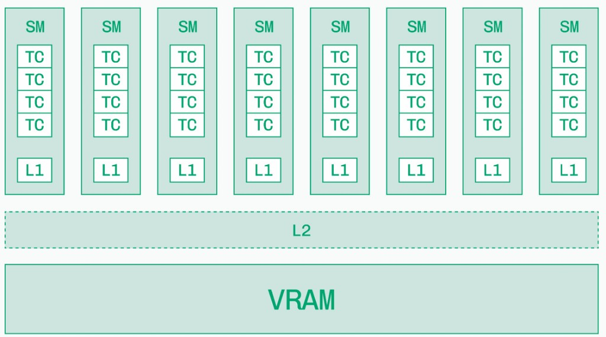
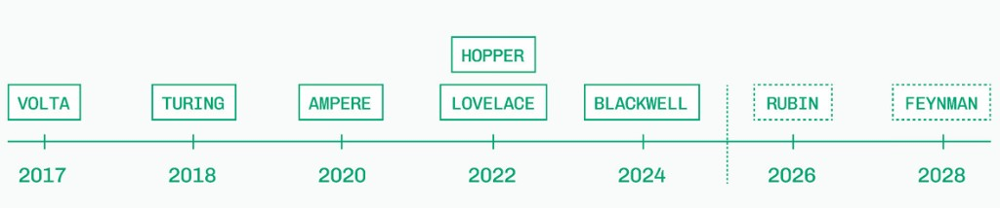

The previous chapter framed latency and arithmetic intensity. Before you read TFLOPS on a datasheet or size a KV cache, it helps to know what a GPU actually *is*: thousands of small math lanes, a stack of fast on-chip memory, and a large pool of VRAM at the bottom.

This chapter is that foundation. The next — [GPU Architecture for LLM Inference](./gpu-architecture) — turns the same hardware into serving decisions: how much fits, what limits speed, and how cards compare.

## 1. CPU cores vs streaming multiprocessors

A CPU has a few *cores*, each built for complex, branching, low-latency work. A GPU has many *streaming multiprocessors* (SMs), each running hundreds of lightweight threads in parallel.

| | CPU core | GPU SM |
|---|----------|--------|
| Count | Few (8–128) | Many (tens to 100+) |
| Thread model | Few heavy threads | Thousands of tiny threads |
| Strength | Control flow, latency | Throughput on regular math (matmuls) |
| LLM role | Host, I/O, orchestration | Forward pass, Tensor Core matmuls |

Transformers are mostly large, regular matrix multiplies — exactly the pattern GPUs were built for.

<figure>

<figcaption>Figure 1. Simplified GPU stack — many SMs above shared L2, VRAM at the base</figcaption>
</figure>

Each SM in the diagram is one parallel compute block. Data flows *up* from VRAM through caches into the cores; results flow back down. Inference performance is often about how often you can reuse data before paying the VRAM trip again.

## 2. What runs inside an SM — CUDA cores, Tensor cores, SFU

An SM is not one monolithic processor. It mixes specialized units:

| Unit | What it does | LLM inference role |
|------|--------------|-------------------|
| *CUDA core* | General FP32 / INT32 math | Elementwise ops, softmax pieces, indexing |
| *Tensor core* | Fused matrix multiply-accumulate (GEMM) | Attention and MLP matmuls — where most FLOPs live |
| *SFU* (special-function unit) | Transcendentals (`exp`, `sin`, `rsqrt`, …) | Activations, parts of softmax and normalization |

For LLM serving, read specs with this split in mind:

- *Tensor Core TFLOPS* (BF16 / FP16 / FP8) → prefill and large batched matmuls
- *Memory bandwidth* → decode, when weights and KV stream from VRAM every token
- CUDA cores and SFUs matter, but rarely headline the datasheet — they fill gaps around the big GEMMs

Modern kernels (FlashAttention, fused MLPs) are written to keep hot paths on Tensor Cores and minimize round-trips to VRAM.

## 3. Two memory worlds — DRAM capacity vs SRAM speed

GPUs sit at two very different memory scales:

| Memory | Typical size | Technology | Role |
|--------|-------------|------------|------|
| *VRAM* (device memory) | GB (24–141+ on datacenter cards) | HBM or GDDR — off-chip DRAM | Weights, KV cache, activations |
| *On-chip SRAM* | MB per chip (L1 + shared L2) | Static RAM on die | Hot tiles of weights and activations during a kernel |

The pattern is always the same: **large and slow at the bottom, small and fast at the top.**

- *DRAM (GB)* — cheap per bit, high capacity. This is where the 70B model and every concurrent KV cache must live.
- *SRAM (MB)* — expensive per bit, low latency. Kernels win when they reuse the same bytes many times while data still sits in L1/L2.

That is why a fat matmul (prefill) can be *compute-bound* — each weight byte gets reused across many tokens — while skinny decode (one token) is often *memory-bound* — little reuse before the next VRAM read.

CPU system memory is a third tier (DDR DRAM, 50–200 GB/s over PCIe). Treat it as staging, not the hot store for serving. See [GPU Architecture](./gpu-architecture) for sizing weights and KV in HBM.

## 4. Cache hierarchy — L0, L1, L2

Between VRAM and the cores, modern GPUs use a three-level cache ladder. Exact sizes vary by architecture, but the roles are stable:

| Level | Scope | Typical role |
|-------|-------|--------------|
| *L0* / operand cache | Per CUDA core lane | Tiny, holds operands for the current instruction |
| *L1* | Per SM | Shared memory + L1 data cache — tile of a matmul, a slice of activations |
| *L2* | Whole GPU (shared) | Last stop before VRAM; all SMs compete for it |

Data path for one kernel launch:

1. Load from *VRAM* into *L2* (if not already resident)
2. SM pulls tiles into *L1* / shared memory
3. *Tensor Cores* consume those tiles; *L0* feeds individual ops

When a kernel says it is “memory-bound,” it usually means the SM is waiting on L2 or VRAM, not that Tensor Cores are idle by choice. Optimizations (fusion, tiling, quantization) shrink bytes moved across that path.

Figure 1 shows the two levels that matter most at a glance: *L1 per SM* and *L2 shared* above *VRAM*.

## 5. Generations — same story, different packaging (Hopper vs Lovelace)

NVIDIA has shipped a new architecture roughly every two years. Names change; the SM → cache → VRAM picture stays similar.

<figure>

<figcaption>Figure 2. NVIDIA architecture generations — solid boxes are shipping; dashed boxes are roadmap</figcaption>
</figure>

For LLM inference, the important split is not Volta vs Turing trivia — it is *datacenter* (H-series) vs *workstation/consumer* (L-series):

| | Hopper (H100, H200) | Lovelace (L40S, RTX) |
|---|---------------------|----------------------|
| VRAM type | HBM (high bandwidth) | GDDR (lower bandwidth per pin) |
| Typical capacity | 80–141 GB | 24–48 GB |
| Peak bandwidth | ~3–5 TB/s | ~0.6–1 TB/s |
| Form | SXM + NVLink / NVSwitch | PCIe, often no NVSwitch |
| Sweet spot | Large models, high concurrency, multi-GPU TP | Small models, dev/prototype, graphics workloads |

Same Tensor Core idea on both. Hopper pays for HBM, fabric, and capacity. Lovelace trades that for cost, graphics features, and cards you can put in a desktop. A 7B model on an L40S can feel fine; a 70B production fleet usually wants HBM and NVLink.

Blackwell (2024+) continues the datacenter push — more HBM, faster Tensor Cores — while Rubin and Feynman on the roadmap extend the same line.

## Takeaways

1. *SMs* are the GPU’s parallel workers; CPUs orchestrate, GPUs execute matmuls at scale.
2. *Tensor Cores* run the heavy GEMMs; CUDA cores and SFUs handle the rest.
3. *VRAM (GB)* holds the model and KV; *SRAM/cache (MB)* is where kernels win or lose on reuse.
4. *L1 → L2 → VRAM* is the latency ladder — bandwidth-bound decode is often a VRAM/L2 story.
5. *Hopper vs Lovelace* is mostly HBM + fabric vs GDDR + cost — not a different programming model.

Next: turn this hardware into inference specs — memory budgets, roofline, interconnect, and card choice in [GPU Architecture for LLM Inference](./gpu-architecture).