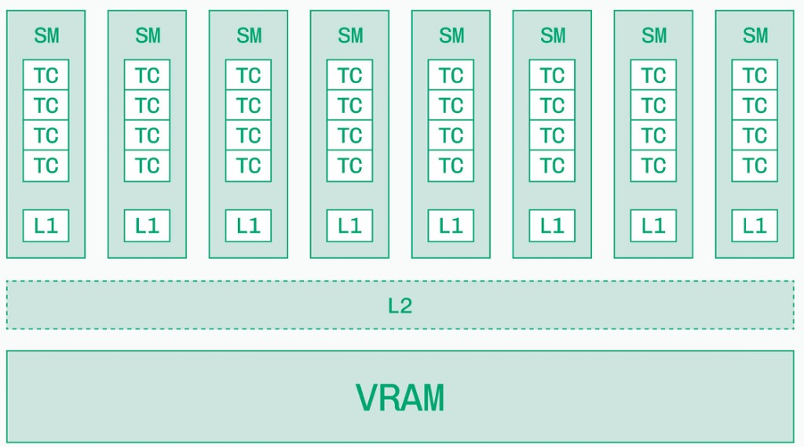
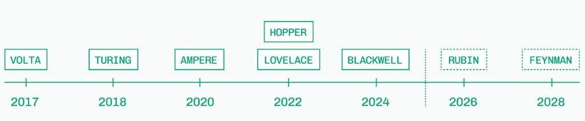

The previous chapter framed latency and arithmetic intensity. Before you read TFLOPS on a datasheet or size a KV cache, it helps to know what a GPU actually *is*: thousands of small math lanes scheduled in warps, a deep register file that hides memory latency, a stack of fast on-chip memory, and a large pool of VRAM at the bottom.

This chapter is that foundation — the concepts most GPU architecture walkthroughs cover at a high level. The next — [GPU Architecture for LLM Inference](./gpu-architecture) — turns the same hardware into serving decisions: how much fits, what limits speed, and how cards compare.

Concrete numbers below use the *H100 SXM5* (Hopper) unless noted. Full GH100 silicon has 144 SMs; the shipping SXM5 product exposes 132.

## 1. CPU cores vs streaming multiprocessors

A CPU has a few *cores*, each built for complex, branching, low-latency work. A GPU has many *streaming multiprocessors* (SMs), each running hundreds of lightweight threads in parallel.

| | CPU core | GPU SM (H100) |
|---|----------|----------------|
| Count | Few (8–128) | 132 SMs on H100 SXM |
| Thread model | Few heavy threads, out-of-order, branch prediction | Thousands of tiny threads; in-order issue; hide stalls with more threads |
| Strength | Control flow, latency | Throughput on regular math (matmuls) |
| Local storage | Large private caches, modest register file | Huge *register file* (~256 KB/SM) + L1/shared memory |
| LLM role | Host, I/O, orchestration | Forward pass, Tensor Core matmuls |

Think of an SM as closer to “a mini parallel computer” than to “one CPU core.” A single H100 SM can keep up to *64 warps* resident (up to 2,048 threads) if registers and shared memory allow — that occupancy is how the GPU stays busy while some warps wait on memory.

Transformers are mostly large, regular matrix multiplies — exactly the pattern GPUs were built for.

<figure>

<figcaption>Figure 1. Simplified GPU stack — many SMs above shared L2, VRAM at the base</figcaption>
</figure>

Each SM in the diagram is one parallel compute block. Data flows *up* from VRAM through caches into the cores; results flow back down. Inference performance is often about how often you can reuse data before paying the VRAM trip again.

## 2. What runs inside an SM — CUDA cores, Tensor cores, SFU

An SM is not one monolithic processor. It mixes specialized units. On Hopper (H100):

| Unit | Per H100 SM | What it does | LLM inference role |
|------|-------------|--------------|-------------------|
| *CUDA core* (FP32) | 128 | General FP32 / INT32 math | Elementwise ops, softmax pieces, indexing |
| *Tensor core* | 4 (4th gen) | Fused matrix multiply-accumulate (GEMM) | Attention and MLP matmuls — where most FLOPs live |
| *SFU* (special-function unit) | Few per SM | Transcendentals (`exp`, `sin`, `rsqrt`, …) | Activations, parts of softmax and normalization |
| *Load/store* | Dedicated path | Moves data between registers and memory | Feeds every kernel |

Chip-level roll-up for H100 SXM: 132 × 128 = *16,896* FP32 CUDA cores and 132 × 4 = *528* Tensor Cores.

For LLM serving, read specs with this split in mind:

- *Tensor Core TFLOPS* (BF16 / FP16 / FP8) → prefill and large batched matmuls
- *Memory bandwidth* → decode, when weights and KV stream from VRAM every token
- CUDA cores and SFUs matter, but rarely headline the datasheet — they fill gaps around the big GEMMs

Modern kernels (FlashAttention, fused MLPs) are written to keep hot paths on Tensor Cores and minimize round-trips to VRAM.

## 3. Threads, warps, and SIMT — how work actually runs

Software launches *threads*. Hardware does not schedule them one-by-one like a CPU OS. NVIDIA groups them:

| Level | Size | Who schedules it |
|-------|------|------------------|
| *Thread* | 1 | Owns its own registers and program counter |
| *Warp* | 32 threads | Basic execution unit on the SM |
| *Thread block* | Many warps | Assigned to one SM; can share L1 / shared memory |
| *Grid* | Many blocks | Whole kernel launch across the GPU |

A *warp* is the unit the SM’s *warp scheduler* picks each cycle. All 32 threads in a warp issue the *same instruction* on that cycle — this is *SIMT* (single instruction, multiple threads).

How that relates to *SIMD*:

- *SIMD* (single instruction, multiple data) — classic vector hardware: one instruction operates on a wide vector register
- *SIMT* — same idea at the programming model: you write scalar per-thread code; the hardware packs 32 threads into a warp and runs them lockstep when paths agree

So: SIMD is the vector *hardware* intuition; SIMT is NVIDIA’s *thread* abstraction on top. Both buy throughput by doing one instruction across many data lanes. GPUs add the twist that each thread has its own registers and can *diverge* (see §7).

*Parallelism* on a GPU is therefore hierarchical:

1. *Thread-level* — each thread processes its own element / tile
2. *Warp-level* — 32 threads share an instruction stream
3. *SM-level* — many warps resident; schedulers pick ready warps
4. *GPU-level* — 132 SMs on H100 SXM run different blocks at once

That stack is why “more concurrent tokens / larger tiles” often raises utilization: you give the schedulers more independent warps to choose from while others wait on HBM.

## 4. Registers and latency hiding

The fastest storage on the chip is not L1 — it is the *register file*.

| Resource (H100 SM) | Size / limit | Role |
|--------------------|--------------|------|
| Register file | 256 KB (~64K 32-bit registers) | Per-thread live values; compiler allocates |
| Max registers / thread | 255 | More registers per thread → fewer resident warps |
| Max warps / SM | 64 | Upper bound on occupancy |
| Shared memory / L1 carveout | Up to ~228 KB shared | Programmer-managed scratchpad + L1 |

*Latency* here means “how many cycles until a result or a memory load is ready.” Math ops are short; a trip to HBM is long (hundreds of cycles). CPUs fight that with caches, speculation, and out-of-order execution. GPUs fight it mainly by *latency hiding*:

1. Warp A issues a load from VRAM and stalls
2. Scheduler switches to warp B (or C, D, …) that already has data in registers
3. When A’s data arrives, A becomes eligible again

So a “slow” memory system can still deliver high throughput if enough warps are *resident*. That is why occupancy, register pressure, and shared-memory use show up in CUDA/Triton tuning — they control how many warps fit on the SM.

Registers are private per thread (within the SM’s shared register file). Spilling registers to local memory (backed by VRAM) is a common performance cliff: you traded occupancy or spilled, and suddenly every “register” access pays HBM latency.

## 5. Two memory worlds — DRAM capacity vs SRAM speed

GPUs sit at two very different memory scales:

| Memory | Typical size | Technology | Role |
|--------|-------------|------------|------|
| *VRAM* (device memory) | GB (80 GB HBM3 on H100 SXM) | HBM or GDDR — off-chip DRAM | Weights, KV cache, activations |
| *On-chip SRAM* | MB per chip (L1 + shared L2) | Static RAM on die | Hot tiles of weights and activations during a kernel |

The pattern is always the same: **large and slow at the bottom, small and fast at the top.**

- *DRAM (GB)* — cheap per bit, high capacity. This is where the 70B model and every concurrent KV cache must live.
- *SRAM (MB)* — expensive per bit, low latency. Kernels win when they reuse the same bytes many times while data still sits in L1/L2.

That is why a fat matmul (prefill) can be *compute-bound* — each weight byte gets reused across many tokens — while skinny decode (one token) is often *memory-bound* — little reuse before the next VRAM read.

CPU system memory is a third tier (DDR DRAM, 50–200 GB/s over PCIe). Treat it as staging, not the hot store for serving. See [GPU Architecture](./gpu-architecture) for sizing weights and KV in HBM.

## 6. Cache hierarchy — L0, L1, L2

Between VRAM and the cores, modern GPUs use a ladder of progressively larger, slower stores. Exact sizes vary by architecture; H100 SXM has about *50 MB* of L2 shared across the chip.

| Level | Scope | Typical role |
|-------|-------|--------------|
| *Registers* | Per thread | Hottest values; not a cache, but the top of the latency stack |
| *L0* / operand cache | Per CUDA core lane | Tiny, holds operands for the current instruction |
| *L1* + *shared memory* | Per SM | Tile of a matmul, a slice of activations; shared memory is software-managed |
| *L2* | Whole GPU (shared) | Last stop before VRAM; all SMs compete for it |
| *VRAM / HBM* | Whole GPU | Model weights, KV, large activations |

Data path for one kernel launch:

1. Load from *VRAM* into *L2* (if not already resident)
2. SM pulls tiles into *L1* / shared memory
3. Values land in *registers*; *Tensor Cores* / CUDA cores consume them

When a kernel says it is “memory-bound,” it usually means the SM is waiting on L2 or VRAM, not that Tensor Cores are idle by choice. Optimizations (fusion, tiling, quantization) shrink bytes moved across that path — and more resident warps hide the remaining latency.

Figure 1 shows the two levels that matter most at a glance: *L1 per SM* and *L2 shared* above *VRAM*.

## 7. Warp divergence — when threads in a warp disagree

Because a warp issues one instruction at a time, *branch divergence* is expensive.

If 32 threads hit `if (cond) { A } else { B }`:

1. Threads that take `A` run while the others are masked off (idle)
2. Then threads that take `B` run while the first group is masked off
3. Wall time is roughly *time(A) + time(B)*, not `max(A, B)`

That is *warp divergence*: lockstep SIMT becomes serialized paths inside the warp. Uniform control flow (all 32 threads take the same branch) stays efficient.

Why this matters for LLM kernels:

- Softmax, masking, and variable-length sequences can introduce divergent paths if written naively
- Well-structured kernels keep warps coherent — same sequence lengths padded in a tile, mask handled so lanes stay aligned, or special cases peeled into separate launches
- Divergence wastes *ALU / Tensor Core* cycles the same way poor occupancy wastes *memory* latency hiding — different failure modes, same symptom: low achieved TFLOPS

Rule of thumb: threads are free to branch; *warps* pay for disagreement.

## 8. Generations — same story, different packaging (Hopper vs Lovelace)

NVIDIA has shipped a new architecture roughly every two years. Names change; the SM → warp → cache → VRAM picture stays similar.

<figure>

<figcaption>Figure 2. NVIDIA architecture generations — solid boxes are shipping; dashed boxes are roadmap</figcaption>
</figure>

For LLM inference, the important split is not Volta vs Turing trivia — it is *datacenter* (H-series) vs *workstation/consumer* (L-series):

| | Hopper (H100, H200) | Lovelace (L40S, RTX) |
|---|---------------------|----------------------|
| VRAM type | HBM (high bandwidth) | GDDR (lower bandwidth per pin) |
| Typical capacity | 80–141 GB | 24–48 GB |
| Peak bandwidth | ~3–5 TB/s | ~0.6–1 TB/s |
| Form | SXM + NVLink / NVSwitch | PCIe, often no NVSwitch |
| Sweet spot | Large models, high concurrency, multi-GPU TP | Small models, dev/prototype, graphics workloads |

Same Tensor Core idea on both. Hopper pays for HBM, fabric, and capacity. Lovelace trades that for cost, graphics features, and cards you can put in a desktop. A 7B model on an L40S can feel fine; a 70B production fleet usually wants HBM and NVLink.

Blackwell (2024+) continues the datacenter push — more HBM, faster Tensor Cores — while Rubin and Feynman on the roadmap extend the same line.

## Takeaways

1. *SMs* are the GPU’s parallel workers; an H100 SXM has 132 of them. CPUs orchestrate; GPUs execute matmuls at scale.
2. Inside an SM: *CUDA cores* for general math, *Tensor Cores* for GEMMs, *SFUs* for transcendentals.
3. Work runs as *warps* of 32 threads under *SIMT* — one instruction, many threads; related to but not identical to classic *SIMD*.
4. *Registers* plus many resident warps *hide latency* while other warps wait on HBM.
5. *VRAM (GB)* holds the model and KV; *L1/L2/SRAM* is where kernels win or lose on reuse.
6. *Warp divergence* serializes disagreeing branches inside a warp — keep control flow coherent when you can.
7. *Hopper vs Lovelace* is mostly HBM + fabric vs GDDR + cost — not a different programming model.

Next: turn this hardware into inference specs — memory budgets, roofline, interconnect, and card choice in [GPU Architecture for LLM Inference](./gpu-architecture).
