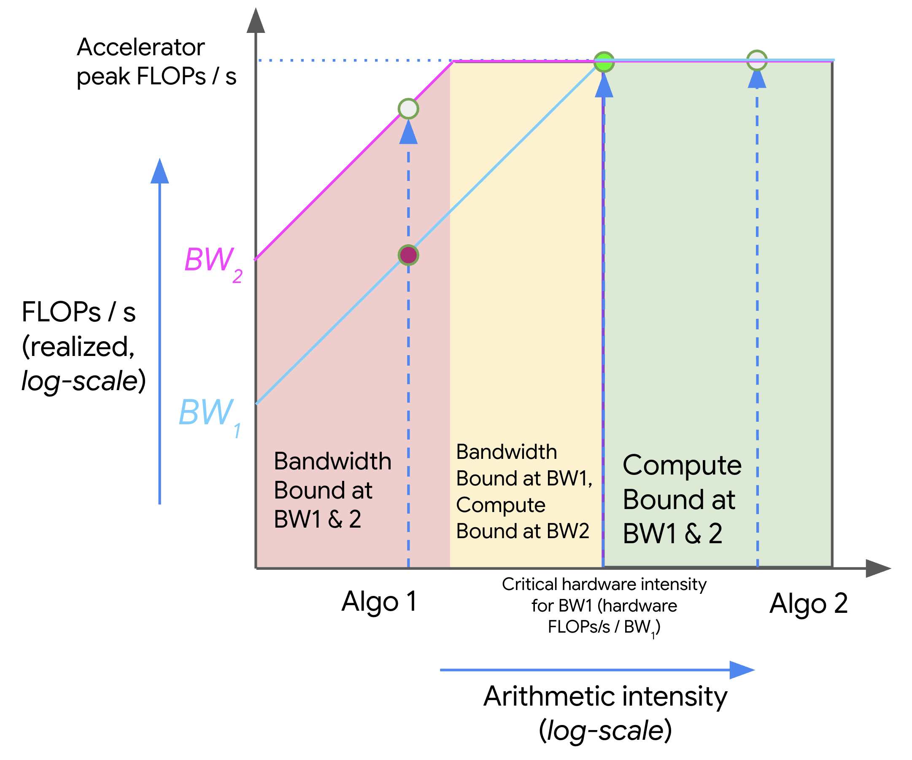

This chapter is the *math reference* for the rest of the book. Each section starts from definitions and symbols, then grows into worked examples you can reuse when sizing GPUs, reading dashboards, or arguing about trade-offs.

The companion spreadsheet [`Inference_Math_Basics.xlsx`](./Inference_Math_Basics.xlsx) holds the same matmul / intensity calculations so you can change $B$, $D$, and $F$ and watch the ridge move.

Related narrative chapters: [Inference Engineering Basics](./basics), [GPU Architecture](./gpu-architecture), [Batching](./inference-optimizations-batching), [Quantization](./inference-optimizations-quantization).

## 1. Notation

| Symbol | Meaning |
|--------|---------|
| $B$ | Batch size (rows of activations; concurrent tokens or sequences in a step) |
| $D$, $F$ | Inner / output feature dimensions of a linear layer ($Z = X Y$ with $X\!:\![B,D]$, $Y\!:\![D,F]$) |
| $L$ | Number of transformer layers |
| $n$ / $s$ / $T$ | Sequence length (prompt + generated so far; $T$ in attention FLOP counts) |
| $d$ / $d_{\text{model}}$ | Hidden size |
| $n_q$, $n_{kv}$ | Query heads / KV heads |
| $d_h$ | Head dimension ($d_{\text{model}} / n_q$ for MHA) |
| $p$, $c$ | Prompt tokens / completion tokens |
| $I$ | Arithmetic intensity (FLOPs per byte moved) |
| $T_{\text{math}}$, $T_{\text{mem}}$ | Pure compute time / pure memory time |

## 2. Two clocks — math and memory

Every GPU kernel races two clocks. Whichever finishes later sets the wall time:

$$
T_{\text{math}} = \frac{\text{FLOPs}}{\text{peak FLOPs/s}}, \qquad
T_{\text{mem}} = \frac{\text{bytes moved}}{\text{peak bandwidth (bytes/s)}}
$$

$$
T_{\text{wall}} \;\ge\; \max\!\big(T_{\text{math}},\, T_{\text{mem}}\big)
\quad\text{(lower bound; upper bound }\approx T_{\text{math}} + T_{\text{mem}}\text{)}
$$

- If $T_{\text{math}} > T_{\text{mem}}$ the kernel is *compute-bound* — Tensor Cores are busy; more bandwidth barely helps.
- If $T_{\text{mem}} > T_{\text{math}}$ the kernel is *memory-bound* (bandwidth-bound) — cores sit idle waiting on HBM.

H100 SXM numbers used throughout this chapter (dense BF16 Tensor peak, not the sparse datasheet figure):

| Resource | Value |
|----------|------:|
| Peak BF16 | $989 \times 10^{12}$ FLOPs/s |
| HBM bandwidth | $3.35$ TB/s $= 3.35 \times 10^{12}$ B/s |
| Ridge intensity | $989 / 3.35 \approx 295$ FLOPs/byte |

### Dot product — the smallest example

For two length-$N$ vectors the exact op count is $N$ multiplies + $(N-1)$ adds $= 2N - 1$ FLOPs. With BF16 (2 bytes/elem), you read both vectors and write one scalar:

$$
I_{\text{dot}} = \frac{2N - 1}{4N + 2} \;\xrightarrow{N \to \infty}\; \tfrac{1}{2}\ \text{FLOP/byte}
$$

At $N = 1000$ that is $\approx 1999$ FLOPs and $\approx 4002$ bytes. On an H100:

$$
T_{\text{math}} = \frac{1999}{9.89 \times 10^{14}} \approx 2.0 \times 10^{-12}\ \text{s}
$$

$$
T_{\text{mem}} = \frac{4002}{3.35 \times 10^{12}} \approx 1.2 \times 10^{-9}\ \text{s}
$$

Memory wins by three orders of magnitude — a lone dot product is hopelessly bandwidth-bound. Real kernels only escape this fate when they *reuse* bytes many times (large matmuls, fat batches).

## 3. Matmul FLOPs, bytes, and intensity

A BF16 GEMM $Z = X Y$ with shapes $X\!:\![B,D]$, $Y\!:\![D,F]$, $Z\!:\![B,F]$ is the workhorse of transformers (every linear / projection / MLP block).

### Why $2BDF$ — count from one output cell

Take a tiny matmul so the counting is obvious:

$$
X\!:\![3,2]\ \times\ Y\!:\![2,3]\ \rightarrow\ Z\!:\![3,3]
$$

Here $B=3$, $D=2$, $F=3$. One entry of $Z$ is a length-$D$ dot product:

$$
z_{ij} = \sum_{k=1}^{D} x_{ik}\, y_{kj}
$$

- *Multiplies* — $D$ (here $2$)
- *Additions* — $D-1$ (here $1$), to fold those products into one scalar

Exact FLOPs for one output cell: $D + (D-1) = 2D - 1$. The output has $B \times F$ cells, so

$$
\text{FLOPs}_{\text{exact}} = BF\,(2D - 1)
$$

For this toy shape: $3 \times 3 \times (2\cdot 2 - 1) = 27$. For large $D$ the $-1$ is noise, so we drop it:

$$
\text{FLOPs} \approx BF \cdot 2D = 2BDF
$$

Same story in words: fill $BF$ outputs; each costs about $2D$ FLOPs (one mul and one add per inner index). That is where the factor of two comes from — not “two matmuls,” but *mul + add* along the shared dimension $D$.

### Same count for attention scores

Score matmul $S = Q K^{\mathsf{T}}$ for one head (batch omitted, or fold it into $T$):

| Matrix | Shape |
|--------|-------|
| $Q$ | $[T,\, d_h]$ |
| $K^{\mathsf{T}}$ | $[d_h,\, T]$ |
| $S$ | $[T,\, T]$ |

Map to the GEMM labels: $B \to T$, $D \to d_h$, $F \to T$. Then

$$
\text{FLOPs}(QK^{\mathsf{T}}) \approx 2\, T \cdot d_h \cdot T = 2\, d_h\, T^{2}
$$

Or from the cell-counting view again: $S$ has $T^{2}$ entries to fill; each is a length-$d_h$ dot product $\approx 2 d_h$ FLOPs → $2 d_h T^{2}$.

(The later $SV$ multiply with $V\!:\![T, d_h]$ is another $2\, T \cdot T \cdot d_h = 2 d_h T^{2}$. Softmax itself is lower order in the usual FLOP accounting.)

| Quantity | Formula (BF16 = 2 bytes/elem) |
|----------|-------------------------------|
| FLOPs | $2 B D F$ (approx.; exact is $BF(2D-1)$) |
| Bytes read | $2BD + 2DF$ |
| Bytes written | $2BF$ |
| Bytes total | $2BD + 2DF + 2BF$ |
| Intensity | $I = 2BDF / (2BD + 2DF + 2BF)$ |

When $B \ll D,F$ the weight term $2DF$ dominates the traffic and

$$
I \approx \frac{BDF}{DF} = B
$$

Raising batch size is the main way to climb the roofline for a fixed layer shape. Prefill (many tokens at once) sits higher on that curve than single-token decode.

If you count *reads only* (as in the companion spreadsheet), drop the $2BF$ write:

$$
I_{\text{reads}} = \frac{2BDF}{2BD + 2DF} = \frac{BDF}{BD + DF}
$$

For square hidden size $D = F = d$, that simplifies to

$$
I_{\text{reads}} = \frac{d\, B}{B + d}
$$

## 4. The roofline

Plot arithmetic intensity on the $x$-axis and attainable FLOPs/s on the $y$-axis. Hardware draws a *roof*: a diagonal set by bandwidth, then a flat ceiling set by peak FLOPs. The elbow is the *ridge point*:

$$
I_{\text{ridge}} = \frac{\text{peak FLOPs/s}}{\text{peak bandwidth}}
$$

<figure>

<figcaption>Figure 1. Roofline: low-intensity kernels ride the bandwidth slope; high-intensity kernels hit the compute ceiling</figcaption>
</figure>

- *Algo 1* (left) — low $I$: raising bandwidth moves you up the slope; extra TFLOPS do nothing.
- *Algo 2* (right) — high $I$: you are already on the ceiling; more HBM bandwidth does not help.

LLM serving maps onto this picture almost for free: *prefill* tends toward Algo 2; *decode* tends toward Algo 1. See also [Basics §2](./basics#2-arithmetic-intensity--attention-as-an-example) and [GPU Architecture §4](./gpu-architecture#4-what-limits-speed--flops-bandwidth-and-arithmetic-intensity).

## 5. Worked matmuls — H100 linear layers

The spreadsheet walks three BF16 cases of $X\!:\![B, 4096] \times Y\!:\![4096, 4096]$. Intensity below uses the *reads-only* form that matches the sheet ($I = 4096 B / (B + 4096)$). H100 ridge $\approx 295$ FLOPs/byte.

### Case A — $B = 32$ (decode-ish)

| Quantity | Value |
|----------|------:|
| FLOPs ($2BDF$) | $1.074 \times 10^{9}$ ($\approx 1.07$ GFLOP) |
| $X$ bytes ($2BD$) | $0.26$ MB |
| $Y$ bytes ($2DF$) | $33.55$ MB |
| Total traffic | $33.82$ MB |
| Intensity | $\approx 31.8$ FLOPs/byte |
| vs H100 ridge | $31.8 \ll 295$ → *memory-bound* |

### Case B — $B = 256$

| Quantity | Value |
|----------|------:|
| FLOPs | $8.59 \times 10^{9}$ ($\approx 8.59$ GFLOP) |
| $X$ bytes | $2.10$ MB |
| $Y$ bytes | $33.55$ MB |
| Total traffic | $35.65$ MB |
| Intensity | $\approx 241$ FLOPs/byte |
| vs H100 ridge | $241 < 295$ → still *memory-bound*, but close |

### Case C — find the critical batch

Set intensity equal to the ridge and solve for $B$:

$$
\frac{4096\, B}{B + 4096} = \frac{989}{3.35} \approx 295
\quad\Rightarrow\quad
B \gtrsim 318
$$

| $B$ | $I$ (FLOPs/byte) | Regime on H100 |
|----:|-----------------:|----------------|
| 1 | $\approx 1$ | Deeply memory-bound (token decode) |
| 32 | $\approx 32$ | Memory-bound |
| 256 | $\approx 241$ | Memory-bound, near ridge |
| $\ge 318$ | $\ge 295$ | Compute-bound |

Same story for a fatter projection $x\!:\![B, 4096]$, $W\!:\![4096, 16384]$ (including the $Z$ write). With the fuller traffic $2BD + 2DF + 2BF$:

$$
T_{\text{math}} = \frac{2 B \cdot 4096 \cdot 16384}{9.89 \times 10^{14}}, \qquad
T_{\text{mem}} = \frac{2BD + 2DF + 2BF}{3.35 \times 10^{12}}
$$

$T_{\text{math}} > T_{\text{mem}}$ once $B \gtrsim 320$. Below that batch you are leaving Tensor Cores underfed — the usual decode pathology.

## 6. Precision changes the ridge

Cut element size and you move two things at once: fewer bytes on the wire, and (often) a higher peak op rate.

### INT8 matmul on the same shapes

With 1 byte/elem, $X\!:\![B,D]$, $Y\!:\![D,F]$, $Z\!:\![B,F]$:

| Quantity | Formula |
|----------|---------|
| FLOPs | $\approx 2 B D F$ |
| Bytes | $BD + DF + BF$ |
| Intensity | $I = 2BDF / (BD + DF + BF) \approx 2B$ when $B \ll D,F$ |

On a machine with int8 peak $3.94 \times 10^{14}$ ops/s and HBM $8.2 \times 10^{11}$ B/s, the ridge is

$$
I_{\text{ridge}} = \frac{3.94 \times 10^{14}}{8.2 \times 10^{11}} \approx 481\ \text{ops/byte}
$$

Requiring $2B \gtrsim 481$ gives $B \gtrsim 240$. Smaller batches stay memory-bound even in int8; the win is that *the same* $B$ now moves half the bytes of BF16, so $T_{\text{mem}}$ drops.

Runtime bounds:

$$
T_{\text{math}} = \frac{2BDF}{3.94 \times 10^{14}}, \qquad
T_{\text{mem}} = \frac{BD + DF + BF}{8.2 \times 10^{11}}
$$

$$
T_{\text{lower}} = \max(T_{\text{math}}, T_{\text{mem}}), \qquad
T_{\text{upper}} \approx T_{\text{math}} + T_{\text{mem}}
$$

Weight-only quantization for serving is the same idea applied to the $DF$ term: shrink the dominant traffic when $B$ is small. See [Quantization](./inference-optimizations-quantization).

## 7. Multi-GPU communication

On-chip HBM is not the only roof. When a matmul is split across GPUs, *partial results* must cross NVLink / InfiniBand, and that link has its own bandwidth.

Split the $D$ dimension across two devices:

$$
Z_0 = X[:, :D/2]\, Y[:D/2, :], \qquad
Z_1 = X[:, D/2:]\, Y[D/2:, :]
$$

then exchange and add the partial $Z$ tiles. Assume the shards of $X$ and $Y$ already live on each GPU, so the *new* traffic is the partial outputs — $2BF$ bytes total — over a link of $45$ GB/s with per-GPU compute $1.97 \times 10^{14}$ FLOPs/s:

$$
T_{\text{math}} = \frac{BDF}{1.97 \times 10^{14}}, \qquad
T_{\text{comm}} = \frac{2BF}{4.5 \times 10^{10}}
$$

Compute hides the exchange when $T_{\text{math}} > T_{\text{comm}}$:

$$
\frac{D}{2} > \frac{1.97 \times 10^{14}}{4.5 \times 10^{10}}
\quad\Rightarrow\quad
D \gtrsim 8756
$$

Larger inner dimension → more local FLOPs per byte shipped. That is why tensor-parallel width is a trade: more GPUs cut per-device memory, but the all-reduce must stay under the math time.

### Decode floor for a sharded 70B

Llama-70B BF16 is $\approx 140$ GB of weights → $17.5$ GB per GPU on 8-way tensor parallel. Each decode step must touch those weights once:

$$
T_{\text{decode}} \ge \frac{17.5\ \text{GB}}{3.35\ \text{TB/s}} \approx 5.2\ \text{ms}
$$

That is a hard *per-token* floor from HBM alone (before attention KV traffic or network). Pushing the same 17.5 GB gradient shard over NVLink at $900$ GB/s takes $\approx 19$ ms; over a $50$ GB/s link it jumps to $\approx 350$ ms — interconnect math for training-style collectives, same bandwidth thinking.

## 8. Latency — TTFT, ITL, and E2E

Serving clocks compose as:

$$
\text{E2E} = \text{queue} + \text{TTFT} + (c - 1) \cdot \text{ITL}
$$

| Symbol | Meaning |
|--------|---------|
| Queue | Time waiting for a scheduler slot / batch |
| TTFT | Time to first token — dominated by *prefill* of $p$ prompt tokens |
| ITL | Inter-token latency — one decode step (plus schedule delay) |
| $c$ | Completion tokens |

Related views:

- *TPOT* (time per output token) $\approx$ E2E$/c$ over the full response; ITL is the steady-state decode tick after the first token.
- Per-request output TPS $\approx 1/\text{ITL}$ when ITL is steady.
- Report *percentiles* (p50 / p90 / p99), not only means — tails are where queueing and long prompts show up ([Basics §1](./basics#1-latency-metrics--ttft-itl-and-tps)).

## 9. Throughput and concurrency

| Metric | Definition |
|--------|------------|
| Output TPS (one sequence) | $\approx 1 / \text{ITL}$ |
| System TPS | Sum of tokens emitted across all in-flight sequences per second |
| Goodput | Tokens that meet the latency SLO |

Little's law for serving:

$$
\text{concurrency} \approx \text{arrival rate} \times \text{E2E latency}
$$

Raising concurrency raises system TPS until you hit a knee — KV memory, scheduler queueing, or the memory-bound decode roof from §5. Past that knee, ITL and TTFT percentiles climb and *goodput* can fall even as raw TPS rises.

## 10. Memory and KV cache

Weights and KV compete for the same HBM:

$$
\text{Weight bytes} \approx N_{\text{params}} \cdot \frac{\text{bits}}{8}
$$

$$
\text{KV bytes} \approx 2 \cdot L \cdot n_{kv} \cdot d_h \cdot n \cdot B \cdot \text{bytes/elem}
$$

(The leading $2$ is keys + values. GQA/MQA shrink $n_{kv}$ relative to $n_q$.)

### Worked example — 7B MHA on H100 80 GB

| Input | Value |
|-------|------:|
| Parameters | 7B |
| Layers $L$ | 32 |
| Hidden $d_{\text{model}}$ | 4096 |
| Attention heads | 32 (MHA) |
| Weight / KV precision | BF16 |
| Prompt / generate | 4096 / 1024 tokens |
| Concurrency $B$ | 1 |
| GPU | H100 SXM 80 GB |

| # | Output | Answer |
|--:|--------|-------:|
| 1 | Head dimension $d_h$ | $4096 / 32 = 128$ |
| 2 | Weight memory (BF16) | $7\times 10^9 \times 2 \approx 14$ GB |
| 3–5 | Q / K / V per token, 1 layer | $[32, 128] = 4096$ values each |
| 6–7 | K or V cache / token / layer | $4096 \times 2 = 8192$ B $= 8$ KiB |
| 8 | KV / token / layer | $16$ KiB |
| 9 | KV / token / 32 layers | $512$ KiB $= 524{,}288$ B |
| 10 | KV for 4096-token prompt | $4096 \times 512$ KiB $= 2$ GiB |
| 11 | KV after +1024 generated ($n=5120$) | $2.5$ GiB |
| 12 | Weights + final KV | $\approx 16.7$ GB |
| 13 | H100 memory remaining | $\approx 63.3$ GB |

Remaining capacity is what you spend on *concurrency*: each extra in-flight sequence needs its own KV footprint at the current context length. Paged KV and prefix caching change fragmentation, not the asymptotic byte count.

## 11. Batching

Continuous / in-flight batching changes the *effective* $B$ that appears in §3–§5 without waiting for a static batch to fill.

- Static batching — pad to a fixed $B$; padding wastes both FLOPs and KV slots.
- Continuous batching — sequences join/leave every step; the token budget (not request count) is the real control knob.
- Prefill vs decode mixing — a large prefill spike raises TTFT for everyone in the batch; chunked prefill trades TTFT fairness against utilization.

Batching is how you push decode toward the ridge of §5 without changing the model. Details: [Batching](./inference-optimizations-batching).

## 12. Cost and capacity planning

From SLOs back to hardware:

1. Pick target p99 TTFT / ITL and tokens per request $(p, c)$.
2. Estimate concurrency from arrival rate × E2E (Little's law).
3. Check KV + weight fit (§10); if not, add GPUs or shrink context / precision.
4. Check decode floor (§7) and matmul regime (§5) — more GPUs help memory fit, but per-GPU ITL still obeys HBM.
5. Convert GPU-hours to \$/M output tokens at your utilization assumption; overprovision for p99, not for the mean.

Rough capacity sketch:

$$
\text{GPUs needed} \approx \frac{\text{required system TPS}}{\text{achievable TPS per GPU at SLO}}
$$

Multi-model sharing adds fragmentation and cache interference on top of the single-model math — budget headroom.

## Quick reference

| Question | Formula / rule |
|----------|----------------|
| Wall-time lower bound | $\max(T_{\text{math}}, T_{\text{mem}})$ |
| Intensity | FLOPs / bytes moved |
| H100 BF16 ridge | $\approx 295$ FLOPs/byte |
| Matmul FLOPs | $\approx 2BDF$; exact $BF(2D-1)$ (mul + add per inner index) |
| Attention $QK^{\mathsf{T}}$ (one head) | $\approx 2\, d_h\, T^{2}$ |
| Square $d{\times}d$ layer, reads-only | $I = d B / (B + d)$; compute-bound when $B \gtrsim I_{\text{ridge}}$ |
| E2E latency | queue + TTFT + $(c-1)\cdot$ITL |
| KV bytes | $2\, L\, n_{kv}\, d_h\, n\, B\, \times$ bytes/elem |
| Decode HBM floor | weight_bytes_per_GPU / HBM_bandwidth |

Keep [`Inference_Math_Basics.xlsx`](./Inference_Math_Basics.xlsx) open while you change shapes — the ridge does not move, but your kernel's $I$ does.
