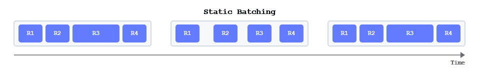
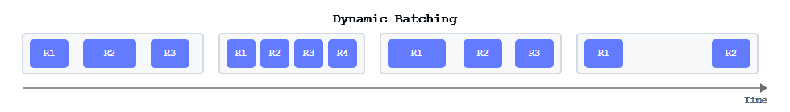
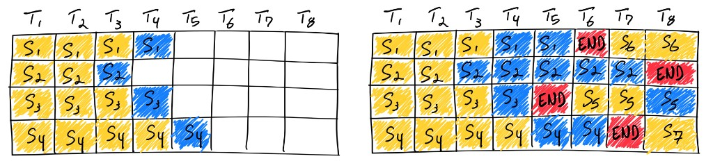

Serving one prompt at a time wastes a GPU. Serving many at once without a plan wastes latency. Batching is the optimization that sits between those two failures.

This chapter is the boat story: why you fill seats, what goes wrong with static and dynamic closed batches, and how continuous batching plus chunked prefill keep the ferry moving — including when a long boarding (prefill) would otherwise block everyone else.

Prerequisite mental model: [prefill vs decode and KV cache](./vllm-basics-kv-cache). For how a server wires the loop, see [Serving Engine Internals](./serving-engine-internals).

---

## 1. The boat — requests as passengers, the GPU as a ferry

Think of the GPU as a ferry that runs short trips in a loop. Each trip is one *iteration*: a forward pass that advances every passenger currently on board.

| Boat world | Inference world |
| ---------- | --------------- |
| Ferry / boat | GPU running one batched forward |
| Passenger | One request / sequence |
| Seat | Slot in the current batch (`max_num_seqs`, memory for that seq’s KV) |
| Dock / waiting line | Admission queue |
| Boarding | Prefill — process the prompt, build KV |
| Riding between stops | Decode — one new token per trip |
| Getting off | EOS / max tokens / client cancel |
| Ticket id | Sequence id (so the right answer returns to the right client) |

The captain’s job is not “make one perfect trip.” It is *keep seats useful*: pick up waiting passengers when a seat frees, drop finished ones immediately, and do not let one slow boarding freeze the whole route.

---

## 2. Why batching is needed

A transformer forward pass loads the same weights from HBM whether you run *1* sequence or *N*. Decode is usually *memory-bandwidth bound*: most of the time is moving weights, not doing math on one token.

So with one passenger alone on a big boat:

- You still pay the full weight-load cost every decode step  
- Most seats are empty  
- Tokens/sec for the *fleet* (throughput) stay low even if that one rider feels fine  

Batching puts several passengers on the same trip. One weight load serves many sequences. Cost per token falls; GPU utilization rises.

```text
1 passenger alone     →  pay full trip cost for 1 token
8 passengers together →  pay ~same trip cost for 8 tokens
```

That is the whole economic case for batching: *amortize weight traffic across concurrent sequences*.

Batching also matters in prefill. Larger effective batch / token counts make matmuls fatter and more compute-bound — which is where TFLOPS actually help (see [GPU Architecture](./gpu-architecture)).

---

## 3. Static batching — wait for a fixed-size group

The simplest form of batching is *static batching*. The server waits until a fixed number of requests arrive, then processes them together as one batch. Nothing new boards until that whole group is done.

<figure>



<figcaption><span class="figure-label">Figure 1.</span> Static batching: fixed-size batches processed one after another</figcaption>
</figure>

*How it runs:*

1. Collect up to $B$ prompts from the queue  
2. Pad them to the same length  
3. Run prefill + decode until *all* sequences in that batch are done  
4. Only then admit the next batch  

While static batching is easy to implement, it has notable downsides.

- *First request waits for the last.* The earliest arrival in a batch is forced to wait until the batch fills — like a printer that will not start until a fixed number of documents are queued, no matter how long the last one takes to arrive.  
- *Uneven work inside the batch.* In LLM inference some requests finish in a few tokens; others run long chain-of-thought. Everyone waits for the slowest sequence, so seats sit idle after short requests finish and latency climbs.  

*Boat picture:* eight tourists board together. One wants a 2-stop hop; another wants a 200-stop cruise. The ferry will not drop the short rider at stop 2 and free that seat. Everyone stays on until the longest trip ends. New tourists on the dock watch an almost-empty boat cruise past because the charter rules say “same group only.”

### What hurts in practice

| Problem | On the boat | On the GPU |
| ------- | ----------- | ---------- |
| Uneven *generation* length | Short trips stuck until the longest ends | Early-finished sequences idle in the batch; seats wasted |
| Uneven *prompt* length | Some bring huge luggage, some a backpack | Pad to `max_len` in the batch → fake tokens, wasted compute/memory |
| Late arrivals | Cannot board mid-voyage | New requests wait for the whole static batch to drain |
| Latency tails | One long cruise defines everyone’s return time | p99 latency dominated by the slowest sequence in the batch |

Padding is the silent tax. If prompts are lengths `[8, 8, 8, 512]`, a naive tensor batch shaped `(4, 512)` spends most of its work on pad positions that mean nothing — empty seats with sandbags so the rows “look” rectangular.

Static batching is fine for offline jobs where you already have a pile of prompts and care about throughput, not interactive latency. It is a poor fit for a live API.

---

## 4. Dynamic batching — leave on a timer or when full

*Dynamic batching* still groups requests into batches, but it does not insist on a fixed size. It sets a time window and processes whatever has arrived by then. If the batch hits its size limit sooner, it launches immediately — like a bus that leaves on a schedule *or* when it is full, whichever comes first.

<figure>



<figcaption><span class="figure-label">Figure 2.</span> Dynamic batching: batch size varies with arrivals</figcaption>
</figure>

Dynamic batching balances throughput and latency better than static: early requests are not delayed indefinitely waiting for a full charter. The trade-offs remain:

- Batches may launch underfull, so GPU efficiency is not always maxed  
- Like static batching, the *longest* request in a batch still defines when the batch finishes — short requests wait for that slowest member before the next group can start  

So dynamic batching softens the “wait forever to fill” problem. It does not fix uneven generation lengths inside a closed batch.

---

## 5. Continuous batching — pick up and drop off every stop

For LLM inference, output lengths vary widely. Static and dynamic batching keep short requests stuck until the longest one in the *same closed batch* finishes. That leaves GPU seats unsaturated.

*Continuous batching* (also called *in-flight* or *iteration-level* batching) addresses that. It does not force the entire batch to complete before returning results. Each sequence finishes independently; as soon as one slot frees, the server inserts a new request. Think of an assembly line: as soon as one item is done, a new one takes its place so the line stays full.

<figure>



<figcaption><span class="figure-label">Figure 3.</span> Generating seven sequences with continuous batching — finished slots are replaced in-flight (right) instead of staying empty (left). Source: Anyscale</figcaption>
</figure>

*Rules of the modern ferry:*

1. After *every* decode trip, check who finished → *drop them off*, free their seat and KV  
2. If seats (and memory) remain, *pick up* waiting passengers from the dock  
3. New passengers may need boarding (prefill) while others are already riding (decode)  
4. The boat never waits for the original group to finish together  

```text
Iteration t:   [A decode] [B decode] [C decode] [D decode]
               C reaches EOS → drop C
Iteration t+1: [A decode] [B decode] [E prefill/decode] [D decode]
               E boarded into C’s freed seat
```

*Boat picture:* the ferry runs a tight loop of short hops. At each pier it lets people off who reached their stop and lets new people on if a seat is free. A two-stop rider does not hostage a two-hundred-stop rider. The dock clears steadily instead of in giant charter waves.

| Static / dynamic | Continuous batching |
| ---------------- | ------------------- |
| Batch membership fixed until all in the group are done | Membership changes every iteration |
| Seat freed only at end of that closed batch | Seat freed at EOS / cancel |
| Great for offline bulk / simple servers | Default for interactive serving (vLLM, TGI, TensorRT-LLM, …) |
| Padding + idle early finishers | Running set stays closer to “full useful seats” |

This is why production engines talk about `max_num_seqs` and KV memory pools rather than “batch size 32 until done.” The boat’s capacity is a *ceiling on concurrent passengers*, not a fixed tour group.

### What continuous batching does *not* remove

Passengers still have different luggage sizes (prompt lengths) and different destinations (output lengths). Continuous batching fixes *when* you can pick up and drop off. You still need a plan for *boarding* so a single tourist with a shipping container of luggage does not block the gangway for everyone else. That plan is chunked prefill.

---

## 6. Prefill vs decode on the same boat

Recall two phases per passenger:

| Phase | Work | Feels like |
| ----- | ---- | ---------- |
| Prefill | Process all prompt tokens, write KV | Heavy boarding — many bags through the gate |
| Decode | One new token, read KV + weights | Light hop — passenger already seated |

Decode wants many seated passengers sharing each weight load. Prefill wants lots of tokens to chew through at once. Mixing them carelessly creates a classic failure mode:

*Head-of-line blocking on the gangway.*  
A new passenger arrives with a 8k-token prompt. If the engine runs that entire prefill in one blocking chunk, every already-seated rider waits — no decode tokens stream to them — until boarding finishes. Time-to-first-token for the new rider may look fine while *everyone else’s* token stream stalls.

Boat picture: the ferry is mid-route with 20 happy passengers. One new tourist shows up with a container load. If the crew insists on loading the entire container before the next hop, those 20 riders sit dead in the water. Efficient pick-and-drop dies at the dock.

---

## 7. Chunked prefill — board luggage in pieces

Chunked prefill splits a long prompt into token chunks (e.g. 512 or 2048 at a time). Between chunks, the engine can still run decode steps for passengers already on board.

*Rules:*

1. Cap how many *prefill tokens* you admit in one iteration (`max_num_batched_tokens` style budgets)  
2. Spend some of that budget on decode tokens for active riders (often prioritized so streams stay smooth)  
3. Spend the rest on the next chunk of boarding for new / partially prefilling sequences  
4. Repeat until the new passenger’s prompt is fully boarded (KV complete), then they join normal decode rides  

```text
Iteration:  decode(A,B,C) + prefill_chunk(D, tokens 0..511)
Iteration:  decode(A,B,C) + prefill_chunk(D, tokens 512..1023)
Iteration:  decode(A,B,C,D)   ← D fully boarded, now a normal rider
```

*Boat picture:* the container is loaded *crate by crate*. Between crates, the ferry still makes its short hops — existing passengers keep moving toward their stops. New boarding progresses without turning the route into a blocked cargo operation.

| Without chunked prefill | With chunked prefill |
| ----------------------- | -------------------- |
| One long prefill monopolizes an iteration (or many) | Prefill work is budgeted per iteration |
| Active decodes stall → latency spikes for everyone | Decodes keep getting seats on each trip |
| Unpredictable interference when long prompts arrive | Smoother TTFT / TPOT trade-off under mixed traffic |

Chunked prefill is how you keep *efficient pick and drop* when the dock has both day-trippers (short prompts) and freight (long contexts).

---

## 8. Putting the route together

End-to-end, a well-run inference ferry looks like this:

```text
                    ┌──────────── dock (queue) ────────────┐
                    │  waiting passengers (new requests)   │
                    └───────────────┬──────────────────────┘
                                    │ pick up if seat + KV free
                                    ▼
              ┌─────────────────────────────────────────────┐
              │              boat (GPU batch)               │
              │  seats: partial prefill | decode riders     │
              │  each iteration: drop EOS, chunk-board, hop │
              └─────────────────────────────────────────────┘
                                    │
                    drop off finished → free seat + KV → next pick up
```

*Design checklist*

1. *Batch* — never run the big ferry for one rider if others are waiting and memory allows  
2. *Continuous* — re-form the passenger list every iteration; drop finished, pick new  
3. *Chunk prefill* — board long prompts in budgets so decode riders keep moving  
4. *Cap seats by memory* — KV cache is the real seat belt count, not a vanity batch size  
5. *Track tickets* — sequence ids so pick/drop never mix up who gets which answer  

Static batching is a charter bus. Dynamic batching is a bus that leaves on a timer or when full. Continuous batching is a city ferry with open boarding. Chunked prefill is the rule that freight loads in stages so the ferry schedule still serves everyone.

---

## 9. Takeaways

1. *Why batch* — share weight loads across sequences; empty seats are burned money.  
2. *Static* — fixed group until all done; first request waits for fill, short requests wait for the longest.  
3. *Dynamic* — time window or size limit; better latency than static, but still a closed batch.  
4. *Continuous* — pick up and drop off every iteration so seats stay useful under uneven output lengths.  
5. *Chunked prefill* — board long prompts in pieces so one heavy boarding does not freeze riders already on the water.  
6. *Same analogy everywhere* — queue = dock, batch = boat, prefill = boarding, decode = hop, EOS = drop-off, KV = luggage already stowed for the rest of the trip.

Next: [Quantization](./inference-optimizations-quantization) — fewer bits per weight so more passengers (and longer trips) fit in the same pantry.
