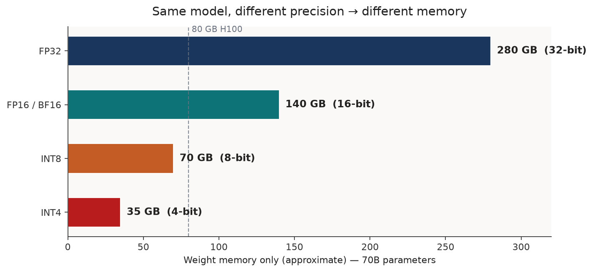
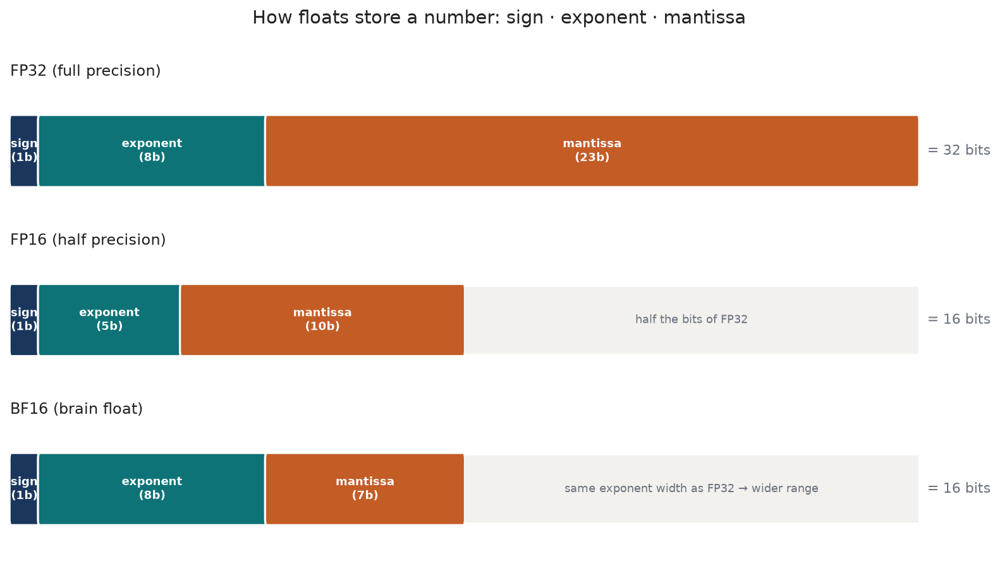
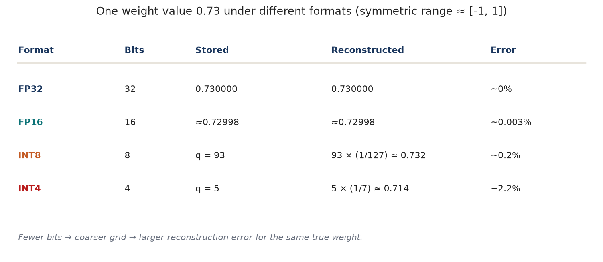
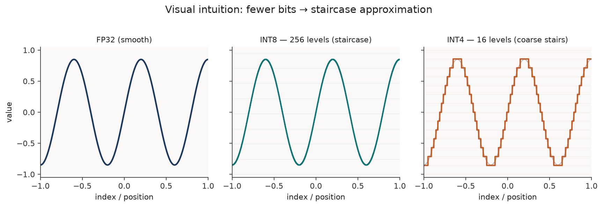
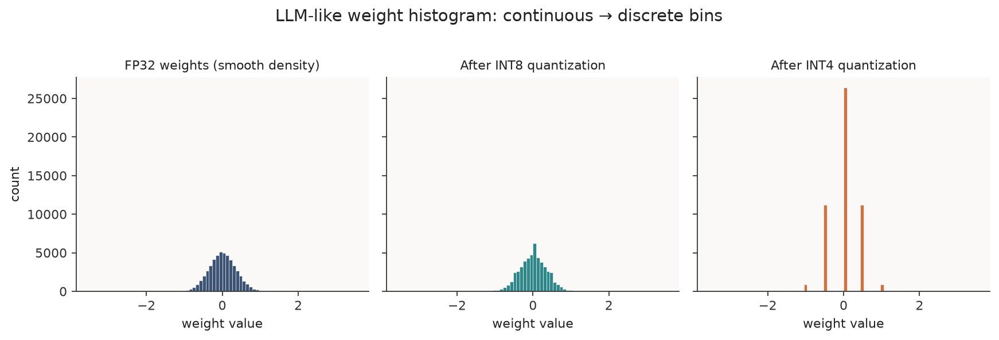
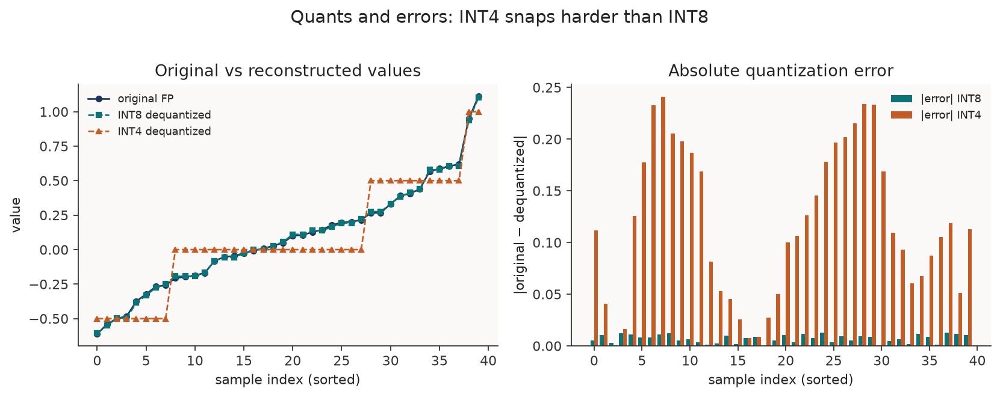
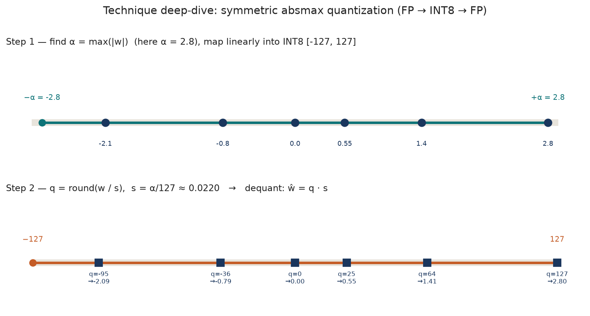

LLMs are “large” mostly because they store billions of numbers. Quantization asks a simple question: **can we store each number with fewer bits and still get almost the same answers?**

This note builds that intuition from bits upward — memory math, float layouts, the staircase picture, weight histograms, quantization error — then walks one technique in detail: **symmetric absmax**.

Inspired by [A Visual Guide to Quantization](https://newsletter.maartengrootendorst.com/p/a-visual-guide-to-quantization) (Maarten Grootendorst) and the walkthrough in [LLM Quantization Explained](https://www.youtube.com/watch?v=37g8S71LfmQ). Figures below are originals drawn for this series.

Related: [GPU memory budgets](./gpu-architecture), [batching](./inference-optimizations-batching).

---

## 1. Why quantization — same model, different memory

The *architecture* of a 70B model does not change when you go from FP32 to INT4. The *size of each weight* does.

$$
\text{weight memory (bytes)} \approx \text{parameters} \times \frac{\text{bits per parameter}}{8}
$$

| Precision | Bits / param | ~Memory for 70B weights |
| --------- | ------------ | ----------------------- |
| FP32 | 32 | ~280 GB |
| FP16 / BF16 | 16 | ~140 GB |
| INT8 | 8 | ~70 GB |
| INT4 | 4 | ~35 GB |

<figure>

<figcaption>Figure 1. Same 70B model — fewer bits per weight → fits (or fails to fit) on an 80 GB GPU. Weights only; KV cache and activations are extra.</figcaption>
</figure>

That is the core pressure: interactive serving wants the model in GPU HBM. If FP16 does not fit, you either shard across GPUs or **shrink the numbers**. Quantization is the shrink.

Trade-off in one line: lower bits → less memory (and often more tokens/sec on bandwidth-bound decode) → more rounding error → possible quality loss.

---

## 2. Basics — bits, bytes, and how floats store a number

### Bits and bytes

A **bit** is 0 or 1. With $n$ bits you can represent $2^n$ distinct patterns.

| Width | Distinct integer levels (unsigned) |
| ----- | ---------------------------------- |
| 2-bit | $2^2 = 4$ |
| 4-bit | $2^4 = 16$ |
| 8-bit | $2^8 = 256$ |

Eight bits = one **byte**. So FP32 is 4 bytes per value, INT8 is 1 byte, INT4 is half a byte (often packed).

Example: the integer **173** in one byte is `10101101` → $128 + 32 + 8 + 4 + 1$.

### Floating-point layouts (IEEE-style)

A float is not “a decimal with infinite precision.” It is a fixed bit budget split into:

- **sign** — positive or negative  
- **exponent** — where the decimal point sits (the *range*)  
- **mantissa / fraction** — the digits (the *precision*)

<figure>

<figcaption>Figure 2. FP32 vs FP16 vs BF16 bit layouts. BF16 keeps FP32’s exponent width (wide range) but shortens the mantissa.</figcaption>
</figure>

| Format | Bits | Typical role in LLMs |
| ------ | ---- | -------------------- |
| FP32 | 32 | Training / “full precision” reference |
| FP16 | 16 | Inference; smaller range than FP32 |
| BF16 | 16 | Training & inference; FP32-like range |
| INT8 / INT4 | 8 / 4 | Quantized weights (and sometimes activations) |

*Dynamic range* = how large/small a value you can represent.  
*Precision* = how close neighboring representable values are.

### One concrete weight: 0.73

Take a weight $w = 0.73$ and a symmetric range roughly $[-1, 1]$ (as in the video’s worked example). Store it at different widths and reconstruct:

<figure>

<figcaption>Figure 3. Same true value 0.73 — FP16 is nearly exact; INT8 ~0.2% error; INT4 ~2% error.</figcaption>
</figure>

| Format | Idea | Rough error for 0.73 |
| ------ | ---- | -------------------- |
| FP32 | store as float | ~0% |
| FP16 | smaller float | ~0.003% |
| INT8 | integer index × scale | ~0.2% |
| INT4 | very coarse index × scale | ~2% |

#### Worked example — why INT8 stores `93` for `0.73`

Assume **symmetric absmax** on the range $[-1,\ 1]$ (so $\alpha = 1$) and signed INT8 codes in $[-127,\ 127]$.

**1. Scale** — one integer step in weight space:

$$
s = \frac{\alpha}{127} = \frac{1}{127} \approx 0.007874
$$

**2. Quantize** — divide by the scale and round to the nearest integer:

$$
q = \mathrm{round}\!\left(\frac{w}{s}\right) = \mathrm{round}\!\left(\frac{0.73}{1/127}\right) = \mathrm{round}(0.73 \times 127) = \mathrm{round}(92.71) = 93
$$

So the byte on disk / in GPU memory is the integer **93**, not the float 0.73.

**3. Dequantize** — multiply back when you need an approximate float:

$$
\hat{w} = q \cdot s = 93 \times \frac{1}{127} \approx 0.732283
$$

**4. Error:**

$$
|w - \hat{w}| \approx |0.73 - 0.732283| \approx 0.002283 \quad (\sim 0.31\%\ \text{relative to } 0.73)
$$

Same recipe for INT4 on $[-1,\ 1]$ uses $s = 1/7$: $\mathrm{round}(0.73 \times 7) = \mathrm{round}(5.11) = 5$, then $\hat{w} = 5/7 \approx 0.714$ (~2% error) — that is why Figure 3 shows `q = 5` for INT4.

Integers need a **scale** (and sometimes a **zero-point**) so you can map between “real” weight space and a small integer grid. That mapping *is* quantization.

---

## 3. The staircase — visual intuition (and why LLMs care)

Imagine a smooth curve of weight values (or any continuous signal). High-bit floats can follow it almost continuously. Low-bit integers can only sit on a fixed set of horizontal levels — so the curve becomes a **staircase**.

<figure>

<figcaption>Figure 4. Fewer bits → fewer allowed levels → blockier staircase. This is the same intuition as the staircase visuals in common quantization explainers.</figcaption>
</figure>

| Format | ~Levels (signed) | Looks like |
| ------ | ---------------- | ---------- |
| FP32 | enormous | smooth curve |
| INT8 | 255 usable (e.g. $[-127,127]$) | fine stairs |
| INT4 | 15 usable (e.g. $[-7,7]$) | coarse stairs |
| INT2 | 4 | usually too coarse for LLM weights |

### Why this matters for LLMs

1. **Fit** — Figure 1: 70B in FP16 may need multi-GPU; INT4 often fits one card (weights only).  
2. **Bandwidth** — decode is often HBM-bound ([GPU Architecture](./gpu-architecture)). Moving 4-bit weights instead of 16-bit moves fewer bytes per token.  
3. **Quality** — neural nets tolerate small weight noise; INT8 is often nearly free. INT4 needs care (calibration, GPTQ/AWQ/GGUF-style methods). INT2 is rarely “just absmax the whole matrix.”

Quantization is not changing the network graph. It is changing the **alphabet of numbers** the weights are allowed to speak.

---

## 4. Histograms — FP weights vs quantized weights

Real LLM weights are not uniform. They cluster near zero, with a long tail of larger magnitudes (outliers). Histograms make the staircase concrete: continuous density collapses onto discrete bins.

<figure>

<figcaption>Figure 5. Synthetic LLM-like weights: smooth FP32 density → INT8 still dense → INT4 collapses onto a handful of spikes (the stair levels).</figcaption>
</figure>

What to notice:

- **Near zero** — most mass lives here; coarse bins merge many distinct small weights into the same integer.  
- **Tails / outliers** — one huge $|w|$ can stretch the whole scale (see absmax below), wasting levels on empty space and hurting the small weights.  
- **INT4 spikes** — you literally see the allowed reconstruction values; everything else was rounded away.

That is why production 4-bit methods often quantize **per group / per channel** and protect sensitive weights — not one global scale for the entire model.

---

## 5. Quants and errors

**Quantize** → map float $w$ to integer $q$.  
**Dequantize** → map $q$ back to an approximate float $\hat{w}$.

$$
\text{quantization error} = w - \hat{w}
$$

If two different floats land on the same $q$, dequantization cannot tell them apart — they become the same $\hat{w}$. That is the precision loss in Figure 3 (e.g. nearby values both mapping to INT8 code 36 in classic absmax demos).

<figure>

<figcaption>Figure 6. Left: reconstructed values track FP closely at INT8, drift more at INT4. Right: absolute error is consistently larger for INT4.</figcaption>
</figure>

Rules of thumb:

- Error grows as bits fall (wider stair steps).  
- **Outliers** inflate the scale → larger steps for *everyone* → small weights get crushed.  
- **Clipping** (choosing a tighter range than $\max|w|$) can protect the bulk of the distribution while sacrificing outliers — a calibration choice.

---

## 6. One technique in detail — symmetric absmax

Many LLM recipes start from **linear** quantization. The simplest useful variant is **symmetric absmax** (also called absmax quantization in [Maarten’s visual guide](https://newsletter.maartengrootendorst.com/p/a-visual-guide-to-quantization)).

### Idea

1. Look at a tensor (or channel / group) of weights $w$.  
2. Find $\alpha = \max_i |w_i|$.  
3. Map $[-\alpha,\ \alpha]$ onto the signed integer range, e.g. INT8 $[-127,\ 127]$ (restricted symmetric range).  
4. Zero in float stays zero in integer — that is the *symmetric* part.

### Formulas (FP → INT8)

$$
s = \frac{\alpha}{127}, \qquad
q = \mathrm{clip}\!\left(\mathrm{round}\!\left(\frac{w}{s}\right),\ -127,\ 127\right), \qquad
\hat{w} = q \cdot s
$$

<figure>

<figcaption>Figure 7. Absmax on a toy vector: α = 2.8, s ≈ 0.022, each weight becomes an INT8 code, then ≈ the original after × s.</figcaption>
</figure>

Worked values from the figure:

| $w$ | $q$ | $\hat{w} = q\cdot s$ |
| --- | --- | -------------------- |
| −2.1 | −95 | ≈ −2.09 |
| −0.8 | −36 | ≈ −0.79 |
| 0.0 | 0 | 0.00 |
| 0.55 | 25 | ≈ 0.55 |
| 1.4 | 64 | ≈ 1.41 |
| 2.8 | 127 | 2.80 |

Tiny mismatches ($\pm 0.01$) *are* the quantization error.

### Why practitioners still move beyond plain absmax

| Limit | What happens | Common fix |
| ----- | ------------ | ---------- |
| One huge outlier | $\alpha$ blows up; most weights share few bins | clip / percentile calibration; per-channel or per-group scales |
| Asymmetric mass | data not centered; wasted codes on one side | **asymmetric / zero-point** quantization |
| 4-bit is harsh | row-wise error compounds in matmuls | GPTQ, AWQ, GGUF block scales, … |
| Activations move | ranges unknown until runtime | dynamic or static activation quantization (PTQ) |

Absmax is the right first mental model: **choose a range, choose a grid, round, keep the scale for dequant**. Advanced methods keep that skeleton and spend complexity on *where* scales live and *which* errors to redistribute.

*(Asymmetric / zero-point quantization maps $[\min w,\ \max w]$ onto $[q_{\min},\ q_{\max}]$ with an integer zero-point $z$ so $0$ in float need not land on $0$ in integer — see the same visual guide for the side-by-side.)*

---

## 7. Takeaways

1. **Same LLM, different memory** — bits per weight dominate whether a model fits in HBM.  
2. **Bits → levels** — $n$ bits give $2^n$ patterns; floats split those bits into sign / exponent / mantissa.  
3. **Staircase** — quantization replaces a smooth value axis with discrete steps; INT8 fine, INT4 coarse.  
4. **Histograms** — LLM weights pile near zero; quantization turns a density into spikes on allowed levels.  
5. **Error** — $w - \hat{w}$ after round-trip; outliers and low bit-width make it worse.  
6. **Absmax** — $\alpha=\max|w|$, $s=\alpha/127$, $q=\mathrm{round}(w/s)$, $\hat{w}=q\cdot s$; start here, then graduate to group-wise / GPTQ-style methods for 4-bit serving.

**Practical default today:** serve in BF16/FP16 when VRAM allows; use well-tested **INT8 / INT4** checkpoints (GPTQ, AWQ, GGUF, …) when you need to fit or to cut weight traffic — and always measure quality on *your* prompts, not only perplexity tables.

Next optimization neighbors: activation quantization & KV-cache dtype, and speculative decoding for latency without shrinking weights.
