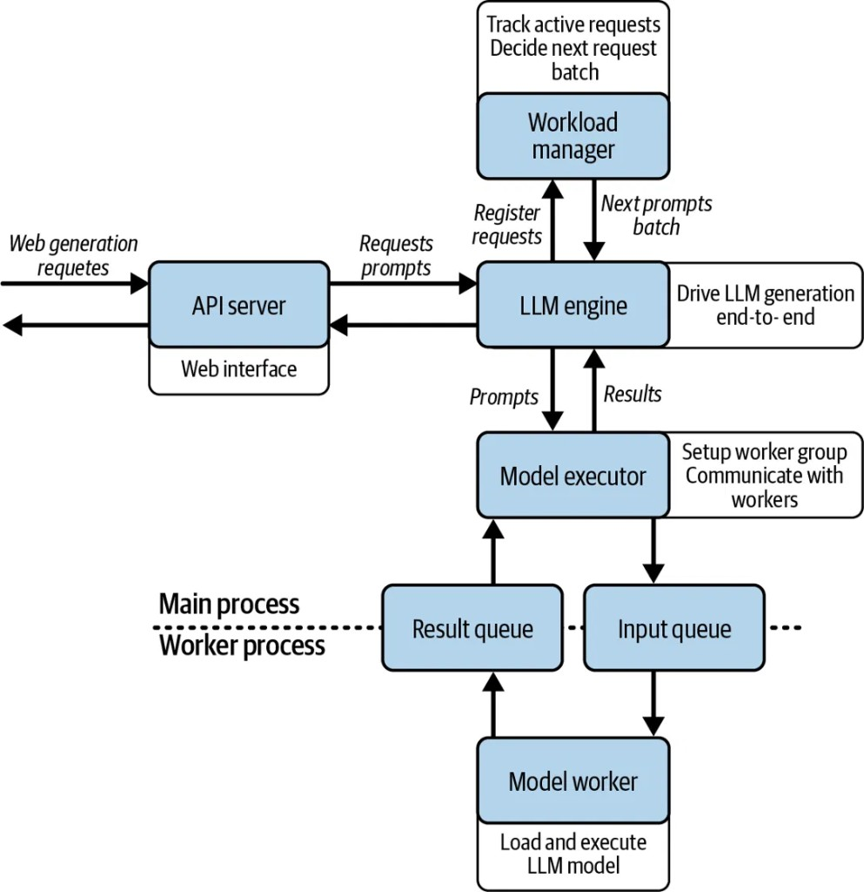
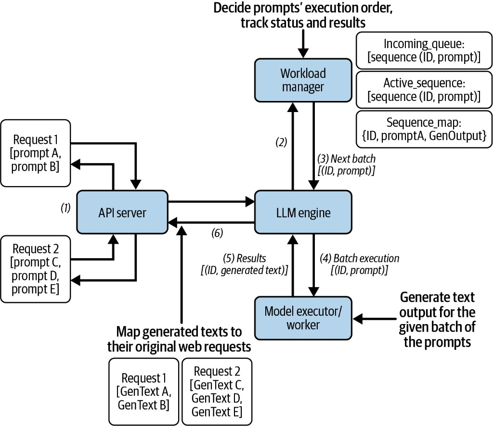
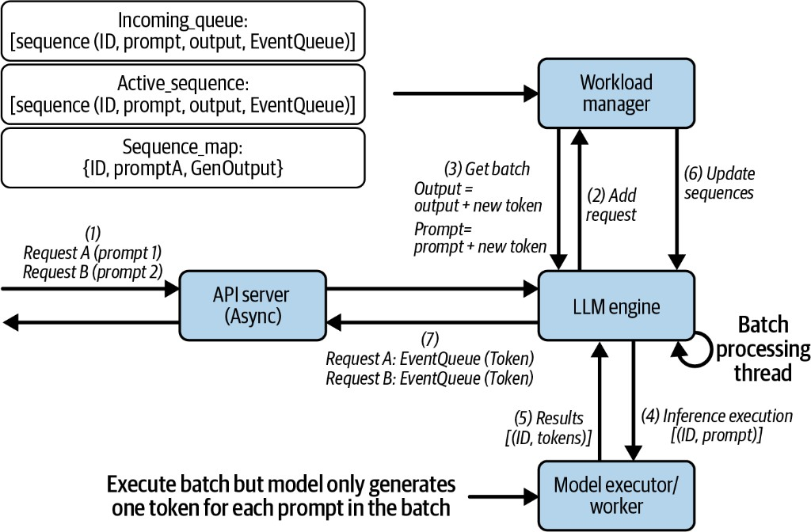
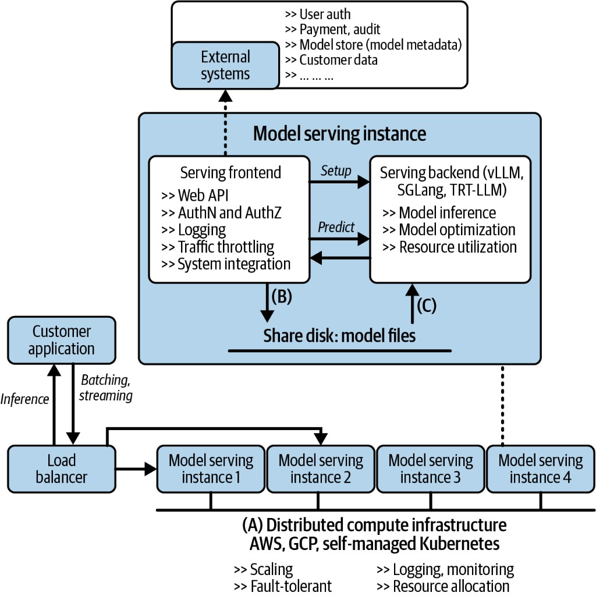

Once you can generate tokens with vLLM (see [vLLM Basics and Why KV Cache Matters](./vllm-basics-kv-cache)), the next question is: **how does a request travel from HTTP to GPU and back?**

Lab: `notebooks/llm-inference/single_model_llm_serving/` — start the server from `main.ipynb`, call it from `test.ipynb`. Server FLOW prints (`>>> [Layer]`) match the boxes in the diagrams below.

Checkpoint paths come from gitignored `notebooks/llm-inference/local_paths.json` (see `local_paths.example.json`). Absolute machine paths are not published.

---

## 1. Restaurant analogy + one simple request

Think of serving as a busy kitchen.

| Restaurant | In the stack | Job |
| ---------- | ------------ | --- |
| Customer | Client (`test.ipynb`) | Sends prompt(s) |
| Waiter | FastAPI (API Server) | Takes the order, returns the answer |
| Head chef | LLM Engine | Runs the ticket end-to-end |
| Host | Workload Manager | Queues tickets, forms batches, tracks ids |
| Kitchen manager | Model Executor | Sends work across the pass window |
| Pass window | Input / result queues | Orders out, plates back |
| Cook | Model Worker | Runs the model on GPU |
| Pantry | Model Manager | Loads weights once at open |



```text
Client → FastAPI → LLM Engine → Workload Manager → Model Executor
       → queues → Model Worker → GPU → results back the same way
```

### Example A — Basic generate (one prompt)

One customer, one dish. From `test.ipynb`:

```python
import httpx

with httpx.Client(proxy=None, trust_env=False) as client:
    response = client.post(
        "http://127.0.0.1:8000/basic_generate",
        json={"prompt": "What is the capital of the United States?"},
        timeout=60.0,
    )

print(response.status_code)
print(response.text)
```

**Client output:**

```text
200
{"generated_text":"What is the capital of the United States? The capital of the United States is Washington, D.C. ..."}
```

**Full server FLOW** (connect each line to the picture above):

```text
============================================================
 REQUEST  POST /basic_generate
============================================================
>>> [FastAPI] /basic_generate — prompt='What is the capital of the United States?'
>>> [FastAPI] → LLMEngine.basic_generate()
--- SKIP [WorkloadManager] basic_generate bypasses queue/batching; goes straight to ModelExecutor
>>> [LLMEngine] basic_generate(prompt='What is the capital of the United States?')
--- SKIP [WorkloadManager] basic_generate builds Sequence locally; no add_request / get_next_batch
>>> [LLMEngine] → ModelExecutor.execute_batch([sequence])
>>> [ModelExecutor] execute_batch — sending 1 item(s) to worker (is_streaming=False)
>>> [ModelExecutor] waiting on result_queue…
>>> [ModelWorker] task received — is_streaming=False, batch_size=1
>>> [ModelWorker] generate() — batch size=1
--- SKIP [ModelManager] model already loaded at worker startup; not reloaded per request
>>> [GPU] model.generate() on cuda  input_shape=(1, 9)
>>> [GPU] ← model.generate() finished
>>> [ModelWorker] generate() — returning 1 result(s)
>>> [ModelWorker] result put on result_queue
>>> [ModelExecutor] ← result received from ModelWorker
>>> [LLMEngine] ← result received from ModelExecutor
>>> [FastAPI] ← returning GenerateResponse
============================================================
 DONE     POST /basic_generate
============================================================
```

| Log line | Box on the diagram |
| -------- | ------------------ |
| `[FastAPI]` | API Server / Web Interface |
| `[LLMEngine]` | LLM Engine (head chef) |
| `SKIP [WorkloadManager]` | Host not needed for a single plate |
| `[ModelExecutor]` … `result_queue` | Model Executor + queues on the process boundary |
| `[ModelWorker]` / `[GPU]` | Worker process — load/execute model |
| `SKIP [ModelManager]` | Pantry already stocked at startup |

So Example A walks the picture top → bottom → back up, with one sequence and no batching.

---

## 2. Many prompts and many requests

When more than one prompt is in flight, the engine must **create an id per prompt**, **batch** work for the GPU, then **map results back** and **remove** finished sequences. That is what the workload picture shows:



### Example B — One HTTP request, four prompts

```python
payload = {
    "prompts": [
        "The capital of France is",
        "The capital of India is",
        "The capital of Japan is",
        "The largest planet is",
    ]
}

with httpx.Client(trust_env=False) as client:
    response = client.post(
        "http://127.0.0.1:8000/generate",
        json=payload,
        timeout=60.0,
    )

print(response.status_code)
print(response.json())
```

**Client output (shape):**

```text
200
{
  "generated_texts": [
    "The capital of France is Paris. ...",
    "The capital of India is ...",
    "The capital of Japan is ...",
    "The largest planet is ..."
  ]
}
```

**Full server FLOW:**

```text
============================================================
 REQUEST  POST /generate
============================================================
>>> [FastAPI] /generate — 4 prompts
>>> [FastAPI] → LLMEngine.generate()  [uses WorkloadManager batching]
>>> [LLMEngine] generate(4 prompts) — uses WorkloadManager
>>> [WorkloadManager] add_request → incoming_queue  id=7a0a61c3… prompt='The capital of France is'
>>> [WorkloadManager] add_request → incoming_queue  id=006cff72… prompt='The capital of India is'
>>> [WorkloadManager] add_request → incoming_queue  id=b0c77899… prompt='The capital of Japan is'
>>> [WorkloadManager] add_request → incoming_queue  id=d46619e1… prompt='The largest planet is'
>>> [WorkloadManager] get_next_batch(batch) — pulled 4, active=4
>>> [LLMEngine] batch loop — 4 seq(s) → ModelExecutor.execute_batch()
>>> [ModelExecutor] execute_batch — sending 4 item(s) to worker (is_streaming=False)
>>> [ModelExecutor] waiting on result_queue…
>>> [ModelWorker] task received — is_streaming=False, batch_size=4
>>> [ModelWorker] generate() — batch size=4
--- SKIP [ModelManager] model already loaded at worker startup; not reloaded per request
>>> [GPU] model.generate() on cuda  input_shape=(4, 5)
>>> [GPU] ← model.generate() finished
>>> [ModelWorker] generate() — returning 4 result(s)
>>> [ModelWorker] result put on result_queue
>>> [ModelExecutor] ← result received from ModelWorker
>>> [WorkloadManager] update_sequence_output id=7a0a61c3… finished=True tokens=1
>>> [WorkloadManager] update_sequence_output id=006cff72… finished=True tokens=1
>>> [WorkloadManager] update_sequence_output id=b0c77899… finished=True tokens=1
>>> [WorkloadManager] update_sequence_output id=d46619e1… finished=True tokens=1
>>> [WorkloadManager] remove_finished_sequence id=7a0a61c3…
>>> [WorkloadManager] remove_finished_sequence id=006cff72…
>>> [WorkloadManager] remove_finished_sequence id=b0c77899…
>>> [WorkloadManager] remove_finished_sequence id=d46619e1…
>>> [LLMEngine] ← returning 4 generated texts
>>> [FastAPI] ← returning BatchGenerateResponse
============================================================
 DONE     POST /generate
============================================================
```
### Server flow in detail (ids: create → send → update → remove)

This is the numbered path on the workload diagram, lined up with Example B’s log:

**1. API Server receives the web request**  
Waiter gets `Request 1` with prompts A–D (or several overlapping requests).

**2. LLM Engine registers each prompt**  
`add_request` creates a UUID **id**, builds a `Sequence(id, prompt)`, puts it on `incoming_queue`, and stores it in `sequence_map`.

```text
>>> [WorkloadManager] add_request → incoming_queue  id=7a0a61c3… prompt='The capital of France is'
… (one line per prompt)
```

**3. Engine asks for the next batch**  
Host moves sequences from `incoming_queue` into `active_sequences` (up to `batch_size=4`) and returns `[(id, prompt), …]`.

```text
>>> [WorkloadManager] get_next_batch(batch) — pulled 4, active=4
```

**4. Batch execution**  
Engine sends that list to Model Executor → Worker. The GPU never needs to know about HTTP — only `(id, prompt)`.

```text
>>> [ModelExecutor] execute_batch — sending 4 item(s) to worker
>>> [GPU] model.generate() on cuda  input_shape=(4, 5)
```

**5. Results come back tagged by id**  
Worker returns `[(id, generated_text), …]`.

**6. Update `sequence_map`, then remove**  
Engine writes each result into `sequence_map[id]`, then drops finished ids from active lists and the map. Finally it walks the original id list to build `generated_texts` in the right order for the API.

```text
>>> [WorkloadManager] update_sequence_output id=7a0a61c3… finished=True
>>> [WorkloadManager] remove_finished_sequence id=7a0a61c3…
>>> [LLMEngine] ← returning 4 generated texts
>>> [FastAPI] ← returning BatchGenerateResponse
```

**Create id → queue → batch → model → update by id → remove id → map to HTTP response.**  
That loop is how nothing is lost or swapped when many prompts share one GPU call.

### Example C — Many HTTP requests at once

Four clients call `/basic_generate` in parallel (`test.ipynb`):

```python
prompts = [
    "What is KV cache?",
    "What is attention?",
    "What is speculative decoding?",
    "What is continuous batching?",
]

async def call_api(prompt):
    async with httpx.AsyncClient(trust_env=False) as client:
        start = time.perf_counter()
        r = await client.post(
            "http://127.0.0.1:8000/basic_generate",
            json={"prompt": prompt},
            timeout=60.0,
        )
        return {
            "prompt": prompt,
            "time": round(time.perf_counter() - start, 2),
            "response": r.json(),
        }

results = await asyncio.gather(*[call_api(p) for p in prompts])
```

**Client output:**

```text
{'prompt': 'What is KV cache?',             'time': 1.61, ...}
{'prompt': 'What is attention?',            'time': 3.04, ...}
{'prompt': 'What is speculative decoding?', 'time': 4.45, ...}
{'prompt': 'What is continuous batching?',  'time': 5.86, ...}
```

On the server you see **four separate** `REQUEST  POST /basic_generate` FLOW blocks (same pattern as Example A). Each connection owns its own reply.

| | Example B | Example C |
| - | --------- | --------- |
| HTTP | 1 request, 4 prompts | 4 requests, 1 prompt each |
| Ids + Host queue | Yes — see FLOW `add_request` / `remove_finished_sequence` | Each call is independent |
| GPU | One batch `input_shape=(4, …)` | Separate generates (times add up) |

In a production **vLLM** server, concurrent calls like C are continuously batched with the same id discipline as the second diagram — Request 1 and Request 2 share the kitchen; ids keep answers attached when mapping back.


---

## 3. Streaming — one token per batch step

Batch generate waits for the **full** text. Streaming returns **tokens as they are produced**. The continuous loop looks like this:



### What the figure is saying

| Step | Meaning |
| ---- | ------- |
| (1) | API Server (async) accepts Request A and Request B |
| (2) | Engine **Add Request** — each gets an id, lands in `incoming_queue` / `sequence_map` (with an **EventQueue** for that client) |
| (3) | Batch-processing thread **Get Batch** of active sequences |
| (4)–(5) | Model Executor runs the batch but generates **only one new token per prompt** |
| (6) | **Update Sequences** — append token; grow `output` / prompt context |
| (7) | Push token into that sequence’s **EventQueue**; API streams it to the client |

Two requests stay on the same loop; ids + EventQueues keep tokens on the right wire.

### Example — `POST /generate_stream` (`test.ipynb`)

```python
import json
import httpx

prompt = "What is the capital of the United States?"
tokens = []
sequence_ids = set()

with httpx.Client(trust_env=False) as client:
    with client.stream(
        "POST",
        "http://127.0.0.1:8000/generate_stream",
        json={"prompt": prompt},
        timeout=120.0,
    ) as response:
        print("status:", response.status_code)
        for line in response.iter_lines():
            if not line or not line.startswith("data: "):
                continue
            data = json.loads(line[6:])
            token = data["token"]
            seq_id = data["sequence_id"]
            tokens.append(token)
            sequence_ids.add(seq_id)
            print(token, end="", flush=True)

print("\n")
print("sequence_id:", sequence_ids)
print("num tokens:", len(tokens))
print("full text:", prompt + "".join(tokens))
```

**Client output (from the lab):**

```text
status: 200
 Washington, D.C. is the capital of the United States. It is located on the National Mall in

sequence_id: {'bf1b87d8-a261-481e-9e2a-08831607bb11'}
num tokens: 21
full text: What is the capital of the United States? Washington, D.C. is the capital of the United States. It is located on the National Mall in
```

One `sequence_id` for all 21 tokens — that is the ticket number on every SSE event (figure step 7).

### Server FLOW (from `main.ipynb`) — connect to the figure

**Start — figure steps (1)–(2):** create id, EventQueue, enqueue.

```text
============================================================
 REQUEST  POST /generate_stream
============================================================
>>> [FastAPI] /generate_stream — prompt='What is the capital of the United States?'
>>> [FastAPI] → LLMEngine.event_generator()  [uses WorkloadManager + streaming loop]
>>> [LLMEngine] event_generator(prompt='What is the capital of the United States?')
>>> [WorkloadManager] add_streaming_request → streaming_queue  id=bf1b87d8…
>>> [LLMEngine] streaming seq bf1b87d8… queued; waiting on client asyncio.Queue
>>> [LLMEngine] (tokens produced asynchronously by requests_processing_loop thread)
>>> [WorkloadManager] get_next_batch(streaming) — pulled 1, active=1
```

**One decode step — figure steps (3)–(7):** one forward, one token, push to EventQueue, update sequence.  
`input_shape` grows `(1, 9) → (1, 10) → …` as the prompt context lengthens.

```text
>>> [LLMEngine] streaming loop — 1 active seq(s) → ModelExecutor.execute_forward_batch()
>>> [ModelExecutor] execute_forward_batch — sending 1 item(s) to worker (is_streaming=True)
>>> [ModelWorker] task received — is_streaming=True, batch_size=1
>>> [ModelWorker] generate_forward_batch() — 1 prompt(s), one token each
--- SKIP [ModelManager] model already loaded; not reloaded per request
>>> [GPU] model forward() on cuda  input_shape=(1, 9)
>>> [GPU] ← forward() + sample finished
>>> [ModelWorker] generate_forward_batch() — returning 1 token(s)
>>> [ModelExecutor] ← streaming result received (type=stream)
>>> [LLMEngine] streaming loop — seq bf1b87d8… token=' Washington' → client queue
>>> [WorkloadManager] update_sequence_output id=bf1b87d8… finished=False tokens=1
```

Next iterations (same pattern; tokens from the run):

```text
… token=','          tokens=2   input_shape=(1, 10)
… token=' D'         tokens=3
… token='.C'         tokens=4
… token='.'          tokens=5
… token=' is'        tokens=6
… token=' the'       tokens=7
… token=' capital'   tokens=8
… token=' of'        tokens=9
… token=' the'       tokens=10
… token=' United'    tokens=11
… token=' States'    tokens=12
… token='.'          tokens=13
… token=' It'        tokens=14
… token=' is'        tokens=15
… token=' located'   tokens=16
… token=' on'        tokens=17
… token=' the'       tokens=18
… token=' National'  tokens=19
… token=' Mall'      tokens=20
… token=' in'        tokens=21   input_shape=(1, 29)
```

**Finish — remove id** (same lifecycle as batch generate):

```text
>>> [LLMEngine] streaming loop — seq bf1b87d8… finished → put None on client queue
>>> [WorkloadManager] remove_finished_sequence id=bf1b87d8…
>>> [LLMEngine] event_generator — end of stream for seq bf1b87d8…
>>> [LLMEngine] event_generator — cleaned up seq bf1b87d8…
============================================================
 DONE     POST /generate_stream
============================================================
```

| Log / client | Figure |
| ------------ | ------ |
| `add_streaming_request … id=bf1b87d8` | (2) Add Request + id |
| `get_next_batch(streaming)` / `streaming loop` | (3) Get Batch (batch thread) |
| `execute_forward_batch` / `generate_forward_batch` / `GPU forward` | (4)–(5) one token per prompt |
| `update_sequence_output … tokens=N` | (6) Update Sequences |
| `token='…' → client queue` + client prints tokens | (7) EventQueue → API stream |
| `remove_finished_sequence` / `end of stream` | ticket closed |

### Code path in the lab

**Waiter** — FastAPI SSE (`main.ipynb` / `main.py`):

```python
@app.post("/generate_stream")
async def generate_stream(request: GenerateRequest, llm: LLMEngine = Depends(get_llm)):
    async def event_generator():
        loop = asyncio.get_event_loop()
        async for token in llm.event_generator(loop, request.prompt):
            yield token
    return StreamingResponse(event_generator(), media_type="text/event-stream")
```

**Head chef** — EventQueue + wait for tokens (`llm/llm.py`):

```python
async def event_generator(self, loop, prompt: str):
    queue = asyncio.Queue()  # EventQueue in the figure
    seq_id = self.workload_manager.add_streaming_request(prompt, queue, loop)
    while True:
        data = await queue.get()
        if data is None:
            break
        yield f"data: {data}\n\n"
    self.workload_manager.remove_finished_sequence(seq_id)
```

**Batch-processing thread** — figure steps 3–7 (`requests_processing_loop`):

```python
active = workload_manager.get_next_batch(is_streaming=True)
results = model_executor.execute_forward_batch(
    [{"prompt": seq.prompt, "request_id": seq.id} for seq in active]
)
for result in results:
    seq.client_stream.put(json.dumps({
        "token": result["token"],
        "sequence_id": result["request_id"],  # same id client prints
    }))
    workload_manager.update_sequence_output(result["request_id"], result["token"])
```

When finished (EOS or `max_tokens`), put `None` on the queue and **remove** the sequence.

---

## 4. Takeaways

1. **Example A** walks the architecture diagram with a full FLOW log — waiter → chef → executor → worker → GPU and back.  
2. **Many prompts / requests** need **ids**: create on `add_request`, send in the batch, update `sequence_map`, then **remove** when done.  
3. **Example B** is one request with many prompts batched together; **Example C** is many requests at once — production vLLM merges those with the same id discipline.  
4. **Streaming** (`bf1b87d8…`, 21 tokens in the lab): same Host + **one GPU forward per token**; EventQueue delivers SSE; id is created, updated each step, then removed.

---

## 5. Scaling out: single-model serving architecture

The lab above is **one process, one model**. In production you usually replicate that pattern across a cluster. A common layout looks like this:



### Layers

| Layer | Role |
| ----- | ---- |
| Customer application | Sends inference / streaming requests |
| Load balancer | Spreads traffic across serving instances |
| Serving frontend | Web API, AuthN/AuthZ, logging, throttling, integration with external systems |
| Serving backend | Inference engines (vLLM, SGLang, TRT-LLM) — run the model, optimize, use GPU |
| Shared disk | Model weight files visible to every instance |
| External systems | User auth, payment/audit, model metadata store, customer data |
| Distributed compute | AWS / GCP / self-managed Kubernetes — scaling, fault tolerance, monitoring |

### How a request moves

1. App → load balancer → one of N **model serving instances**  
2. **Frontend** authenticates / throttles (via external systems), then issues **Setup** / **Predict** to the backend  
3. **Backend** reads weights from shared disk (or uses an already-loaded engine) and runs inference  
4. Response returns (batch or stream) through the same path  

Labeled paths in the figure:

- **(A)** Instances run on shared distributed compute  
- **(B)** Frontend can stage / discover model files on shared disk  
- **(C)** Backend loads those files for inference  

### Mapping to this series

| Production box | In the lab stack |
| -------------- | ---------------- |
| Serving frontend | FastAPI API server |
| Serving backend | LLM Engine → Workload Manager → Model Executor → Model Worker (or vLLM) |
| Model files | Local checkpoint under `MODELS_DIR` |

The lab is the **inside of one instance**. The figure is how you **replicate** that instance behind a load balancer when one GPU (or one process) is no longer enough.

**Previous:** [vLLM Basics and Why KV Cache Matters](./vllm-basics-kv-cache)  
**Next:** [Serving Multiple Models](./serving-multi-models)
