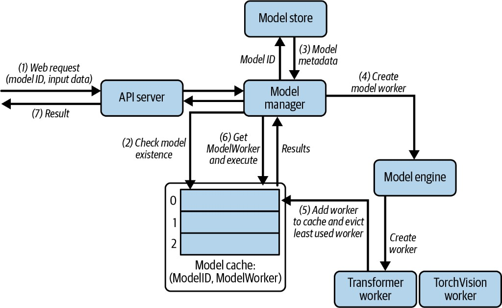
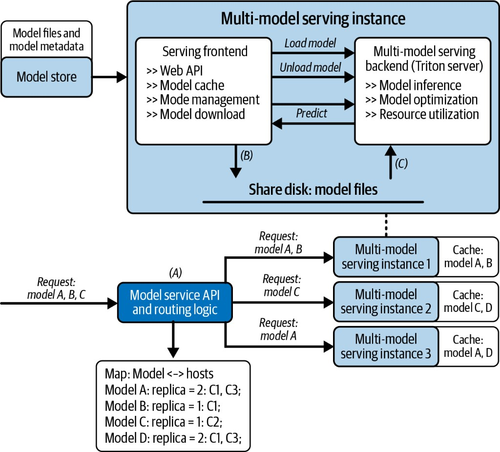

A single-model server is simple: load weights once, answer every request with that model. Real platforms often need **several** models behind one API — different sizes, chat templates, or tasks — without keeping every checkpoint resident on GPU.

This post walks a small multi-model stack: one HTTP process, a model store, an LRU cache (capacity 2), and workers for two local chat models.

| Model ID | Checkpoint |
| -------- | ---------- |
| `qwen2.5-0.5b` | `Qwen2.5-0.5B-Instruct` |
| `tinyllama-1.1b` | `TinyLlama-1.1B-Chat-v1.0` |

---

## 1. Architecture



| Box in the diagram | Code | Job |
| ------------------ | ---- | --- |
| API server | `app/server.py` | HTTP: `/models`, `/generate`, `/predict` |
| Model manager | `app/manager.py` | Cache lookup, LRU eviction, orchestrate load |
| Model store | `app/store.py` + `config/models.json` | Metadata + path resolution |
| Model cache | `OrderedDict` in manager | Resident `(model_id → worker)`, capacity `max_models` |
| Model engine | `app/engine.py` | Factory: create / delete workers |
| Model workers | `app/worker.py` | Load weights, run `generate` |

Request path (numbers match the figure):

1. Client sends `{model_id, prompt}` to the API server  
2. Manager checks the **model cache**  
3. On miss → load **metadata** from the store  
4. Engine **creates** the right worker  
5. Worker is **added** to the cache; if full, **evict** least-recently used  
6. Manager **executes** on the worker  
7. Result returns through the API  

```text
Client → FastAPI → ModelManager → (cache hit?)
                              ├─ hit  → worker.predict()
                              └─ miss → Store → Engine → LLMCausalWorker → cache → predict()
```

---

## 2. Register models (store)

`config/models.json` lists what the platform *knows about*. Paths are **folder names** under `MODELS_DIR` — not absolute machine paths.

```json
{
  "models": [
    {
      "id": "qwen2.5-0.5b",
      "name": "Qwen2.5-0.5B-Instruct",
      "path": "Qwen2.5-0.5B-Instruct",
      "type": "llm",
      "framework": "transformers",
      "version": "1.0.0",
      "description": "Qwen2.5 0.5B Instruct — local causal LM"
    },
    {
      "id": "tinyllama-1.1b",
      "name": "TinyLlama-1.1B-Chat-v1.0",
      "path": "TinyLlama-1.1B-Chat-v1.0",
      "type": "llm",
      "framework": "transformers",
      "version": "1.0.0",
      "description": "TinyLlama 1.1B Chat — local causal LM"
    }
  ]
}
```

Machine-local roots live in a **gitignored** file (never published):

```text
local_paths.example.json   # committed template
local_paths.json           # your copy — gitignored
```

```python
from local_paths import load_local_paths, models_dir

cfg = load_local_paths()
MODELS_DIR = models_dir(cfg)
os.environ["MODELS_DIR"] = str(MODELS_DIR)
```

---

## 3. LRU manager + engine

Default capacity is **2** — enough to keep both lab models warm. On a miss with a full cache, the oldest entry is unloaded.

```python
# app/manager.py (core of get_model_worker)
if model_id in self.model_cache:
    self.model_cache.move_to_end(model_id)
    return self.model_engine.get_worker(model_id)

if len(self.model_cache) >= self.max_models:
    evicted_id, _ = self.model_cache.popitem(last=False)
    self.model_engine.delete_worker(evicted_id)

worker = self.model_engine.create_worker(model_metadata)
self.model_cache[model_id] = worker
return worker
```

The engine picks a worker type from metadata (here: transformers causal LM):

```python
# app/engine.py
if model_metadata.framework == "transformers" and model_metadata.type == "llm":
    self.workers[model_metadata.id] = LLMCausalWorker(model_metadata)
```

`LLMCausalWorker` loads from disk with `local_files_only=True`, applies the chat template when present, and returns only newly generated tokens.

---

## 4. Serving the API

```python
import uvicorn
from app.server import app

uvicorn.run(app, host="127.0.0.1", port=8001)
```

Endpoints used below: `GET /models`, `POST /generate`, `POST /predict`, plus admin helpers for cache demos.

---

## 5. What we measured

When we exercised different scenarios against the running server, these were the inputs and outputs.

### List models (cache empty)

**Input**

```http
GET /models
```

**Output**

```text
200
available: ['qwen2.5-0.5b', 'tinyllama-1.1b']
models_dir: <MODELS_DIR>
  qwen2.5-0.5b: resolved=<MODELS_DIR>/Qwen2.5-0.5B-Instruct
  tinyllama-1.1b: resolved=<MODELS_DIR>/TinyLlama-1.1B-Chat-v1.0
loaded: {}
```

`available` comes from the store; `loaded` is the cache. Nothing is resident until the first generate.

### Generate — Qwen

**Input**

```json
{
  "model_id": "qwen2.5-0.5b",
  "prompt": "What is the capital of the United States? Answer in one sentence.",
  "max_new_tokens": 48
}
```

**Output**

```json
{
  "model_id": "qwen2.5-0.5b",
  "model_name": "Qwen2.5-0.5B-Instruct",
  "prompt": "What is the capital of the United States? Answer in one sentence.",
  "generated_text": "The capital of the United States is Washington, D.C., which was established as the nation's first city in 1790 to serve as its seat of government and to be the official residence of the President of the United States."
}
```

### Generate — TinyLlama

**Input**

```json
{
  "model_id": "tinyllama-1.1b",
  "prompt": "What is 2+2? Answer briefly.",
  "max_new_tokens": 32
}
```

**Output**

```json
{
  "model_id": "tinyllama-1.1b",
  "model_name": "TinyLlama-1.1B-Chat-v1.0",
  "prompt": "What is 2+2? Answer briefly.",
  "generated_text": "2 + 2 = 4 in simple terms."
}
```

After both models have been hit once (`max_models=2`):

**Output**

```text
loaded_models: {
  'tinyllama-1.1b': 'TinyLlama-1.1B-Chat-v1.0',
  'qwen2.5-0.5b': 'Qwen2.5-0.5B-Instruct'
}
```

### Concurrent requests (both models warm)

Four `/generate` calls in parallel (`max_new_tokens=40`).

**Input**

| model_id | prompt |
| -------- | ------ |
| `qwen2.5-0.5b` | What is attention? One sentence. |
| `tinyllama-1.1b` | What is continuous batching? One sentence. |
| `qwen2.5-0.5b` | What is speculative decoding? One sentence. |
| `tinyllama-1.1b` | What is a transformer? One sentence. |

**Output**

| model_id | time | generated_text (truncated) |
| -------- | ---- | ------------------------- |
| `qwen2.5-0.5b` | 3.39s | Attention refers to the process of selectively focusing on relevant information… |
| `tinyllama-1.1b` | 3.64s | Continuous batching is a technique used in data processing that involves processing batches… |
| `qwen2.5-0.5b` | 3.77s | Speculative decoding involves the use of computational methods to decode information… |
| `tinyllama-1.1b` | 3.57s | A transformer is a device that can transform one type of energy… |

Every response echoed the requested `model_id` — routing stayed correct under concurrency.

### Warm latency (same model)

Same prompt twice on an already-loaded Qwen worker.

**Input**

```json
{
  "model_id": "qwen2.5-0.5b",
  "prompt": "Explain KV cache in 2 sentences.",
  "max_new_tokens": 48
}
```

**Output**

```text
call 1: 1.477s  status=200
call 2: 1.446s  status=200

generated_text: "A Key-Value (KV) Cache is an application layer storage that stores data
in a non-volatile manner using hash or bitmaps as key-value pairs. It provides
fast access to data and can improve the performance of applications by reducing disk…"
```

Once the worker is cached, repeat calls are generation cost only — no reload spike between call 1 and 2.

### Errors

**Input** — invalid model

```json
{ "model_id": "does-not-exist", "prompt": "hello", "max_new_tokens": 8 }
```

**Output**

```json
{ "detail": "Model does-not-exist not found" }
```

**Input** — empty prompt

```json
{ "model_id": "qwen2.5-0.5b", "prompt": "", "max_new_tokens": 8 }
```

**Output**

```text
500  — Empty prompt
```

### Token length vs latency (warm Qwen)

**Input**

```json
{
  "model_id": "qwen2.5-0.5b",
  "prompt": "Explain continuous batching briefly.",
  "max_new_tokens": <8 | 32 | 64 | 128>
}
```

**Output**

| `max_new_tokens` | Latency | Approx. chars |
| ---------------- | ------- | ------------- |
| 8 | 0.28s | 59 |
| 32 | 0.95s | 197 |
| 64 | 1.90s | 361 |
| 128 | 3.79s | 765 |

Decode cost scales roughly with tokens generated — same idea as single-model serving, now behind a model router.

### LRU eviction (`max_models=1`)

**Input**

```json
POST /admin/cache/config   { "max_models": 1 }
POST /admin/cache/clear
POST /generate             alternate qwen2.5-0.5b ↔ tinyllama-1.1b
```

**Output (expected)**

With capacity 1, `loaded_models` holds only the last requested model; the previous worker is unloaded (server logs show `LRU eviction`). Restore with `{ "max_models": 2 }` when done.

---

## 6. What this demo teaches

- **Store ≠ cache.** Registration is cheap; loading weights is expensive.  
- **LRU is the memory valve.** Cap how many checkpoints stay on GPU.  
- **Engine + workers** keep frameworks pluggable (transformers LLM today; other worker types fit the same factory).  
- **Routing is part of the contract.** Every response echoes `model_id` so clients can verify the right model answered.

This sits next to [LLM Serving Engine Internals](./serving-engine-internals) (one model, deep stack) as the **multi-model control plane**: same HTTP surface, many checkpoints, deliberate load/unload.

---

## 7. Scaling out: multi-model cluster architecture

The lab is **one instance** that can load Qwen or TinyLlama with an LRU cache. Production multi-model platforms add a second concern: **which host should answer for which model?**



### Inside one multi-model instance (top of figure)

| Piece | Role |
| ----- | ---- |
| Model store | Model files + metadata (registry) |
| Serving frontend | Web API, **model cache**, management, download |
| Serving backend | Inference runtime (e.g. Triton / vLLM) — load, unload, predict |
| Shared disk | Staged weights the backend can map into memory |

Flow:

1. Frontend downloads / stages a checkpoint from the model store onto shared disk **(B)**  
2. Frontend tells the backend to **Load model** (or **Unload**)  
3. Backend reads files from shared disk **(C)** and runs **Predict**  
4. Results return through the frontend  

That matches the lab: store → manager/cache → engine/worker → generate — plus an explicit load/unload control plane.

### Across the cluster (bottom of figure)

A **model service API + routing logic** sits in front of many instances. It keeps a **map: model ↔ hosts** (replicas):

| Model | Replicas (example) |
| ----- | ------------------ |
| A | hosts C1, C3 |
| B | host C1 |
| C | host C2 |
| D | hosts C1, C3 |

Incoming traffic for models A/B/C is routed to instances whose **cache already holds** that model (or that are allowed to load it):

- Instance 1 — cache A, B → serves A and B  
- Instance 2 — cache C, D → serves C  
- Instance 3 — cache A, D → serves A  

So routing is not only load balancing — it is **cache-aware placement**: send the request where the weights are warm when possible.

### Lab vs production

| Concern | This lab (one process) | Cluster figure |
| ------- | ---------------------- | -------------- |
| How many models resident? | LRU `max_models` on one host | Per-instance cache + cluster map |
| Who picks the host? | N/A (single process) | Model service router |
| Load / unload | Manager + engine delete worker | Frontend → backend Load/Unload |
| Failure / scale | Restart the process | New instances + updated model↔host map |

**Previous:** [LLM Serving Engine Internals](./serving-engine-internals)
