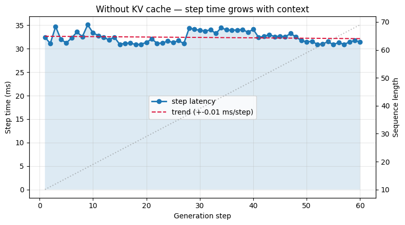
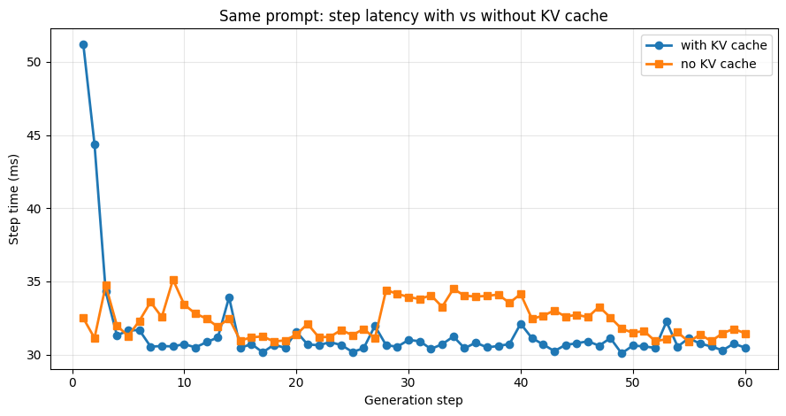
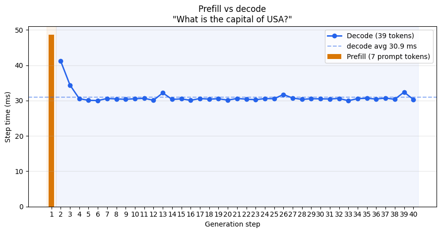

Companion notebook: `notebooks/llm-inference/basic_vLLM_v1.ipynb`  
Model: `Qwen2.5-0.5B-Instruct` (vLLM 0.6.x, PyTorch 2.4, CUDA 11.8)

Local checkpoint root comes from gitignored `notebooks/llm-inference/local_paths.json` (copy from `local_paths.example.json`). Do not commit absolute machine paths.

With GPU memory and bandwidth in mind from the previous chapters, this chapter turns to the generate loop itself — why decode is expensive, what the KV cache fixes, and how vLLM wires it together.

## 1. What inference really is

Training teaches a model weights. *Inference* is the job of turning those weights into answers for real users — at scale, under latency pressure, without burning the GPU budget.

A pocket calculator is easy to serve: one request in, one number out, stateless.  
An LLM is different:

- *Stateful* — it needs context (your whole conversation so far) every single step  
- *Sequential* — it can only produce *one* token at a time, and the next token depends on all previous ones  
- *Memory-hungry* — the more users you serve, the more concurrent state you have to manage on GPU

Those three properties make LLM inference its own engineering problem — not just "run the model on a server."

---

## 2. Transformers: one-step-at-a-time, not one-shot

When you see a sentence generated word by word, that is not a UX trick. It reflects how transformers actually work.

At each decode step, the model takes *all tokens generated so far* as input and predicts only the very next token from the output distribution. Then the loop repeats with one more token appended.

*Pseudocode:*

```python
tokens = tokenize(prompt)

while not done:
    logits = model(tokens)           # forward pass over everything
    next_token = sample(logits[-1])  # pick one token from the last position
    tokens.append(next_token)
    if next_token == EOS: break
```

Every call to `model(tokens)` is a full forward pass. As you generate more tokens, the input gets longer. And longer inputs mean more compute — every step.

---

## 3. The problem: step time grows with context

To make this concrete: without any optimisation, run the model manually for 60 steps. At each step, log how long the forward pass took and how long the sequence already is.

```python
for step in range(max_new_tokens):
    logits = model(input_ids, use_cache=False).logits   # full recompute
    next_id = torch.argmax(logits[:, -1, :]).item()
    input_ids = torch.cat([input_ids, [[next_id]]], dim=-1)
```

**Actual step-by-step timings from the notebook run** — prompt: *"Write a short introduction about the US capital city."*

```output
step 01 | seq= 10 |  32.5 ms | ' Washington'
step 02 | seq= 11 |  31.1 ms | ','
step 03 | seq= 12 |  34.7 ms | ' D'
step 04 | seq= 13 |  32.0 ms | '.C'
step 05 | seq= 14 |  31.3 ms | '.'
...
step 32 | seq= 41 |  34.0 ms | ' eastern'
step 33 | seq= 42 |  33.3 ms | ' coast'
step 34 | seq= 43 |  34.5 ms | ' of'
step 35 | seq= 44 |  34.0 ms | ' the'
```

The times stay in the ~31–35 ms range here because the model is small (0.5B parameters) and the sequence is short. On larger models and longer contexts — which is the realistic case — step time grows more visibly because every step reprocesses an ever-longer sequence from scratch.

The shape of the problem:

```output
Step time
  │          ·
  │         · ·
  │        ·   ·
  │    · ··     ·····
  │·  ·
  └───────────────────► Token number
      (sequence grows → each step recomputes more)
```

The root cause: at each step, the model runs *self-attention over all previous tokens*. That is an O(n) operation per layer — so as you generate more tokens, each new step is proportionally more expensive.

<figure>



<figcaption><span class="figure-label">Figure 1.</span> Step latency without KV cache — time per token vs generation step, with trend line</figcaption>
</figure>

---

## 4. The fix: KV cache

In self-attention, each token produces a *Key* and a *Value* vector. These are used by every later token to decide what to attend to. The important insight: *a token's K/V vectors don't change* once it is computed — they are fixed properties of that token in that context.

So instead of recomputing K/V for all previous tokens at every step, you can *store them* and reuse them.

```output
Without KV cache:          step 5 recomputes K/V for tokens 1, 2, 3, 4, 5
                           step 6 recomputes K/V for tokens 1, 2, 3, 4, 5, 6
                           step N recomputes N×L attention ops

With KV cache:             step 5 uses stored K/V for 1–4, adds K/V for 5
                           step 6 uses stored K/V for 1–5, adds K/V for 6
                           step N does 1×L attention + table lookup
```

Memory cost grows (you're storing more K/V every step), but **compute cost per step becomes roughly constant** once you pass the first step.

---

## 5. Prefill and decode — the two phases

With a KV cache, generation splits into two distinct phases:

*Prefill* — process the full prompt in one forward pass. This builds the KV cache for every prompt token at once.

*Decode* — at each subsequent step, only the newly added token is run through the model. It attends to all past tokens via the cache, produces the next logit, and appends its own K/V.

```output
Prompt tokens: [t1] [t2] [t3] [t4] [t5]
               └──────── Prefill (one pass, builds KV) ──────┘
                                                               ↓
                                                              [t6] ← Decode step 1
                                                              [t7] ← Decode step 2
                                                               ...  (each step: tiny forward + table lookup)
```

*Measured from the notebook* — same prompt as above, but now with `use_cache=True`:

```output
step 01 | prefill seq= 10 |  51.2 ms | ' Washington'   ← more expensive: builds KV for all 10 tokens
step 02 | decode  seq= 11 |  44.4 ms | ','
step 03 | decode  seq= 12 |  34.3 ms | ' D'
step 04 | decode  seq= 13 |  31.3 ms | '.C'
step 05 | decode  seq= 14 |  31.6 ms | '.'
step 06 | decode  seq= 15 |  31.7 ms | ' is'
step 07 | decode  seq= 16 |  30.5 ms | ' the'
step 08 | decode  seq= 17 |  30.6 ms | ' capital'
...
step 24 | decode  seq= 33 |  30.6 ms | 'Atlantic'
```

After the first two steps warm up, decode settles to ~30–31 ms per token and stays flat — regardless of how long the sequence grows. The KV cache eliminated the quadratic recompute.

<figure>



<figcaption><span class="figure-label">Figure 2.</span> With vs without KV cache — step latency overlay on the same prompt</figcaption>
</figure>

On the *"What is the capital of USA?"* question (7 prompt tokens):

```output
Prefill : 48.6 ms   ← pay once to build the cache
Decode  : 30.9 ms/token  (avg; min 30.0, max 41.2)
Prefill ≈ 1.6× a single decode step
```output

Prefill cost scales with prompt length. Decode cost per token is roughly flat. That ratio matters more on larger models and longer prompts than it does here.

<figure>



<figcaption><span class="figure-label">Figure 3.</span> Prefill vs decode — bar for prefill, line for per-token decode steps</figcaption>
</figure>

---

## 6. vLLM: all of this managed for you

Manually managing K/V tensors, handling multiple concurrent users, and keeping the GPU busy is a significant engineering job. *vLLM* is an inference engine that handles it — you write prompts and sampling parameters, it handles the rest.

### Load once, reuse everywhere

```python
from vllm import LLM, SamplingParams
from local_paths import model_path  # notebooks/llm-inference/local_paths.py

MODEL_PATH = str(model_path("QWEN_MODEL"))  # folder under MODELS_DIR in local_paths.json

llm = LLM(
    model=MODEL_PATH,
    dtype="float16",
    gpu_memory_utilization=0.30,
    max_model_len=2048,
    max_num_seqs=8,
)
```

Weights load once — ≈ 0.93 GB for this 0.5B model. vLLM then pre-allocates a *paged KV block pool* so it can serve many concurrent requests without memory fragmentation.

| Knob | Role |
| ---- | ---- |
| `dtype` | Weight precision |
| `gpu_memory_utilization` | Fraction of GPU for weights + KV blocks |
| `max_model_len` | Max prompt + generation length |
| `max_num_seqs` | Max concurrent sequences in one batch |

### First completion

```python
params = SamplingParams(temperature=0.8, top_p=0.95, max_tokens=128)
outputs = llm.generate([prompt], params)
text = outputs[0].outputs[0].text
```

*Run output:*
```
prompt tokens ~ 29
new tokens    = 128

est. speed input: 48.53 toks/s, output: 214.20 toks/s
```

The call blocks until all 128 tokens are ready. Fine for batch jobs.

### Sampling knobs

`SamplingParams` controls *how* you draw from the next-token distribution — the model weights stay fixed.

| Param | Effect |
| ----- | ------ |
| `temperature` | Higher → more random; `0` = greedy (always pick highest probability) |
| `top_p` | Keep smallest token set covering p% of probability mass |
| `top_k` | Keep only the top-k most probable tokens |
| `max_tokens` | Stop after this many new tokens |
| `stop` | Stop on specific strings (e.g. `["\n"]`) |

**Same prompt, two settings — from the run:**

```
[greedy (T=0)]    The capital of France is Paris. It is the largest city in
                  Europe and the third largest city in the world...

[creative (T=1.0)] The capital of France is:
                   A) Paris
                   B) London
                   C) Berlin
                   D) Moscow
                   To determine the capital of France...
```

Same model. Same weights. Entirely different output character.

### Batching: one of the biggest wins

vLLM can run multiple prompts in a **single** forward pass. The GPU is fully occupied; prompts share compute rather than queuing behind each other.

**Measured:**

```
4 prompts in one batch : 0.379s   (~688 output tokens/s)
4 prompts one-by-one   : 1.145s   (~226 output tokens/s)
speedup                : 3.02×
```

This is why serving stacks never isolate each HTTP request to its own idle `generate` call. Batching is how you get GPU utilisation high enough to be economical.

### Streaming: token-by-token for chat UX

`llm.generate` returns a finished string — the caller waits for all tokens. Chat UIs need each token to appear as it is produced. `AsyncLLMEngine` provides this:

```python
from vllm.engine.async_llm_engine import AsyncLLMEngine

engine = AsyncLLMEngine.from_engine_args(engine_args)

async def stream_text(prompt: str):
    prev = ""
    async for req in engine.generate(prompt, sampling, request_id):
        delta = req.outputs[0].text[len(prev):]
        print(delta, end="", flush=True)
        prev = req.outputs[0].text
```

Same checkpoint. Same prefill/decode loop. The only difference is that the engine yields after each decode step instead of waiting for the full answer.

---

## 7. How they fit together

```
Prompt
  → tokenise
  → Prefill   — full forward on all prompt tokens → build KV cache
  → Decode loop (per new token):
        look up cached K/V for past tokens
        run one forward for the new token
        sample next token from logits
        store new K/V in cache
  → detokenise → text
```

vLLM's job: run that loop for *many* requests at once, pack them into efficient batches, and manage KV blocks in a paged pool so the GPU stays busy without you writing any of that.

---

## 8. Takeaways

1. *LLM decode is sequential* — one token per step, full context each time without optimisation.
2. *Step cost grows with context* — because self-attention re-runs over all previous tokens.
3. *KV cache* — store K/V once per token; reuse on every future step → decode cost becomes roughly flat.
4. *Prefill* is expensive per prompt token; *decode* is cheap per generated token.
5. *vLLM* manages all of this: load once, batch many requests, serve streaming or blocking — same weights throughout.
6. *Batching alone gives ~3× throughput* vs one-by-one on the same hardware.

*Next:* [LLM Serving Engine Internals](./serving-engine-internals) — how a request travels through an HTTP serving stack, from waiter (FastAPI) to line cook (ModelWorker).
