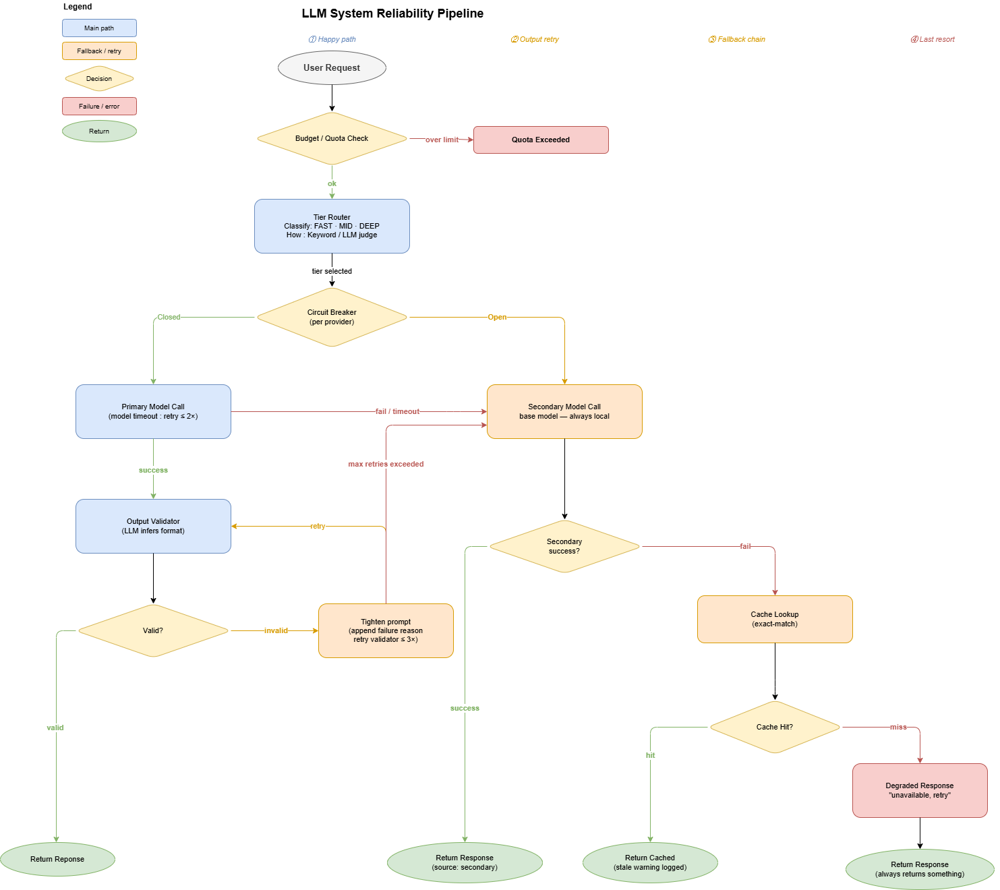

A traditional API either works or throws an exception — simple to monitor and easy to handle. LLM systems break that assumption in three distinct ways.

**Infrastructure failures** — the model doesn't respond at all:
- Endpoint down or unreachable
- Rate limit exceeded
- Network timeout
- Server overloaded

**Output failures** — the model responds but the response is wrong:
- Returns a narrative when you needed a number
- Hallucinated fields in a JSON object
- Truncated mid-sentence
- Plausible-sounding but factually incorrect
- These return HTTP 200 — invisible to infrastructure monitoring

**Quality drift** — no single request fails, but quality degrades over time:
- Model version silently updated by provider
- Prompt that worked last month stops working
- Distribution shift in user inputs
- Only detectable through evaluation, not logs

Designing for reliability means building explicit guards at each layer. The patterns below address them in order, from the simplest to add first to the most involved.

Notebook: [reliability-demo.ipynb](https://github.com/rangarajp/rangarajp.github.io/blob/main/notebooks/llm-system-design/reliability-demo.ipynb) — runs all layers against two local Qwen3-0.6B checkpoints (base + reasoning) using real connection errors and real threading-based timeouts.

---

## Layer 1 — Timeout + retry

The most common infrastructure failure is a call that takes too long. Without a timeout, a single slow model call blocks the thread and stalls every downstream operation.

The fix is a real timeout using a background thread — if the model call exceeds the deadline, we cancel it and raise `TimeoutError`. Then retry with exponential backoff.

```python
import threading, time

def call_with_timeout(fn, prompt: str, timeout_s: float = 30.0) -> str:
    result = {"value": None, "error": None}

    def _run():
        try:
            result["value"] = fn(prompt)
        except Exception as e:
            result["error"] = e

    t = threading.Thread(target=_run, daemon=True)
    t.start()
    t.join(timeout=timeout_s)

    if t.is_alive():
        raise TimeoutError(f"Model did not respond within {timeout_s}s")
    if result["error"]:
        raise result["error"]
    return result["value"]


def with_retry(fn, prompt: str, max_attempts: int = 3, timeout_s: float = 30.0) -> str:
    for attempt in range(1, max_attempts + 1):
        try:
            return call_with_timeout(fn, prompt, timeout_s)
        except Exception as e:
            if attempt == max_attempts:
                raise
            time.sleep(0.5 * attempt)   # 0.5s, 1.0s backoff
```

---

## Layer 2 — Fallback chain

When even retries are exhausted, the system needs a backup. Define the chain before you write any call:

```
Primary model call
  → fail / timeout after retries  →  Secondary model (lighter, different provider)
  → still failing                 →  Cache (stored answer for this query)
  → cache miss                    →  Degraded response ("unavailable, try later")
```

```
         User request
              │
              ▼
     ┌─────────────────┐
     │  Primary model  │──── success ──────────────────▶ return response
     └─────────────────┘
              │ fail / timeout
              ▼
     ┌─────────────────┐
     │  Retry (≤2×)    │──── success ──────────────────▶ return response
     └─────────────────┘
              │ still failing
              ▼
     ┌─────────────────┐
     │ Secondary model │──── success ──────────────────▶ return response
     └─────────────────┘                                 + log: source=secondary
              │ still failing
              ▼
     ┌─────────────────┐
     │  Cache lookup   │──── hit ──────────────────────▶ return cached
     └─────────────────┘                                 + warn: stale
              │ miss
              ▼
     ┌─────────────────┐
     │ Degraded message│──── always succeeds ──────────▶ return fallback
     └─────────────────┘
```

```python
response_cache: dict[str, str] = {}

def fallback_chain(prompt: str) -> dict:
    # 1. Primary (reasoning model) with real timeout
    try:
        text = call_with_timeout(primary_model, prompt, timeout_s=60.0)
        response_cache[prompt] = text
        return {"text": text, "source": "primary"}
    except Exception as e:
        print(f"PRIMARY failed: {type(e).__name__}")

    # 2. Secondary (base model) — lighter, always local
    try:
        text = secondary_model(prompt, max_tokens=80)
        response_cache[prompt] = text
        return {"text": text, "source": "secondary"}
    except Exception as e:
        print(f"SECONDARY failed: {type(e).__name__}")

    # 3. Cache
    if prompt in response_cache:
        return {"text": response_cache[prompt], "source": "cache"}

    # 4. Degraded — always returns something
    return {"text": "I'm unable to answer right now. Please try again.", "source": "degraded"}
```

Log every downgrade. The user experience should be uniform; the observability layer needs to know which tier served each response.

---

## Layer 3 — Output validation

Infrastructure fallbacks handle the case where the model doesn't respond. Output validation handles the case where it responds with the wrong content. This is the harder problem — it reaches your product silently.

### The Validator framework

A `Validator` base class keeps the retry loop format-agnostic. Every output type is a subclass — the same retry logic works for all of them:

```python
from abc import ABC, abstractmethod
import re, json

class Validator(ABC):
    @abstractmethod
    def check(self, text: str) -> tuple[bool, str]:
        """Returns (is_valid, detail_or_reason)."""

    def tighten(self, prompt: str, reason: str) -> str:
        """Append the failure reason to the prompt before retrying."""
        return prompt + f"\n\n[Previous attempt was invalid: {reason}. Please fix.]"


class NumberValidator(Validator):
    def check(self, text):
        m = re.search(r"-?\d+(?:\.\d+)?", text)
        return (True, m.group()) if m else (False, "no number found — reply with digits only")

class JSONValidator(Validator):
    def check(self, text):
        m = re.search(r'(\{.*\}|\[.*\])', text, re.S)
        candidate = m.group(1) if m else text
        try:
            return True, json.dumps(json.loads(candidate), indent=2)
        except json.JSONDecodeError as e:
            return False, f"invalid JSON: {e}"

class MarkdownTableValidator(Validator):
    def check(self, text):
        lines = [l for l in text.splitlines() if '|' in l]
        return (True, text) if len(lines) >= 2 else (False, "no markdown table — use | separators")

class BulletListValidator(Validator):
    def __init__(self, min_bullets=3): self.min = min_bullets
    def check(self, text):
        bullets = re.findall(r'^\s*[-*•]\s+.+', text, re.MULTILINE)
        return (True, text) if len(bullets) >= self.min else (False, f"only {len(bullets)} bullets, need {self.min}")

class LLMJudgeValidator(Validator):
    """Any criteria you can express in plain English."""
    def __init__(self, criteria: str, judge_fn=None):
        self.criteria = criteria
        self.judge_fn = judge_fn or fast_model
    def check(self, text):
        verdict = self.judge_fn(
            f"Does this response meet: {self.criteria}\n\nResponse: {text[:300]}\n\nReply YES or NO."
        ).strip().upper()
        return (True, text) if verdict.startswith("YES") else (False, f"judge said NO — {self.criteria}")
```

The retry loop is the same regardless of validator type:

```python
def validated_ask(prompt: str, validator: Validator, model_fn, max_attempts=3) -> dict:
    current_prompt = prompt
    for attempt in range(1, max_attempts + 1):
        response = model_fn(current_prompt)
        ok, detail = validator.check(response)
        if ok:
            return {"valid": True, "value": detail, "attempts": attempt}
        current_prompt = validator.tighten(prompt, detail)
    return {"valid": False, "value": response, "attempts": max_attempts}
```

### Dynamic validator dispatch

Hardcoding the validator type at every call site is brittle — every caller needs to know the output schema. A cleaner design: ask the model itself which format the prompt expects, then pick the right validator automatically.

```
ask(prompt)
  └─ llm_infer(prompt)      ← fast model classifies format in ~6 tokens
      └─ VALIDATORS[fmt]    ← right validator selected — caller knows nothing
```

```python
VALIDATORS = {
    "number":  NumberValidator(),
    "json":    JSONValidator(),
    "table":   MarkdownTableValidator(),
    "bullets": BulletListValidator(min_bullets=3),
}

def llm_infer(prompt: str) -> str:
    """Ask the fast model to classify the expected output format."""
    reply = fast_model(
        "What output format does this prompt expect?\n"
        "Reply with exactly one word: number / json / table / bullets / text\n\n"
        f"Prompt: {prompt[:300]}\nFormat:"
    ).strip().lower().split()[0]
    return reply if reply in VALIDATORS else "text"

def ask(prompt: str, format: str = "auto", max_tokens: int = 150) -> dict:
    """
    Unified call. Picks the right validator automatically.
    format="auto"   → LLM classifies the expected output format
    format="json"   → explicit override, always use JSONValidator
    format="text"   → no validation
    """
    fmt = llm_infer(prompt) if format == "auto" else format
    validator = VALIDATORS.get(fmt)

    if validator is None:
        return {"valid": True, "format": "text", "value": fast_model(prompt)}

    result = validated_ask(prompt, validator, fast_model, max_tokens=max_tokens)
    result["format"] = fmt
    return result
```

Example usage — the caller passes only the prompt:

```python
ask("What is 12 times 7?")                              # → NumberValidator
ask("Return a JSON object for France with name, capital.")  # → JSONValidator
ask("Compare Python and JavaScript in a markdown table.")   # → MarkdownTableValidator
ask("List 3 reasons to use a circuit breaker.")         # → BulletListValidator
ask("Briefly explain what a transformer is.")           # → text (no validation)
```

---

## Layer 4 — Model routing

Not every request needs the same model. Routing dispatches each request to the right model tier based on what the task actually requires.

| Task type | Characteristics | Right tier |
|---|---|---|
| Fact lookup, arithmetic | Short input, simple output | FAST — base model, low tokens |
| Summarise, list, describe | Moderate length | MID — base model, more tokens |
| Compare, analyse, design | Reasoning required | DEEP — reasoning model + CoT |

Routing reduces cost (small models are 10–50× cheaper) and latency (5–10× faster), at the cost of a classification step.

```
Incoming request
        │
        ▼
  ┌───────────┐
  │  Router   │  ← keyword match / LLM classifier
  └─────┬─────┘
        │
  ┌─────┼──────────┐
  ▼     ▼          ▼
FAST   MID        DEEP
base   base+      reasoning
model  more tok.  model + CoT
```

```python
REASONING_WORDS = (
    "compare", "explain", "why", "difference", "analyse", "analyze",
    "design", "trade-off", "when should", "how does", "evaluate",
    "pros and cons", "versus", "vs",
)

def classify_tier(prompt: str) -> str:
    lower   = prompt.lower()
    n_words = len(prompt.split())
    if any(kw in lower for kw in REASONING_WORDS) or n_words > 30:
        return "DEEP"
    if n_words > 10:
        return "MID"
    return "FAST"

def routed_call(prompt: str) -> dict:
    tier = classify_tier(prompt)
    if tier == "FAST":
        response = base_model(prompt, max_tokens=40)
    elif tier == "MID":
        response = base_model(prompt, max_tokens=120)
    else:
        cot_prompt = "Think step by step, then give a clear, structured answer.\n" + prompt
        response   = reasoning_model(cot_prompt, max_tokens=250)
    return {"tier": tier, "response": response}
```

Observed timings from the notebook (Qwen3-0.6B base + reasoning, CPU):

| Tier | ~ms | Prompt |
|------|-----|--------|
| FAST | 900–1 200 | "What is 9 times 9?" |
| MID | ~3 000 | "List two advantages of caching." |
| DEEP | 8 000–9 000 | "Compare retry logic and circuit breakers." |

Routing and fallback should be combined: route first to select the tier, then fall back within and across tiers if that model fails.

---

## Layer 5 — Circuit breaker

### The problem

When a provider goes down, every request without a circuit breaker pays the full timeout before falling back:

```
10s timeout × 3 retries × 100 concurrent users = request storm + wasted compute
```

### What it does

After N consecutive failures, the circuit trips OPEN. Future calls skip the primary immediately — zero timeout wasted. After a cooldown it sends a single probe to check if the provider recovered.

```
CLOSED ──(3 failures)──▶ OPEN ──(5s cooldown)──▶ HALF-OPEN
  ▲                                                    │          │
  └──── probe succeeds ────────────────────────────────┘          └─▶ OPEN (probe fails)
```

```python
from enum import Enum
import time

class CBState(Enum):
    CLOSED    = "CLOSED"
    OPEN      = "OPEN"
    HALF_OPEN = "HALF-OPEN"

class CircuitBreaker:
    def __init__(self, failure_threshold=3, cooldown_s=5.0):
        self.state      = CBState.CLOSED
        self.failures   = 0
        self.threshold  = failure_threshold
        self.cooldown   = cooldown_s
        self._opened_at = None

    def call(self, primary_fn, fallback_fn, prompt: str) -> dict:
        skip_primary = False

        if self.state == CBState.OPEN:
            waited = time.time() - self._opened_at
            if waited < self.cooldown:
                skip_primary = True               # ⚡ skip instantly
            else:
                self.state = CBState.HALF_OPEN    # 🔶 cooldown done, send probe

        if not skip_primary:
            try:
                result = primary_fn(prompt)
                self.failures = 0
                self.state    = CBState.CLOSED
                return {"text": result, "source": "primary"}
            except Exception:
                self.failures += 1
                if self.failures >= self.threshold or self.state == CBState.HALF_OPEN:
                    self.state      = CBState.OPEN
                    self._opened_at = time.time()

        result = fallback_fn(prompt)
        return {"text": result, "source": "secondary"}
```

Observed from the notebook (threshold=3, cooldown=5s):

```
Request 1  [CLOSED  f=0]  PRIMARY ❌ (1/3)              → SECONDARY ✅
Request 2  [CLOSED  f=1]  PRIMARY ❌ (2/3)              → SECONDARY ✅
Request 3  [CLOSED  f=2]  PRIMARY ❌ → circuit OPEN     → SECONDARY ✅
Request 4  [OPEN    f=3]  ⚡ skipped instantly           → SECONDARY ✅
Request 5  [OPEN    f=3]  ⚡ skipped instantly           → SECONDARY ✅
--- 5s cooldown ---
Request 6  [HALF-OPEN]   🔶 probe → PRIMARY ✅ → CLOSED
Request 7  [CLOSED  f=0]  PRIMARY ✅
```

Requests 4 and 5 cost near-zero latency instead of a full timeout each.

---

## Layer 6 — Centralised gateway

When multiple services make LLM calls, each one re-implementing retry, routing, and fallback creates inconsistency and makes observability impossible. A gateway centralises everything.

```
                 ┌──────────────────────────────────┐
                 │           LLM Gateway             │
                 │                                  │
 App service ──▶ │  Auth + quota per caller         │
                 │  Model routing (tier selection)   │ ──▶ Provider A (cloud)
 App service ──▶ │  Retry + fallback logic          │
                 │  Response caching                │ ──▶ Provider B (cloud)
 App service ──▶ │  Circuit breaker per provider    │
                 │  Cost tracking + logging         │ ──▶ Local model
                 └──────────────────────────────────┘
```

Application services send a task type and a prompt. The gateway handles everything else — tier selection, retry, fallback, caching, circuit breaking, and logging. Services never call providers directly.

```python
class LLMGateway:
    def __init__(self, router, budget, breakers: dict):
        self.router   = router
        self.budget   = budget
        self.breakers = breakers   # tier name → CircuitBreaker

    def call(self, caller: str, prompt: str) -> dict:
        # 1. Quota check
        estimated_tokens = len(prompt.split()) * 2
        if not self.budget.check_and_record(caller, estimated_tokens):
            return {"text": None, "error": "quota_exceeded"}

        # 2. Route to model tier
        tier, model_fn = self.router.classify(prompt)
        breaker = self.breakers.get(tier)

        # 3. Call through circuit breaker → fallback on failure
        try:
            if breaker:
                text = breaker.call(model_fn, self.router.fallback, prompt)
            else:
                text = model_fn(prompt)
            return {"text": text, "tier": tier, "error": None}
        except Exception:
            pass

        return {"text": "Service temporarily unavailable.", "tier": "degraded", "error": None}
```

Token budget enforcement belongs here too — one caller should never drain quota for others:

```python
from collections import defaultdict

class TokenBudget:
    def __init__(self, limit_per_minute: dict[str, int]):
        self.limits = limit_per_minute
        self.usage: dict[str, list] = defaultdict(list)

    def check_and_record(self, caller: str, estimated_tokens: int) -> bool:
        now    = time.time()
        window = [u for u in self.usage[caller] if now - u[0] < 60]
        used   = sum(u[1] for u in window)
        limit  = self.limits.get(caller, self.limits.get("default", 10_000))
        if used + estimated_tokens > limit:
            return False
        window.append((now, estimated_tokens))
        self.usage[caller] = window
        return True
```

---

## Full reliability flowchart




---

## Summary

| Layer | Pattern | Failure it fixes | Add it when |
|---|---|---|---|
| 1 | Timeout + retry | Slow or intermittent calls | Always — every call needs this |
| 2 | Fallback chain | Primary model unavailable | Day one |
| 3 | Output validator + retry | Silent wrong-format responses | As soon as output structure matters |
| 3b | LLM-inferred dispatch | Format knowledge leaking into callers | When you have multiple output types |
| 4 | Model routing | Wrong model for the task, unnecessary cost | Mixed-complexity traffic |
| 5 | Circuit breaker | Timeout storms during sustained outages | More than one provider |
| 6 | Centralised gateway | Scattered logic, no unified observability | More than two services calling LLMs |
| 6 | Token budget | One caller draining quota for others | Before production |
