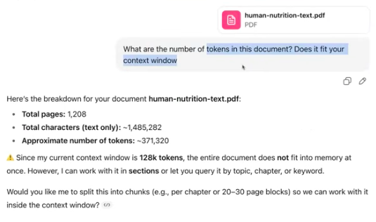

## Background

Problem with handling long sequences

Take english to german translation, the challenge is not word by word translation. Certain words require access to word that appeared previously or latter. To address this problem, encoder-decoder style architecture was used with RNN style encoding & decoding.

Big limitation of RNN encoder-decoder is it can directly access previous hidden state. We assume the current hidden state captures all relevant information, which leads to loss of context in handling long context sequences.

### Bahdanau Attention

RNN style worked for short translation sequences, but longer texts implies it cant direct access the previous words.

Earliest of the attention mechanish, where the decoder can selectively access different parts of the input sequence at each decoding step

### Self Attention

Attention Vs Self Attention

Attention is a mechanism where in above picture during translation, the model decides which part of the words in input sequence (encoder) i should attend to while processing the output sequence (decoder).

Self-Attention - Instead of using attention only between the decoder and encoder, it allows every token within a sequence to directly interact with every other token. A mechanism's ability to compute attention weights by relating different positions within a single input sequence.

Mechanism that allows each position in the input sequence to consider the relevancy of, or “attend to”. Why 

Attention computes contextual relevance scores between tokens.

Given a sequence of embeddings (with positional information already mixed in), attention lets each token look at every other token and decide how much to weigh each one. The result is a new representation that depends on context — the same token can mean different things depending on what surrounds it.
