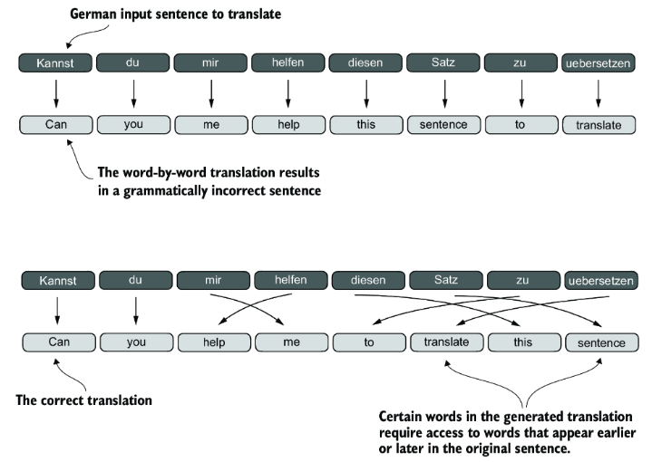
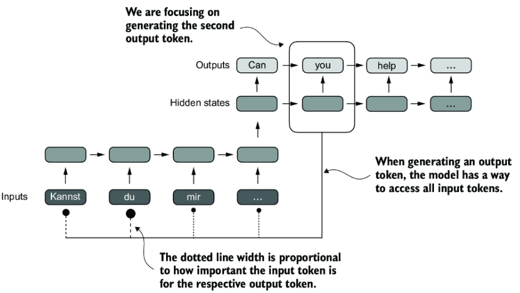

Attention computes contextual relevance scores between tokens. Given a sequence of embeddings (with positional information already mixed in), each token looks at every other token and decides how much to weigh each one. The result is a new representation that depends on context — the same token can mean different things depending on what surrounds it.

## 1. Background

Long sequences are hard to handle well. Take English-to-German translation: you cannot translate word by word. Some words depend on words that appeared earlier or later. Encoder-decoder architectures with RNN-style encoding and decoding were an early answer to that problem.



A big limitation of RNN encoder-decoder models is that they cannot directly access earlier hidden states. We assume the current hidden state captures everything that matters, which leads to loss of context on long sequences. RNN-style models worked for short translations, but longer texts still could not reach back to earlier words directly.

**Bahdanau attention** was an early fix: it let the decoder selectively access different parts of the input sequence at each decoding step.



**Attention** (as in the picture above) lets the decoder decide which parts of the encoder input to focus on while producing the output. **Self-attention** goes further — every token within a sequence can interact directly with every other token. Weights are computed by relating different positions inside a single sequence.

## 2. Self-attention

### 2.1 Why embeddings alone are not enough

Consider these two sentences:

- **Sentence A:** "I am sitting by the river **bank**"
- **Sentence B:** "I am going to the **bank** to deposit money"

Both contain the word "bank", but the meaning differs:

- Sentence A: **bank** = riverbank (geographic, nature-related)
- Sentence B: **bank** = financial institution (business, money-related)

A traditional word embedding is the same in both sentences — ambiguous between the two senses:

```
embedding("bank") = [0.5, 0.5, 0.3, 0.0, 0.0]
                     Geographic, Financial, Nature, Action, Person
```

That single vector does not know what other words are nearby or which sense applies. Self-attention fixes this by looking at all words, scoring how relevant each is to "bank", and building a **context vector** tailored to this sentence. The token embedding starts the same; attention contextualizes it.

### 2.2 Attention scores

Walk through Sentence A with five embedding dimensions:

| Dimension | Meaning |
| --------- | ------- |
| Geographic | How much does the word relate to places or locations? |
| Financial | How much does the word relate to money or transactions? |
| Nature | How much does the word relate to natural elements? |
| Action | How much does the word relate to verbs or movement? |
| Person | How much does the word relate to pronouns or people? |

| Word | Geographic | Financial | Nature | Action | Person |
| ---- | ---------- | --------- | ------ | ------ | ------ |
| I | 0.1 | 0.0 | 0.0 | 0.0 | **0.95** |
| am | 0.0 | 0.0 | 0.0 | 0.5 | 0.1 |
| sitting | 0.1 | 0.0 | 0.1 | **0.9** | 0.0 |
| by | 0.2 | 0.0 | 0.0 | 0.2 | 0.0 |
| the | 0.0 | 0.0 | 0.0 | 0.0 | 0.0 |
| river | **0.8** | 0.0 | **0.9** | 0.0 | 0.0 |
| **bank** | **0.5** | **0.5** | **0.3** | 0.0 | 0.0 |

**Key point:** "bank" starts ambiguous — equal Geographic and Financial (0.5 each). Nothing in the embedding itself says this is a riverbank.

For each word we have three roles:

- **Query (Q):** "What am I looking for?"
- **Key (K):** "What do I offer?"
- **Value (V):** "What information can I provide?"

For simplicity, assume `Q = K = V = embedding`. In real models these are learned linear transformations.

**Note on learned weight matrices:** In practice, Query, Key, and Value are not the raw embeddings. Each is computed by multiplying the embedding with a learned weight matrix:

```
Q = W_Q × embedding
K = W_K × embedding
V = W_V × embedding
```

`W_Q`, `W_K`, and `W_V` are parameters the network learns during training. Different matrices let Q, K, and V capture different aspects of meaning:

- **Query** — what to search for
- **Key** — what to match against
- **Value** — what to contribute

That learned transformation makes self-attention much more expressive than using raw embeddings. For this walkthrough we keep them identical to keep the math clean, but in real Transformers they are always separate learned parameters.

Focus on **"bank"**. The score against each word is the dot product `Q_bank · K_word`:

| Word | Key vector | Dot product with Q_bank | Score |
| ---- | ---------- | ----------------------- | ----- |
| I | [0.1, 0.0, 0.0, 0.0, 0.95] | `(0.5×0.1) + (0.5×0.0) + (0.3×0.0) + (0.0×0.0) + (0.0×0.95)` | **0.05** |
| am | [0.0, 0.0, 0.0, 0.5, 0.1] | `(0.5×0.0) + (0.5×0.0) + (0.3×0.0) + (0.0×0.5) + (0.0×0.1)` | **0.00** |
| sitting | [0.1, 0.0, 0.1, 0.9, 0.0] | `(0.5×0.1) + (0.5×0.0) + (0.3×0.1) + (0.0×0.9) + (0.0×0.0)` | **0.08** |
| by | [0.2, 0.0, 0.0, 0.2, 0.0] | `(0.5×0.2) + (0.5×0.0) + (0.3×0.0) + (0.0×0.2) + (0.0×0.0)` | **0.10** |
| the | [0.0, 0.0, 0.0, 0.0, 0.0] | `(0.5×0.0) + (0.5×0.0) + (0.3×0.0) + (0.0×0.0) + (0.0×0.0)` | **0.00** |
| river | [0.8, 0.0, 0.9, 0.0, 0.0] | `(0.5×0.8) + (0.5×0.0) + (0.3×0.9) + (0.0×0.0) + (0.0×0.0)` | **0.67** |
| bank | [0.5, 0.5, 0.3, 0.0, 0.0] | `(0.5×0.5) + (0.5×0.5) + (0.3×0.3) + (0.0×0.0) + (0.0×0.0)` | **0.59** |

**Raw attention scores:** `[0.05, 0.00, 0.08, 0.10, 0.00, 0.67, 0.59]`

"river" gets the highest score (0.67) — even though "bank" started ambiguous, the nature/geographic neighbor wins.

Softmax converts scores into probabilities that sum to 1:

```
attention_weight = e^score / Σ e^score_i
```

| Word | Score | e^Score |
| ---- | ----- | ------- |
| I | 0.05 | 1.05 |
| am | 0.00 | 1.00 |
| sitting | 0.08 | 1.08 |
| by | 0.10 | 1.11 |
| the | 0.00 | 1.00 |
| river | 0.67 | 1.95 |
| bank | 0.59 | 1.80 |

**Sum:** `1.05 + 1.00 + 1.08 + 1.11 + 1.00 + 1.95 + 1.80 = 9.00`

| Word | Attention weight |
| ---- | ---------------- |
| I | 1.05 / 9.00 = **0.117** |
| am | 1.00 / 9.00 = **0.111** |
| sitting | 1.08 / 9.00 = **0.120** |
| by | 1.11 / 9.00 = **0.123** |
| the | 1.00 / 9.00 = **0.111** |
| river | 1.95 / 9.00 = **0.217** |
| bank | 1.80 / 9.00 = **0.200** |

Interpretation:

- **21.7%** of "bank"'s attention goes to "river"
- **20.0%** goes to itself
- The remaining ~58% is distributed among the other words

### 2.3 Context vector

The context vector is each value vector weighted by its attention weight, then summed:

```
context_vector = Σ attention_weight_i × V_i
```

| Word | Attention wt | Value vector | Weighted vector |
| ---- | ------------ | ------------ | --------------- |
| I | 0.117 | [0.1, 0.0, 0.0, 0.0, 0.95] | [0.012, 0.0, 0.0, 0.0, 0.111] |
| am | 0.111 | [0.0, 0.0, 0.0, 0.5, 0.1] | [0.0, 0.0, 0.0, 0.056, 0.011] |
| sitting | 0.120 | [0.1, 0.0, 0.1, 0.9, 0.0] | [0.012, 0.0, 0.012, 0.108, 0.0] |
| by | 0.123 | [0.2, 0.0, 0.0, 0.2, 0.0] | [0.025, 0.0, 0.0, 0.025, 0.0] |
| the | 0.111 | [0.0, 0.0, 0.0, 0.0, 0.0] | [0.0, 0.0, 0.0, 0.0, 0.0] |
| river | 0.217 | [0.8, 0.0, 0.9, 0.0, 0.0] | [0.174, 0.0, 0.195, 0.0, 0.0] |
| bank | 0.200 | [0.5, 0.5, 0.3, 0.0, 0.0] | [0.100, 0.100, 0.060, 0.0, 0.0] |

```
Context Vector A = [0.323, 0.100, 0.267, 0.189, 0.122]
                    Geographic, Financial, Nature, Action, Person
```

Compare with the original ambiguous embedding `[0.5, 0.5, 0.3, 0.0, 0.0]`:

| Dimension | Original | Context A | Change | Interpretation |
| --------- | -------- | --------- | ------ | -------------- |
| Geographic | 0.5 | 0.323 | Mixed | Pulled by "river", diluted by others |
| Financial | 0.5 | 0.100 | ↓ Dropped | No financial neighbors in this sentence |
| Nature | 0.3 | 0.267 | Held up | "river" kept nature alive |
| Action | 0.0 | 0.189 | ↑ Boosted | "sitting" and "by" contributed action |
| Person | 0.0 | 0.122 | ↑ Boosted | "I" contributed person perspective |

Financial collapsed; nature stayed relevant. The river sentence pushed "bank" toward a nature-oriented reading.

### 2.4 Same embedding, opposite context

Now Sentence B — **same starting "bank" embedding**, different neighbors.

The low-scoring words (`I`, `am`, `going`, `the`) barely move the result. The decisive neighbors are `deposit` and `money`, so we focus the math there (along with `bank` and `to`):

| Word | Geographic | Financial | Nature | Action | Person |
| ---- | ---------- | --------- | ------ | ------ | ------ |
| to | 0.1 | 0.1 | 0.0 | 0.2 | 0.0 |
| **bank** | **0.5** | **0.5** | **0.3** | 0.0 | 0.0 |
| deposit | 0.0 | **0.95** | 0.0 | **0.9** | 0.0 |
| money | 0.0 | **1.0** | 0.0 | 0.0 | 0.0 |

Scores against the same `Q_bank = [0.5, 0.5, 0.3, 0.0, 0.0]`:

| Word | Score |
| ---- | ----- |
| to | 0.10 |
| bank | 0.59 |
| deposit | **0.47** |
| money | **0.50** |

After softmax (sum of `e^score` ≈ 6.17):

| Word | Attention weight |
| ---- | ---------------- |
| bank | 1.80 / 6.17 = **0.293** |
| to | 1.11 / 6.17 = **0.179** |
| deposit | 1.61 / 6.17 = **0.261** |
| money | 1.65 / 6.17 = **0.267** |

Together, `deposit` + `money` get over half the attention mass.

```
Context Vector B = [0.164, 0.679, 0.088, 0.271, 0.000]
                    Geographic, Financial, Nature, Action, Person
```

| Dimension | Original | Context A (river) | Context B (deposit) |
| --------- | -------- | ----------------- | ------------------- |
| Geographic | 0.5 | 0.323 | 0.164 |
| Financial | 0.5 | **0.100** ↓ | **0.679** ↑ |
| Nature | 0.3 | **0.267** | **0.088** ↓ |
| Action | 0.0 | 0.189 | 0.271 |
| Person | 0.0 | 0.122 | 0.000 |

Same token embedding in both sentences. After attention:

- River sentence → Financial collapses, Nature stays relevant
- Deposit sentence → Financial rises, Nature collapses

That is the central point — the embedding starts ambiguous; attention contextualizes it.

### 2.5 Putting it together

```
1. INPUT: same ambiguous embedding in both sentences
   "bank" = [0.5, 0.5, 0.3, 0.0, 0.0]
                │
                ▼
2. QUERY-KEY SIMILARITY: score against neighbors
   Sentence A → "river" wins (0.67)
   Sentence B → "money" / "deposit" rise (0.50, 0.47)
                │
                ▼
3. SOFTMAX: turn scores into attention weights
                │
                ▼
4. WEIGHTED SUM: mix value vectors by weight
   Context A = [0.323, 0.100, 0.267, 0.189, 0.122]  ← nature-oriented
   Context B = [0.164, 0.679, 0.088, 0.271, 0.000]  ← finance-oriented
```

In short:

1. Static embeddings ignore context — the same ambiguous vector for every "bank"
2. Attention scores measure relevance between words
3. Softmax turns scores into weights (0–1, sum to 1)
4. Context vectors are weighted combinations of all words, tailored to the query
5. Same embedding, different neighbors → different representation — the foundation of transformers

For a query word `q`:

```
score_i  = q · k_i
weight_i = e^score_i / Σ_j e^score_j
context  = Σ_i weight_i × v_i
```

where `k_i` and `v_i` are the key and value vectors of word `i`.
