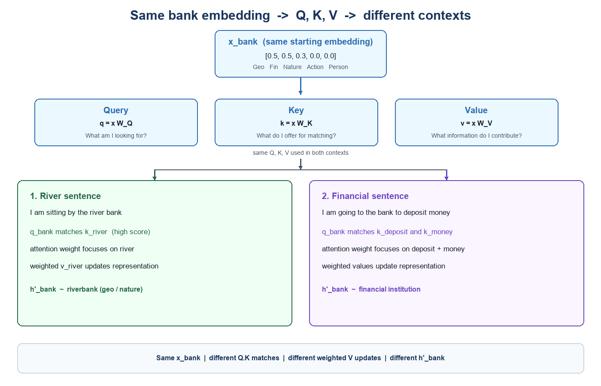
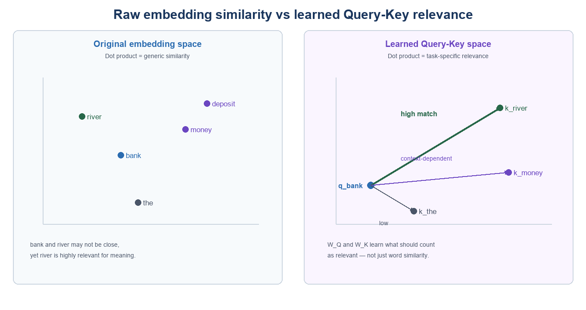
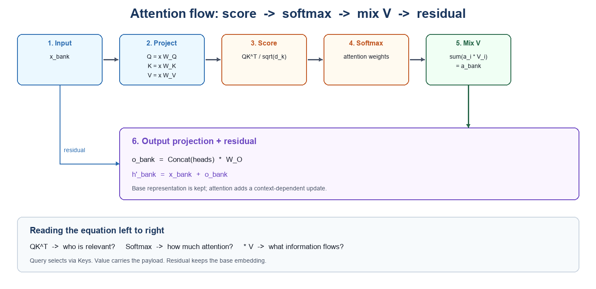

In [Attention](./attention), we built a context vector by making one simplifying assumption:

```text
Q = K = V = token embedding
```

That assumption exposed the core mechanics:

1. Compare the current token with the other tokens.
2. Convert the scores into attention weights.
3. Use those weights to combine information from the tokens.
4. Produce a context-dependent representation.

Real Transformers do not use the same representation for all three jobs. They learn three projections:

$$
Q=XW_Q,\qquad K=XW_K,\qquad V=XW_V
$$

This article continues with the same ambiguous word:

- “I am sitting by the river **bank**.”
- “I am going to the **bank** to deposit money.”

The starting embedding for `bank` is the same. Query, Key, and Value determine which neighbouring tokens matter and what information they contribute.



## 1. Why embeddings alone are not enough

The original embedding represents the general meaning of `bank`, including both geographical and financial associations:

```text
x_bank = [0.5, 0.5, 0.3, 0.0, 0.0]
          Geo  Fin  Nature Action Person
```

If we compare raw embeddings directly, the score

$$
x_{\text{bank}}\cdot x_{\text{river}}
$$

answers a broad question:

> How similar are `bank` and `river` in the original embedding space?

Attention needs a more task-specific question:

> Can `river` help determine the intended meaning of `bank`?

Similarity and relevance are not identical:

- `bank` and `river` are different concepts, but `river` is highly relevant to disambiguating `bank`.
- `bank` and `money` may not be close in every semantic dimension, but money is strong evidence for the financial meaning.
- A grammatical token may be useful to one attention head even if it is not semantically similar.

Learned projections let the model create a separate space in which usefulness—not only raw similarity—determines the score.



## 2. One embedding, three representations

For each token representation $x_i$, an attention head computes:

$$
q_i=x_iW_Q
$$

$$
k_i=x_iW_K
$$

$$
v_i=x_iW_V
$$

The three outputs have distinct roles:

| Representation | Role | Bank example |
|---|---|---|
| Query $q_i$ | What information does this token need? | “Which context helps determine my meaning?” |
| Key $k_i$ | What can this token be matched on? | `river`: “I offer geographical evidence.” |
| Value $v_i$ | What information should this token contribute? | `river`: geographical/nature information |

The English descriptions are only intuition. The model stores vectors, not literal questions or rules.

### The matrices are learned

$W_Q$, $W_K$, and $W_V$ start as parameter matrices. During training:

1. The model predicts the next token or optimizes another training objective.
2. The loss measures how wrong the prediction was.
3. Backpropagation calculates how each matrix contributed to the error.
4. Gradient descent adjusts the matrices.

Across many examples, some attention heads become useful for patterns such as:

- ambiguous word → disambiguating clue,
- pronoun → referent,
- verb → subject or object,
- adjective → noun,
- entity → description.

These relationships emerge from training; they are not manually encoded.

## 3. Query: what is `bank` looking for?

The Query projection transforms the `bank` representation:

$$
q_{\text{bank}}=x_{\text{bank}}W_Q
$$

For one hypothetical attention head, the resulting vector may behave as if it asks:

> Which surrounding token helps determine what kind of bank this is?

Another attention head can produce a different Query from the same `bank` embedding. It might search for grammatical relationships rather than word-sense clues.

This is the first benefit of $W_Q$: the token does not have one fixed notion of what matters.

## 4. Key: what does each token advertise?

Every token also produces a Key:

$$
k_i=x_iW_K
$$

For the river sentence:

```text
river   → Key: strong geographical/context clue
sitting → Key: action information
the     → Key: grammatical information
bank    → Key: information about itself
```

The Key does not contain the information that will ultimately be copied into `bank`. Its job is to make the token easy—or difficult—to select for a particular Query.

This separation enables asymmetric relationships. The Query for `bank` can match the Key for `river` even though the Query and Key were produced by different matrices.

## 5. Query–Key matching learns relevance

To measure how useful token $j$ is to token $i$, attention computes:

$$
s_{ij}=\frac{q_i\cdot k_j}{\sqrt{d_k}}
$$

For the `bank` Query:

$$
s_{\text{bank,river}}
=
\frac{q_{\text{bank}}\cdot k_{\text{river}}}{\sqrt{d_k}}
$$

A larger score means that the Key is a better match for what the Query is seeking.

### River sentence

Suppose one head produces these illustrative unscaled scores:

| Key token | $q_{\text{bank}}\cdot k_i$ |
|---|---:|
| I | 0.1 |
| am | 0.1 |
| sitting | 0.3 |
| by | 0.2 |
| the | 0.1 |
| **river** | **2.8** |
| bank | 0.5 |

`river` is the strongest match. The model has learned a projection space in which the relation “geographical clue for an ambiguous bank” receives a high score.

This differs from the simplified article:

```text
Earlier:  x_bank · x_river
Now:     (x_bank W_Q) · (x_river W_K)
```

The earlier calculation used fixed similarity from the embedding space. The new calculation learns what should count as relevant.

## 6. Scaling and softmax produce attention weights

Dot products can grow as the Query–Key dimension $d_k$ increases. Dividing by $\sqrt{d_k}$ keeps their magnitude controlled:

$$
\tilde{s}_{ij}=\frac{q_i\cdot k_j}{\sqrt{d_k}}
$$

Softmax converts the scaled scores into non-negative weights that sum to one:

$$
\alpha_{ij}
=
\operatorname{softmax}_j\left(
\frac{q_i\cdot k_j}{\sqrt{d_k}}
\right)
$$

Using the illustrative scores above with $d_k=2$ gives:

| Token | Attention weight from `bank` |
|---|---:|
| I | 0.075 |
| am | 0.075 |
| sitting | 0.087 |
| by | 0.081 |
| the | 0.075 |
| **river** | **0.507** |
| bank | 0.100 |

Query and Key have now answered:

> Where should `bank` obtain information from, and in what proportion?

They have not answered what information should flow. That is the Value’s job.

## 7. Value: what information should flow?

Each token produces a Value:

$$
v_i=x_iW_V
$$

For `river`:

$$
v_{\text{river}}=x_{\text{river}}W_V
$$

The Value is the payload contributed if the token receives attention.

```text
Query + Key → who is relevant?
Value       → what information is transferred?
```

The representation useful for finding a token need not be the same representation useful for updating another token. For example:

- `k_river` can advertise “useful geographical clue.”
- `v_river` can carry a learned mixture of geographical and nature information.
- A different attention head can derive a different Key and Value from the same `river` representation.

## 8. Attention combines the Values

The context or attention output for `bank` is the weighted sum:

$$
a_{\text{bank}}
=
\sum_j \alpha_{\text{bank},j}v_j
$$

For the river sentence:

$$
a_{\text{bank}}
=
0.507v_{\text{river}}
+0.100v_{\text{bank}}
+0.087v_{\text{sitting}}
+\cdots
$$

The important upgrade from the previous article is:

```text
Simplified: context = Σ attention_weight_i × x_i
Learned:    context = Σ attention_weight_i × (x_i W_V)
```

The model is no longer mixing the original embeddings directly. It mixes learned Value representations.

## 9. Output projection and residual update

The weighted Value sum does not normally replace the `bank` representation. For multi-head attention, each head first produces its attention output; the heads are concatenated and projected by $W_O$:

$$
o_{\text{bank}}
=
\operatorname{Concat}(a_{\text{bank}}^{(1)},\ldots,a_{\text{bank}}^{(h)})W_O
$$

The Transformer then uses a residual connection:

$$
h'_{\text{bank}}=h_{\text{bank}}+o_{\text{bank}}
$$

Layer normalization is also applied; its exact position depends on whether the architecture uses pre-normalization or post-normalization.

This distinction matters:

- $h_{\text{bank}}$ preserves the incoming representation.
- Attention computes a context-dependent update $o_{\text{bank}}$.
- Their sum $h'_{\text{bank}}$ is the updated representation passed onward.



## 10. Same `bank`, different context

In the river sentence, the `bank` Query strongly matches the `river` Key:

```text
bank Query → river Key → high attention → river Value contributes strongly
```

The update moves the representation toward a geographical/nature interpretation.

In the financial sentence, suppose the illustrative scores are:

| Key token | $q_{\text{bank}}\cdot k_i$ | Attention weight ($d_k=2$) |
|---|---:|---:|
| I | 0.1 | 0.052 |
| going | 0.2 | 0.056 |
| to | 0.1 | 0.052 |
| the | 0.1 | 0.052 |
| bank | 0.4 | 0.065 |
| **deposit** | **2.5** | **0.286** |
| **money** | **3.1** | **0.437** |

`deposit` and `money` together receive 72.3% of the attention. Their Values dominate the update:

```text
bank Query → deposit/money Keys → high attention
                                      │
                                      ▼
                            financial Value update
```

The base `bank` embedding is the same in both sentences. Different Keys produce different weights, and different weighted Values produce different updates.

### Important: causal masking

The comparison above assumes bidirectional attention, as used by encoder models, where a token can attend to words on either side.

In a decoder-only LLM such as GPT:

- a token can attend only to itself and earlier tokens,
- `bank` cannot attend to later `deposit` and `money` tokens,
- those later tokens can attend back to `bank`.

To demonstrate financial disambiguation at the `bank` position in a causal model, place the clues first:

> “After depositing the money, I walked to the **bank**.”

Now `bank` can attend to both `depositing` and `money`.

## 11. Matrix view

For a sequence containing $n$ tokens with model dimension $d_{\text{model}}$:

$$
X\in\mathbb{R}^{n\times d_{\text{model}}}
$$

A single attention head commonly uses:

$$
W_Q,W_K\in\mathbb{R}^{d_{\text{model}}\times d_k}
$$

$$
W_V\in\mathbb{R}^{d_{\text{model}}\times d_v}
$$

Therefore:

$$
Q,K\in\mathbb{R}^{n\times d_k},
\qquad
V\in\mathbb{R}^{n\times d_v}
$$

The complete operation is:

$$
\operatorname{Attention}(Q,K,V)
=
\operatorname{softmax}\left(
\frac{QK^T}{\sqrt{d_k}}
\right)V
$$

Read it from left to right:

1. $QK^T$ — calculate who is relevant to whom.
2. Divide by $\sqrt{d_k}$ — keep scores numerically stable.
3. Softmax — convert every row into attention weights.
4. Multiply by $V$ — combine the information carried by the selected tokens.

For decoder-only models, disallowed future positions are masked before softmax.

## 12. What the three matrices make possible

Separate projections give attention four important capabilities:

- **Role separation:** searching, matching, and information transfer are different operations.
- **Learned relevance:** the model learns which relationships are useful instead of relying on raw embedding similarity.
- **Asymmetric matching:** what one token seeks can differ from what another token advertises.
- **Multiple perspectives:** each attention head learns its own $W_Q$, $W_K$, and $W_V$.

The last point leads directly to [Multi-Head Attention](./multi-head-attention): one head can learn word-sense clues while another tracks grammar, reference, position, or other relationships.

## Summary

```text
Input representation x_i
        │
        ├── W_Q → Query: what does this token need?
        ├── W_K → Key: what can this token match on?
        └── W_V → Value: what information can it contribute?

Query × Keyᵀ
        ↓
scaled scores + mask
        ↓
softmax weights
        ↓
weighted sum of Values
        ↓
W_O projection + residual connection
        ↓
contextualized token representation
```

The sentence to remember is:

> Query determines what to look for. Key determines what can be matched. Value determines what information is transferred.
