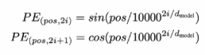

In English, word order matters. Compare:

- **Dog chased the cat**
- **Cat chased the dog**

These are completely different sentences, but a transformer processes all tokens in parallel — so without extra information, both could look the same. We need positional awareness.

**Self-attention** knows the relationship between tokens, but not their order. Attention answers *what* is relevant; positional encoding answers *where*.

Positional embeddings inform word order and contextual relationships. Ideally, they should:

1. Give different positions different representations
2. Make nearby positions similar and meaningful
3. Stay numerically bounded even for large positions
4. Allow recovery — if you know `PE(k)`, you should be able to derive `PE(k+10)`

There are a few common approaches.

## Naive representation

Why not just add the absolute position number?

| Token | Representation |
| ----- | -------------- |
| I | embedding + 1 |
| love | embedding + 2 |
| AI | embedding + 3 |

Problems:

- Position numbers grow large for long sequences
- No relative relationship is captured — the model ideally needs signals like "previous token" or "5 tokens earlier"

## Sinusoidal position encoding

### Why sine and cosine?

Polynomial or exponential functions grow quickly out of bounds. We want something that changes with position without increasing in magnitude.

Sine and cosine stay bounded between −1 and 1. But a single sine wave cannot distinguish all positions — it repeats every cycle (like a clock hand that wraps around).

Think of multiple clock hands:

```
[sin(pos), sin(pos/10), sin(pos/100)]  →  [second hand, minute hand, hour hand]
```

The second hand alone is not enough because it repeats every 60 seconds. Combine seconds + minutes + hours and you get a unique, richer representation of time that does not repeat. Sinusoidal encoding creates hundreds of these "clock hands."

### The formula



| Variable | Meaning |
| -------- | ------- |
| `pos` | Token position: 0, 1, 2, 3... |
| `i` | Embedding dimension index |
| `d_model` | Embedding dimension (e.g. 768) |

For simplicity:

```
PE(pos, 2i)   = sin(pos × w_i)
PE(pos, 2i+1) = cos(pos × w_i)
```

**Example:** assume dimension = 4

For `i = 0`:

- `w_i = 10000^(0/4) = 1`
- dim 0, dim 1 → `sin(pos)`, `cos(pos)`

For `i = 1`:

- `w_i = 100`
- dim 2, dim 3 → `sin(pos/100)`, `cos(pos/100)`

```
PE(pos) = [sin(pos), cos(pos), sin(pos/100), cos(pos/100)]

PE(1) = [0.841,  0.540,  0.010,  0.999]
PE(2) = [0.909, −0.416,  0.020,  0.9998]
PE(3) = [0.141, −0.990,  0.030,  0.9995]
```

The first dimensions change rapidly; later dimensions change slowly (`0.01 → 0.02 → 0.03`). Each dimension `i` oscillates at a different rate — dim 1 changes fast, dim 2 less, and so on.

### Linear shift property

Sine and cosine create a linear transformation when moving from position `k` to `k + p`:

```
sin(p + k) = sin(p)cos(k) + cos(p)sin(k)
```

This is why we need both sine and cosine — together they encode the linear relationship between positions.

### Relative positions in practice

Take two sentences:

- "Cat ate my fish"
- "Yesterday, the cat ate my fish"

In both, *cat* and *ate* have a similar relative relationship. With sinusoidal encoding, this gives the same positional information rather than a distinct unique ID for each absolute position.

### Sinusoidal encoding in one picture

```
Position
    │
    ▼
Represent it as many clocks
    │
    ├── very fast clock
    ├── fast clock
    ├── medium clock
    ├── slow clock
    └── very slow clock
            │
            ▼
    Each clock represented by [sin(angle), cos(angle)]
            │
            ▼
    Combined values give a positional fingerprint
```

**Why a sin/cos pair?** It represents rotation, stays bounded, and shifting position by `k` becomes a simple linear transformation.

**Why many frequencies?** One clock repeats; many clocks capture position across different distance scales.

**Why 10000?** It spreads those frequencies over a wide range of wavelengths — the number itself is not sacred.

**Why efficient?** No learned parameters, cheap to precompute, simple addition to embeddings, same dimensionality, and mathematically structured relative-position information.

## RoPE

**Key shift:** sinusoidal positional encoding *adds* position to token embeddings. **RoPE** (*Rotary Position Embedding*) *rotates* the query and key vectors inside attention.

### Attention without position

Attention for a token computes:

```
Q = X Wq
K = X Wk
V = X Wv
```

The attention score between token `m` and token `n` is:

```
Qmᵀ Kn
```

That score does not tell the model *where* tokens `m` and `n` occur — only how similar their query and key vectors are.

### Rotating Q and K by position

RoPE rotates the Q and K vectors based on their positions.

For a token at position `m`:

```
Qm′ = Rm Qm
Kn′ = Rn Kn
```

where `R` is a rotation matrix. The attention score becomes:

```
Qm′ᵀ Kn′
```

RoPE rotates information in the relevant dimensions and depends only on Q and K:

- **Q and K** decide *where* to look
- **V** carries *what* to retrieve

### How RoPE works

1. Create Q and K normally
2. Split each Q/K vector into 2D pairs
3. Assign each pair a frequency
4. Rotate every pair by `position × frequency`
5. Compute attention using the rotated Q and K

```
same token content
+ different position
= different orientation

orientation difference
= relative positional distance
```
