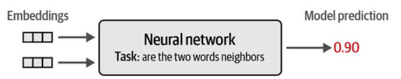

## Embeddings

Embeddings add meaning to the words or add contextual information. Higher dimension captures better relationship but comes at cost. Modern GPT has range from 768 to 12288 dimensions.

** Word2Vec**

Initial algorithms were Word2Vec. Embeddings were generated by classification task. Train a NN to predict words commonly appear together. NN will take two words and predict 1 if appear together or 0 if not

Ex: i want to learn machine learning and human ethics.

Training Samples

| Word 1 | Word 2 | Target |
| ------ | ------ | ------ |
| i | want | 1 |
| want | to | 1 |
| to | learn | 1 |
| learn | machine | 1 |
| i | to | 1 |
| want | learn | 1 |
| to | machine | 1 |
| i | machine | 0 |
| want | machine | 0 |
| i | learn | 0 |

Good to add random negative examples. Now we take these pairs and give random token weights to each words and send it to NN and predict. Over training it will start updating embeddings.

Overview of different embedding techniques

