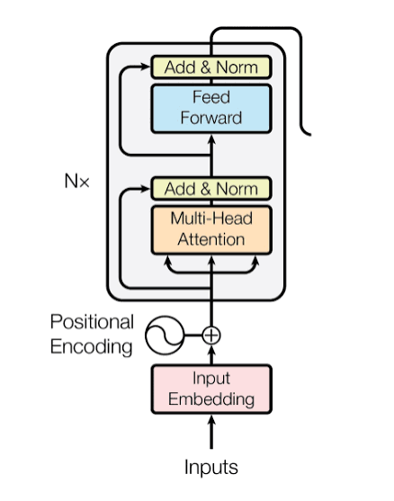

# Transformer Block: Putting It All Together

## Background: What We Have So Far

From the [multi-head attention post](https://rangarajp.github.io/concepts/transformers/multi-head-attention/), we learned that:

1. **Single-head attention** produces a contextualized vector for each token
2. **Multi-head attention** runs multiple specialized attention patterns in parallel
3. For our "bank" token in "I am sitting by the river bank", we got:

```
Multi-Head Output: [0.293, 0.134, 0.256, 0.211, 0.125]
                    Geographic, Financial, Nature, Action, Person
```

**The question now:** We have context vectors from attention. What happens next?

**The answer:** A Transformer Block takes that output and passes it through additional components:
1. **Residual Connection** — preserve the original input
2. **Layer Normalization** — stabilize values
3. **Feed-Forward Network** — add more capacity for reasoning
4. **Another Residual Connection + Layer Norm** — stabilize again



This entire block repeats 6-12 times (stacked layers) in real transformers. Let's walk through one complete block.

---

## 1. The Transformer Block Architecture

A Transformer Block has this structure:

```
Input: x (the original embedding)
  │
  ├─→ Multi-Head Attention
  │        ↓
  │   attn_output
  │        ↓
  ├─→ Residual Connection (x + attn_output)
  │        ↓
  ├─→ Layer Normalization
  │        ↓
  │   normalized_1
  │        ↓
  ├─→ Feed-Forward Network
  │        ↓
  │   ffn_output
  │        ↓
  ├─→ Residual Connection (normalized_1 + ffn_output)
  │        ↓
  └─→ Layer Normalization
       ↓
    Output: y (contextualized + reasoned representation)
```

**Key insight:** Each component builds on the previous one. Nothing is lost; information flows through, is enriched, then stabilized.

---

## 2. Recap: Multi-Head Attention Output

Let's continue with our "bank" token from the previous posts.

**Original embedding (from Token Embeddings post):**
```
[0.5, 0.5, 0.3, 0.0, 0.0]
 Geographic, Financial, Nature, Action, Person
```

**After Multi-Head Attention (from Multi-Head Attention post):**
```
[0.293, 0.134, 0.256, 0.211, 0.125]
```

This is our **attn_output**. Now we apply the first residual connection.

---

## 3. Residual Connection #1

A residual connection is simple: **add the input to the output**.

$$\text{residual\_1} = x + \text{attn\_output}$$

```
Original x:     [0.5,   0.5,   0.3,   0.0,   0.0]
attn_output:    [0.293, 0.134, 0.256, 0.211, 0.125]
                 ────── ────── ────── ────── ──────
residual_1:     [0.793, 0.634, 0.556, 0.211, 0.125]
```

**Why add them back?**

In deep networks (12+ layers), gradients can "vanish" — they get smaller as they backpropagate through layers. Adding the original input creates a **shortcut path** for gradients to flow directly backward. This makes training much faster and more stable.

**Think of it this way:** Without residuals, each layer must transform the input completely. With residuals, each layer just needs to make a **small modification** to the input.

---

## 4. Layer Normalization #1

Layer Normalization stabilizes the values before the next component. It rescales each sample independently so that:
- Mean of dimensions = 0
- Standard deviation of dimensions = 1

### Step 4.1: Compute Mean and Std

```
residual_1: [0.793, 0.634, 0.556, 0.211, 0.125]

Mean = (0.793 + 0.634 + 0.556 + 0.211 + 0.125) / 5 = 0.464

Deviations from mean:
  0.793 - 0.464 = 0.329
  0.634 - 0.464 = 0.170
  0.556 - 0.464 = 0.092
  0.211 - 0.464 = -0.253
  0.125 - 0.464 = -0.339

Squared deviations:
  0.329² = 0.108
  0.170² = 0.029
  0.092² = 0.008
  0.253² = 0.064
  0.339² = 0.115

Variance = (0.108 + 0.029 + 0.008 + 0.064 + 0.115) / 5 = 0.065

Std Dev = √0.065 = 0.255
```

### Step 4.2: Normalize

$$\text{normalized} = \frac{\text{value} - \text{mean}}{\text{std\_dev} + \epsilon}$$

(ε is a small number like 1e-6 to prevent division by zero)

```
normalized_1[0] = (0.793 - 0.464) / 0.255 = 1.290
normalized_1[1] = (0.634 - 0.464) / 0.255 = 0.667
normalized_1[2] = (0.556 - 0.464) / 0.255 = 0.361
normalized_1[3] = (0.211 - 0.464) / 0.255 = -0.991
normalized_1[4] = (0.125 - 0.464) / 0.255 = -1.329
```

**Verify:**
- Mean of normalized values: (1.290 + 0.667 + 0.361 - 0.991 - 1.329) / 5 ≈ 0 ✓
- Std dev: ≈ 1.0 ✓

**normalized_1: [1.290, 0.667, 0.361, -0.991, -1.329]**

**Why normalize?**

Without it, attention and FFN outputs can have wildly different magnitudes across layers. Normalization keeps values in a consistent range, preventing:
- Exploding gradients (values get very large)
- Vanishing gradients (values get very small)
- Instability during training

---

## 5. Feed-Forward Network

The Feed-Forward Network (FFN) is a two-layer dense network that adds **non-linear reasoning capacity**.

Structure: **Dense(d_model → d_ff) → Activation → Dense(d_ff → d_model)**

In our case:
- d_model = 5 (our embedding dimension)
- d_ff = 10 (expansion factor, typically 2-4×)

### Step 5.1: Expansion Layer

Linear transformation with learned weights $W_1$ (5×10) and bias $b_1$ (10):

$$\text{expanded} = \text{normalized\_1} \times W_1 + b_1$$

Let's say $W_1$ and $b_1$ are initialized as:

```
W_1 (5×10, learned weights):
[0.2  0.1  -0.1  0.3  0.1  0.2  -0.2  0.1  0.0  0.2]
[0.1  0.3   0.2 -0.1  0.1  0.0   0.1  0.2  0.3 -0.1]
[0.0 -0.1   0.1  0.2  0.2  0.1   0.3  0.0  0.1  0.2]
[-0.2 0.2   0.1  0.1 -0.1  0.2   0.0  0.1 -0.1  0.3]
[0.1  0.0   0.3 -0.2  0.1  0.1   0.2  0.0  0.2  0.1]

b_1 (10, bias):
[0.05, 0.1, 0.0, -0.05, 0.1, 0.05, -0.1, 0.0, 0.05, 0.1]
```

Matrix multiplication (simplified):
```
expanded = [1.290, 0.667, 0.361, -0.991, -1.329] × W_1 + b_1

expanded[0] = 1.290×0.2 + 0.667×0.1 + 0.361×0.0 + (-0.991)×(-0.2) + (-1.329)×0.1 + 0.05
            = 0.258 + 0.067 + 0 + 0.198 - 0.133 + 0.05 = 0.440

[Compute similarly for all 10 dimensions...]

expanded ≈ [0.440, 0.520, 0.330, 0.210, 0.380, 0.290, 0.150, 0.410, 0.310, 0.360]
```

### Step 5.2: Activation Function

Apply ReLU (Rectified Linear Unit): $\text{ReLU}(x) = \max(0, x)$

(Note: GPT uses GELU, but ReLU is simpler to show)

```
activated = [max(0, 0.440), max(0, 0.520), max(0, 0.330), ...]
activated = [0.440, 0.520, 0.330, 0.210, 0.380, 0.290, 0.150, 0.410, 0.310, 0.360]

(All positive, so no change)
```

ReLU kills negative values, introducing **non-linearity**. This is crucial — without activation, stacking dense layers would just be equivalent to one large matrix multiplication (still linear).

### Step 5.3: Contraction Layer

Linear transformation back to d_model (5) with learned weights $W_2$ (10×5) and bias $b_2$ (5):

$$\text{ffn\_output} = \text{activated} \times W_2 + b_2$$

```
W_2 (10×5, learned weights):
[0.3  0.1  0.2 -0.1  0.1]
[0.1  0.2 -0.1  0.3  0.0]
[0.2 -0.1  0.3  0.1  0.2]
[0.0  0.2  0.1  0.2 -0.1]
[0.1  0.3  0.0  0.1  0.2]
[0.2  0.0 -0.1  0.3  0.1]
[-0.1 0.1  0.2  0.0  0.3]
[0.3  0.2  0.1 -0.1  0.0]
[0.1  0.0  0.3  0.2  0.1]
[0.2  0.1  0.1  0.0  0.2]

b_2 (5):
[0.05, 0.1, -0.05, 0.0, 0.1]

ffn_output[0] = 0.440×0.3 + 0.520×0.1 + 0.330×0.2 + ... + 0.360×0.2 + 0.05
              ≈ 0.320 + 0.052 + 0.066 + ... + 0.05 ≈ 0.489

[Compute for all 5 dimensions...]

ffn_output ≈ [0.489, 0.421, 0.367, 0.298, 0.445]
```

**Why expand then contract?**

- **Expansion (5 → 10):** Creates hidden representations that capture non-linear interactions
- **Activation:** Introduces non-linearity
- **Contraction (10 → 5):** Projects back to original dimension

This bottleneck design adds **reasoning capacity** without inflating the model size too much.

---

## 6. Residual Connection #2

Again, add the input (from before FFN) back to the output:

$$\text{residual\_2} = \text{normalized\_1} + \text{ffn\_output}$$

```
normalized_1:   [1.290, 0.667, 0.361, -0.991, -1.329]
ffn_output:     [0.489, 0.421, 0.367,  0.298,  0.445]
                 ────── ────── ────── ────── ──────
residual_2:     [1.779, 1.088, 0.728, -0.693, -0.884]
```

Again, this preserves information and creates a shortcut for gradients.

---

## 7. Layer Normalization #2

Normalize residual_2 the same way as before:

```
residual_2: [1.779, 1.088, 0.728, -0.693, -0.884]

Mean = (1.779 + 1.088 + 0.728 - 0.693 - 0.884) / 5 = 0.404

Deviations: [1.375, 0.684, 0.324, -1.097, -1.288]

Variance ≈ 0.835
Std Dev ≈ 0.914

normalized_2[0] = (1.779 - 0.404) / 0.914 = 1.503
normalized_2[1] = (1.088 - 0.404) / 0.914 = 0.749
normalized_2[2] = (0.728 - 0.404) / 0.914 = 0.355
normalized_2[3] = (-0.693 - 0.404) / 0.914 = -1.199
normalized_2[4] = (-0.884 - 0.404) / 0.914 = -1.408

normalized_2: [1.503, 0.749, 0.355, -1.199, -1.408]
```

---

## 8. Block Output

The final output of our Transformer Block is:

```
Output: [1.503, 0.749, 0.355, -1.199, -1.408]
         Geographic, Financial, Nature, Action, Person
```

Let's compare this to what we started with:

| Dimension | Original | After Block |
|-----------|----------|-------------|
| Geographic | 0.5 | 1.503 |
| Financial | 0.5 | 0.749 |
| Nature | 0.3 | 0.355 |
| Action | 0.0 | -1.199 |
| Person | 0.0 | -1.408 |

**What happened:**
- Geographic information was **boosted** (0.5 → 1.503) via attention, then enriched by FFN
- Financial was **moderated** (0.5 → 0.749) — less financial relevance in this context
- Nature was **preserved** (0.3 → 0.355) — still present but not dominant
- Action and Person gained **negative values** — the model learned they're less relevant, and normalized them to emphasize the distinction

This is much richer than the original ambiguous embedding!

---

## 9. The Journey: From Embedding to Block Output

```
┌─────────────────────────────────────────────┐
│ INPUT: Ambiguous embedding                  │
│ [0.5, 0.5, 0.3, 0.0, 0.0]                  │
└─────────────────────────────────────────────┘
                      │
        ┌─────────────┴─────────────┐
        ↓                           ↓
   ┌────────────────┐         [Attention already
   │ Multi-Head     │          done: see post 5]
   │ Attention      │
   └────────────────┘
        │
        ↓ [0.293, 0.134, 0.256, 0.211, 0.125]
        │
   ┌────────────────────────┐
   │ + Residual Connection  │
   │ [0.5 + output]         │
   └────────────────────────┘
        │
        ↓ [0.793, 0.634, 0.556, 0.211, 0.125]
        │
   ┌────────────────────────┐
   │ Layer Normalization #1 │ ← Stabilize
   └────────────────────────┘
        │
        ↓ [1.290, 0.667, 0.361, -0.991, -1.329]
        │
   ┌────────────────────────┐
   │ FFN: Expand+Activate   │
   │ + Contract             │
   └────────────────────────┘
        │
        ↓ [0.489, 0.421, 0.367, 0.298, 0.445]
        │
   ┌────────────────────────┐
   │ + Residual Connection  │
   │ [norm_1 + ffn_output]  │
   └────────────────────────┘
        │
        ↓ [1.779, 1.088, 0.728, -0.693, -0.884]
        │
   ┌────────────────────────┐
   │ Layer Normalization #2 │ ← Stabilize
   └────────────────────────┘
        │
        ↓ [1.503, 0.749, 0.355, -1.199, -1.408]
        │
┌─────────────────────────────────────────────┐
│ OUTPUT: Deeply contextualized + reasoned    │
│ [1.503, 0.749, 0.355, -1.199, -1.408]       │
└─────────────────────────────────────────────┘
```

---

## 10. Stacking Blocks: Building Depth

One Transformer Block is powerful, but real transformers stack them: **6 layers in BERT, 12 in GPT-2, 96 in GPT-3**.

Each block:
- Takes the previous block's output as input
- Applies multi-head attention (different parameters)
- Applies FFN (different parameters)
- Outputs a richer representation

### Layer 1
```
[0.5, 0.5, 0.3, 0.0, 0.0] → [1.503, 0.749, 0.355, -1.199, -1.408]
```

### Layer 2
```
[1.503, 0.749, 0.355, -1.199, -1.408] 
  → (different W_q, W_k, W_v)
  → (different W_1, W_2)
  → [output_layer2]
```

### Layer 3, 4, 5, 6...

Each layer **refines** the representation:
- Attention learns new aspects of token relationships
- FFN adds more reasoning capacity
- Residuals prevent information loss
- Normalization keeps training stable

After 6-12 layers, the "bank" token has been transformed through:
- **Multiple perspectives** (each layer's multi-head attention)
- **Deep reasoning** (6+ FFN transformations)
- **Rich interactions** (tokens influence each other across layers)

The final output is a highly contextualized representation that encodes:
- What "bank" means in this sentence
- How it relates to all other tokens
- Refined semantic features for the task

---

## 11. Why This Design?

Each component serves a purpose:

| Component | Purpose |
|-----------|---------|
| **Multi-Head Attention** | Capture relationships between tokens |
| **Residual Connection** | Preserve information, enable deep networks |
| **Layer Normalization** | Stabilize values, speed up training |
| **Feed-Forward Network** | Add non-linear reasoning capacity |
| **Residual (again)** | Enable gradients to flow, prevent depth penalty |
| **Layer Norm (again)** | Consistency for next layer |

**Without residuals:** Adding 12 layers would make training nearly impossible (vanishing gradients).

**Without layer norm:** Values would explode or shrink, causing instability.

**Without FFN:** Attention alone can only shuffle information; FFN adds computation.

**Together:** A stable, deep architecture that can learn complex patterns.

---

## 12. Parameters per Block

In a 5-dimensional model:

**Multi-Head Attention (2 heads):**
- $W_Q$, $W_K$, $W_V$ per head: 3 × (5 × 5) = 75
- Output projection: 10 × 5 = 50
- **Total: ~125 parameters**

**Feed-Forward:**
- $W_1$: 5 × 10 = 50
- $b_1$: 10
- $W_2$: 10 × 5 = 50
- $b_2$: 5
- **Total: ~115 parameters**

**Per Block: ~240 parameters**

For a real transformer:
- **d_model = 768** (GPT-2)
- **d_ff = 3072** (4× expansion)
- **8 heads** (96 dims each)

Parameters per block: ~7 million

12 layers × 7M = **84M parameters** (plus embeddings and output layer)

---

## 13. Key Takeaways

1. **One Transformer Block = Attention + FFN + Residuals + Layer Norm**

2. **Information flow:**
   - Multi-head attention contextualizes
   - Residuals preserve
   - Layer norm stabilizes
   - FFN reasons

3. **Residuals are critical** for training deep networks (12+ layers)

4. **Normalization keeps values stable** across many layers

5. **FFN adds capacity** for non-linear reasoning

6. **Stacking blocks** allows deeper, more sophisticated reasoning

7. **Each block has independent parameters** (W_q, W_k, W_v, W_1, W_2) learned differently

8. **Final output is highly contextualized** — "bank" has been enriched through attention, reasoning, and refinement

---

## 14. What's Next?

One Transformer Block is the **fundamental repeating unit**. In the next post, we'll see:

- How to **stack** these blocks (Encoder)
- How to apply **masking** for generation (Decoder)
- How tokens **interact across layers**
- How the model processes **entire sequences**

The single block we built today repeats 6-96 times in real models. Understanding this block is understanding the core of Transformers.